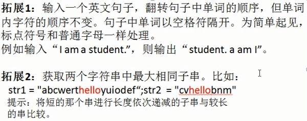

# 面试题

#### 1 什么是Singleton？

```tex
Singleton：在Java中即指单例设计模式，它是软件开发中最常用的设计模式之一。
单：唯一
例：实例

单例设计模式，即某个类在整个系统中只能有一个实例对象可被获取和使用的代码模式。
例如：代表JVM运行环境的Runtime类
```

**要点**

```tex
一是某个类只能有一个实例；
	构造器私有化
二是它必须自行创建这个实例；
	含有一个该类的静态变量来保存这个唯一的实例
三是它必须自行向整个系统提供这个实例;
	对外提供获取该实例对象的方式：
	（1）直接暴露
	（2）用静态变量的get方法获取

```

**几种常见形式**

```tex
饿汉式：直接创建对象，不存在线程安全问题
	直接实例化饿汉式（简洁直观）
	枚举式（最简洁）
	静态代码块饿汉式（适合复杂实例化）

懒汉式：延迟创建对象
	线程不安全（适用于单线程）
	线程安全（适用于多线程）
	静态内部类形式（适用于多线程）

```

**代码示例**

```java
package com.atguigu.single;

/*
 * 饿汉式：
 * 	在类初始化时直接创建实例对象，不管你是否需要这个对象都会创建
 * 
 * （1）构造器私有化
 * （2）自行创建，并且用静态变量保存
 * （3）向外提供这个实例
 * （4）强调这是一个单例，我们可以用final修改
 */
public class Singleton1 {
	public static final Singleton1 INSTANCE = new Singleton1();
	private Singleton1(){
		
	}
}
```


```java
package com.atguigu.single;

/*
 * 枚举类型：表示该类型的对象是有限的几个
 * 我们可以限定为一个，就成了单例
 */
public enum Singleton2 {
	INSTANCE
}
```

```java
package com.atguigu.single;

import java.io.IOException;
import java.util.Properties;

public class Singleton3 {
	public static final Singleton3 INSTANCE;
	private String info;
	
	static{
		try {
			Properties pro = new Properties();					pro.load(Singleton3.class.getClassLoader().getResourceAsStream("single.properties"));			
			INSTANCE = new Singleton3(pro.getProperty("info"));
		} catch (IOException e) {
			throw new RuntimeException(e);
		}
	}
	
	private Singleton3(String info){
		this.info = info;
	}

	public String getInfo() {
		return info;
	}

	public void setInfo(String info) {
		this.info = info;
	}

	@Override
	public String toString() {
		return "Singleton3 [info=" + info + "]";
	}
	
}

```

```java
package com.atguigu.single;

/*
 * 懒汉式：
 * 	延迟创建这个实例对象
 * 
 * (1)构造器私有化
 * (2)用一个静态变量保存这个唯一的实例
 * (3)提供一个静态方法，获取这个实例对象
 */
public class Singleton4 {
	private static Singleton4 instance;
	private Singleton4(){
		
	}
	public static Singleton4 getInstance(){
		if(instance == null){
			
			try {
				Thread.sleep(100);
			} catch (InterruptedException e) {
				e.printStackTrace();
			}
			
			instance = new Singleton4();
		}
		return instance;
	}
}

```

```java
package com.atguigu.single;

/*
 * 懒汉式：
 * 	延迟创建这个实例对象
 * 
 * (1)构造器私有化
 * (2)用一个静态变量保存这个唯一的实例
 * (3)提供一个静态方法，获取这个实例对象
 */
public class Singleton5 {
	private static Singleton5 instance;
	private Singleton5(){
		
	}
	public static Singleton5 getInstance(){
		if(instance == null){
			synchronized (Singleton5.class) {
				if(instance == null){
					try {
						Thread.sleep(1000);
					} catch (InterruptedException e) {
						e.printStackTrace();
					}
					
					instance = new Singleton5();
				}
			}
		}
		return instance;
	}
}

```

```java
package com.atguigu.single;

/*
 * 在内部类被加载和初始化时，才创建INSTANCE实例对象
 * 静态内部类不会自动随着外部类的加载和初始化而初始化，它是要单独去加载和初始化的。
 * 因为是在内部类加载和初始化时，创建的，因此是线程安全的
 */
public class Singleton6 {
	private Singleton6(){		
	}
	private static class Inner{
		private static final Singleton6 INSTANCE = new Singleton6();
	}
	
	public static Singleton6 getInstance(){
		return Inner.INSTANCE;
	}
}

```

#### 2 i++ 和 ++i

```java
	public static void main(String[] args) {
		int i = 1;
		i = i++;
		int j = i++;
		int k = i + ++i * i++;
		System.out.println("i=" + i); // i = 4
		System.out.println("j=" + j); // j = 1
		System.out.println("k=" + k); // k = 11
	}
```


.png)


.png)


.png)

```tex
赋值=，最后计算
=右边的从左到右加载值依次压入操作数栈
实际先算哪个，看运算符优先级
自增、自减操作都是直接修改变量的值，不经过操作数栈
最后的赋值之前，临时结果也是存储在操作数栈中

建议：《JVM虚拟机规范》关于指令的部分

```


#### 3 方法的传递机制

```tex
1.形参是基本数据类型
	传递数据值
2.实参是引用数据类型
	传递地址值
	特殊的类型：String、包装类等对象不可变性

```

```java
public class Exam4 {
	public static void main(String[] args) {
		int i = 1;
		String str = "hello";
		Integer num = 200;
		int[] arr = {1,2,3,4,5};
		MyData my = new MyData();
		
		change(i,str,num,arr,my);
		
		System.out.println("i = " + i); // 1
		System.out.println("str = " + str); // hello
		System.out.println("num = " + num); //200
		System.out.println("arr = " + Arrays.toString(arr)); // {2,2,3,4,5}
		System.out.println("my.a = " + my.a); // 11
	}
	public static void change(int j, String s, Integer n, int[] a,MyData m){
		j += 1;
		s += "world";
		n += 1;
		a[0] += 1;
		m.a += 1;
	}
}
class MyData{
	int a = 10;
}
```

**方法的参数传递机制**

```tex
形参是基本数据类型
	传递数据值
实参是引用数据类型
	传递地址值
特殊的类型：String、包装类等对象不可变性

```

#### 4 类的加载

​	**类初始化过程**

```tex
一个类要创建实例需要先加载并初始化该类
	main方法所在的类需要先加载和初始化
一个子类要初始化需要先初始化父类
一个类初始化就是执行<clinit>()方法
	<clinit>()方法由静态类变量显示赋值代码和静态代码块组成
	类变量显示赋值代码和静态代码块代码从上到下顺序执行
	<clinit>()方法只执行一次

```

​	**实例初始化过程**

```tex
实例初始化就是执行<init>()方法
	<init>()方法可能重载有多个，有几个构造器就有几个<init>方法
	<init>()方法由非静态实例变量显示赋值代码和非静态代码块、对应构造器代码组成
	非静态实例变量显示赋值代码和非静态代码块代码从上到下顺序执行，而对应构造器的代码最后执行
	每次创建实例对象，调用对应构造器，执行的就是对应的<init>方法
	<init>方法的首行是super()或super(实参列表)，即对应父类的<init>方法
```

​	**方法的重写Override**

```tex
哪些方法不可以被重写
	final方法
	静态方法
	private等子类中不可见方法
对象的多态性
	子类如果重写了父类的方法，通过子类对象调用的一定是子类重写过的代码
	非静态方法默认的调用对象是this
	this对象在构造器或者说<init>方法中就是正在创建的对象
```


​	**代码示例**

```java
package src.com.atguigu.test;

/*
 * 父类的初始化<clinit>：
 * （1）j = method();
 * （2）父类的静态代码块
 * 
 *  父类的实例化方法：
 * （1）super()（最前）
 * （2）i = test();
 * （3）父类的非静态代码块
 * （4）父类的无参构造（最后）
 * 
 * 非静态方法前面其实有一个默认的对象this
 * this在构造器（或<init>）它表示的是正在创建的对象，因为这里是在创建Son对象，所以
 * test()执行的是子类重写的代码（面向对象多态）
 * 
 * 这里i=test()执行的是子类重写的test()方法
 */
public class Father{
	private int i = test();
	private static int j = method();
	
	static{
		System.out.print("(1)");
	}
	Father(){
		System.out.print("(2)");
	}
	{
		System.out.print("(3)");
	}
	
	
	public int test(){
		System.out.print("(4)");
		return 1;
	}
	public static int method(){
		System.out.print("(5)");
		return 1;
	}
}

package com.atguigu.test;

/*
 * 子类的初始化<clinit>：
 * （1）j = method();
 * （2）子类的静态代码块
 * 
 * 先初始化父类：(5)(1)
 * 初始化子类：（10）(6)
 * 
 * 子类的实例化方法<init>：
 * （1）super()（最前）      （9）（3）（2）
 * （2）i = test();    （9）
 * （3）子类的非静态代码块    （8）
 * （4）子类的无参构造（最后） （7）
 * 
 * 因为创建了两个Son对象，因此实例化方法<init>执行两次
 * 
 * （9）（3）（2）（9）（8）（7）
 */
public class Son extends Father{
	private int i = test();
	private static int j = method();
	static{
		System.out.print("(6)");
	}
	Son(){
//		super();//写或不写都在，在子类构造器中一定会调用父类的构造器
		System.out.print("(7)");
	}
	{
		System.out.print("(8)");
	}
	public int test(){
		System.out.print("(9)");
		return 1;
	}
	public static int method(){
		System.out.print("(10)");
		return 1;
	}
	public static void main(String[] args) {
		Son s1 = new Son();
		System.out.println();
		Son s2 = new Son();
	}
}

```

​	**运行结果**

```tex
(5)(1)(10)(6)(9)(3)(2)(9)(8)(7)
(9)(3)(2)(9)(8)(7)
```

#### 5 变量的作用域

```tex
就近原则
变量的分类
	成员变量：类变量、实例变量
	局部变量
非静态代码块的执行：每次创建实例对象都会执行
方法的调用规则：调用一次执行一次
```

​	**局部变量与成员变量的区别**

```tex
1 声明的位置
	局部变量：方法体{}中，形参，代码块{}中
	成员变量：类中方法外
		类变量：有static修饰
		实例变量：没有static修饰
2 修饰符
	局部变量：final
	成员变量：public、protected、private、final、static、volatile、transient
3 值存储的位置
	局部变量：栈
	实例变量：堆
	类变量：方法区
4 作用域
	局部变量：从声明处开始，到所属的}结束
	实例变量：在当前类中“this.”(有时this.可以缺省)，在其他类中“对象名.”访问
	类变量：在当前类中“类名.”(有时类名.可以省略)，在其他类中“类名.”或“对象名.”访问
5 生命周期
	局部变量：每一个线程，每一次调用执行都是新的生命周期
	实例变量：随着对象的创建而初始化，随着对象的被回收而消亡，每一个对象的实例变量是独立的
	类变量：随着类的初始化而初始化，随着类的卸载而消亡，该类的所有对象的类变量是共享的
	
6 当局部变量与xx变量重名时，如何区分
	1 局部变量与实例变量重名
		在实例变量前面加“this.”
	2 局部变量与类变量重名
		在类变量前面加“类名.”
```

```java
public class Exam5 {
	static int s;//成员变量，类变量
	int i;//成员变量，实例变量
	int j;//成员变量，实例变量
	{
		int i = 1;//非静态代码块中的局部变量 i
		i++;
		j++;
		s++;
	}
	public void test(int j){//形参，局部变量,j
		j++;
		i++;
		s++;
	}
	public static void main(String[] args) {//形参，局部变量，args
		Exam5 obj1 = new Exam5();//局部变量，obj1
		Exam5 obj2 = new Exam5();//局部变量，obj1
		obj1.test(10);
		obj1.test(20);
		obj2.test(30);
		System.out.println(obj1.i + "," + obj1.j + "," + obj1.s);
		System.out.println(obj2.i + "," + obj2.j + "," + obj2.s);
	}
}
```

​	**运行结果**

```tex
2,1,5
1,1,5
```


#### 6 编程题

```tex
有n步台阶，一次只能上1步或2步，共有多少种走法？
	
	递归
	循环迭代
```


```tex
递归
	n=1  	->一步										->f(1) = 1

	n=2  	->(1)一步一步(2)直接2步						->f(2) = 2 


	n=3     ->(1)先到达f(1)，然后从f(1)直接跨2步			->f(3) = f(1) + f(2)
    		  (2)先到达f(2)，然后从f(2)跨1步

	n=4 	->(1)先到达f(2)，然后从f(2)直接跨2步      		->f(4) = f(2) + f(3)
  			  (2)先到达f(3)，然后从f(3)跨1步
	....
	n=x     ->(1)先到达f(x-2)，然后从f(x-2)直接跨2步  		->f(x) = f(x-2) + f(x-1)
  			  (2)先到达f(x-1)，然后从f(x-1)跨1步                     

```


```java
package com.atguigu.step;

import org.junit.Test;

public class TestStep{
	@Test
	public void test(){
		long start = System.currentTimeMillis();
		System.out.println(f(100));//165580141
		long end = System.currentTimeMillis();
		System.out.println(end-start);//586ms
	}
	
	//实现f(n)：求n步台阶，一共有几种走法
	public int f(int n){
		if(n<1){
			throw new IllegalArgumentException(n + "不能小于1");
		}
		if(n==1 || n==2){
			return n;
		}
		return f(n-2) + f(n-1);
	}
}
```


```tex
循环迭代
	n=1  			->一步											->f(1) = 1
	n=2  			->(1)一步一步(2)直接2步							->f(2) = 2 

	n=3      		->(1)先到达f(1)，然后从f(1)直接跨2步
					  (2)先到达f(2)，然后从f(2)跨1步					->f(3) = two + one  
					  												 f(3) = f(1) + f(2)    
					  												 two = f(1) ; one = f(2)

	n=4 			->(1)先到达f(2)，然后从f(2)直接跨2步      
 				      (2)先到达f(3)，然后从f(3)跨1步
																	->f(4) = two + one  
																	f(4) = f(2) + f(3)
                                                                     two = f(2);    one = f(3)  

	....

	n=x				->(1)先到达f(x-2)，然后从f(x-2)直接跨2步  	
  					  (2)先到达f(x-1)，然后从f(x-1)跨1步    			->f(x) = two + one
  																	 f(x) = f(x-2) + f(x-1)
   																	 two = f(x-2); one = f(x-1)

					
```


```java
import org.junit.Test;

public class TestStep2 {
	@Test
	public void test(){
		long start = System.currentTimeMillis();
		System.out.println(loop(100));//165580141
		long end = System.currentTimeMillis();
		System.out.println(end-start);//<1ms
	}
	
	public int loop(int n){
		if(n<1){
			throw new IllegalArgumentException(n + "不能小于1");
		}
		if(n==1 || n==2){
			return n;
		}
		
		int one = 2;//初始化为走到第二级台阶的走法
		int two = 1;//初始化为走到第一级台阶的走法
		int sum = 0;
		
		for(int i=3; i<=n; i++){
			//最后跨2步 + 最后跨1步的走法
			sum = two + one;
			two = one;
			one = sum;
		}
		return sum;
	}
}
```

**小结**

```tex
方法调用自身称为递归，利用变量的原值推出新值称为迭代。
	递归
		优点：大问题转化为小问题，可以减少代码量，同时代码精简，可读性好；
		缺点：递归调用浪费了空间，而且递归太深容易造成堆栈的溢出。
	迭代
		优点：代码运行效率好，因为时间只因循环次数增加而增加，而且没有额外的空间开销；
		缺点：代码不如递归简洁，可读性好
```

#### 7 Cookie 和Session是什么？

```tex
Cookie 定义
	“Cookie”是小量信息，由网络服务器发送出来以存储在网络浏览器上，从而下次这位独一无二的访客又回到该网络服务器时，可从该浏览器读回此信息。这是很有用的，让浏览器记住这位访客的特定信息，如上次访问的位置、花费的时间或用户首选项（如样式表）。Cookie 是个存储在浏览器目录的文本文件，当浏览器运行时，存储在 RAM 中。一旦你从该网站或网络服务器退出，Cookie 也可存储在计算机的硬驱上。当访客结束其浏览器对话时，即终止的所有 Cookie。
	
Cookie什么时候产生？
	Cookie的使用一先要看需求。因为浏览器可以禁用Cookie，同时服务端也可以不Set-Cookie。
	客户端向服务器端发送一个请求的时，服务端向客户端发送一个Cookie 然后浏览器将Cookie保存，Cookie有两种保存方式，一种是浏览器会将Cookie保存在内存中，还有一种是保存在客户端的硬盘中，之后每次HTTP请求浏览器都会将Cookie发送给服务器端。

具体流程如下：
	客户端提交一个HTTP请求给服务端,服务端这个时候做了两件事，一个是Set-Cookie，还有一个是提交响应内容给客户端 客户端再次向服务器请求时会在请求头中携带一个Cookie服务端提交响应内容给客户端。
	举例：分登录之前和登录后，登录前服务端给浏览器一个Cookie，但是这个Cookie里面没有用户信息，但是登录成功之后，服务端给浏览器一个Cookie，这个时候的Cookie已经记录了用户的信息，在系统内任意访问，可以实现免登录。
	
Cookie的生存周期？
	Cookie在生成时就会被指定一个Expire值，这就是Cookie的生存周期，在这个周期内Cookie有效，超出周期Cookie就会被清除。有些页面将Cookie的生存周期设置为“0”或负值，这样在关闭浏览器时，就马上清除Cookie，不会记录用户信息，更加安全。

Cookie有哪些缺陷？
	1、数量受到限制。一个浏览器能创建的 Cookie 数量最多为 300 个，并且每个不能超过 4KB，每个 Web 站点能设置的 Cookie 总数不能超过 20 个
	2、安全性无法得到保障。通常跨站点脚本攻击往往利用网站漏洞在网站页面中植入脚本代码或网站页面引用第三方法脚本代码，均存在跨站点脚本攻击的可能，在受到跨站点脚本攻击时，脚本指令将会读取当前站点的所有 Cookie 内容（已不存在 Cookie 作用域限制），然后通过某种方式将 Cookie 内容提交到指定的服务器（如：AJAX）。一旦 Cookie 落入攻击者手中，它将会重现其价值。
```


```tex
什么是Session？Session什么时候产生？
	Session:在计算机中，尤其是在网络应用中，称为“会话控制”。Session 对象存储特定用户会话所需的属性及配置信息。这样，当用户在应用程序的 Web 页之间跳转时，存储在 Session 对象中的变量将不会丢失，而是在整个用户会话中一直存在下去。当用户请求来自应用程序的 Web 页时，如果该用户还没有会话，则 Web 服务器将自动创建一个 Session 对象。当会话过期或被放弃后，服务器将终止该会话。
	
为什么要使用Session？
	因为很多第三方可以获取到这个Cookie，服务器无法判断Cookie是不是真实用户发送的，所以Cookie可以伪造，伪造Cookie实现登录进行一些HTTP请求。如果从安全性上来讲，Session比Cookie安全性稍微高一些，我们先要知道一个概念--SessionID。SessionID是什么？客户端第一次请求服务器的时候，服务器会为客户端创建一个Session，并将通过特殊算法算出一个session的ID，下次请求资源时（Session未过期），浏览器会将sessionID(实质是Cookie)放置到请求头中，服务器接收到请求后就得到该请求的SessionID，服务器找到该id的session返还给请求者使用。

Session的生命周期？
	根据需求设定，一般来说，半小时。举个例子，你登录一个服务器，服务器返回给你一个sessionID，登录成功之后的半小时之内没有对该服务器进行任何HTTP请求，半小时后你进行一次HTTP请求，会提示你重新登录。

Session有哪些缺陷？
	因为Session是存储在服务器当中的，所以Session过多，会对服务器产生压力。在我看来，Session的生命周期算是减少服务器压力的一种方式。

```


```tex
Cookie与Session之间有哪些区别或者是优缺点？
	1、Cookie可以存储在浏览器或者本地，session只能存在服务器
	2、Session比Cookie更具有安全性
	3、Session占用服务器性能，Session过多，增加服务器压力
	4、单个Cookie保存的数据不能超过4K，很多浏览器都限制一个站点最多保存20个Cookie
```

#### 8 算法题

#####求最大子数组和

```tex
 	（浙江大学考研题）输入一个整形数组，数组里有正数也有负数。数组中连续的一个或多个整数组成一个子数组，每个子数组都有一个和。
 	求所有子数组的和的最大值。要求时间复杂度为O(n)。
 例如：输入的数组为1, -2, 3, -10, -4, 7, 2, -5，和最大的子数组为3, 10, -4, 7, 2，
 因此输出为该子数组的和18。

```

```java
/*
 * 输入一个整形数组，数组里有正数也有负数。数组中连续的一个或多个整数组成一个子数组，每个子数组都有一个和。
 * 求所有子数组的和的最大值。要求时间复杂度为O(n)。
 例如：输入的数组为1, -2, 3, -10, -4, 7, 2, -5，和最大的子数组为3, 10, -4, 7, 2，
 因此输出为该子数组的和18。

 */
public class Test3 {
	public static void main(String[] args) {
		int[] arr = new int[]{1, -2, 3, 10, -4, 7, 2, -5};
		int i = getGreatestSum(arr);
		System.out.println(i);
	}
	
	public static int getGreatestSum(int[] arr){
      	// 设置储存最大和的值
		int greatestSum = 0;
		if(arr == null || arr.length == 0){
			return 0;
		}
		int temp = greatestSum;
		for(int i = 0;i < arr.length;i++){
			temp += arr[i];
			
          	// 题意要求，有正数，有负数，若为0，则前面的子数组应该抛弃
			if(temp < 0){
				temp = 0;
			}
			
          	// 若临时值 > 最大值，将临时值赋值给最大值，继续向后添加
			if(temp > greatestSum){
				greatestSum = temp;
			}
		}
      	// 由题意得知，若最终最大值为0数组结构为 1，-1, 2，-2 的结构
      	// 必须找出最大的单个数值
		if(greatestSum == 0){
			greatestSum = arr[0];
			for(int i = 1;i < arr.length;i++){
				if(greatestSum < arr[i]){
					greatestSum = arr[i];
				}
			}
		}
		return greatestSum;
	}
}
```

#####求最大公约数和最小公倍数

```java
//输入两个正整数m和n，求其最大公约数和最小公倍数。
public class Test2 {
	public static void main(String[] args) {
		int m = 12;
		int n = 28;
		int max = (m > n)? m : n;
		int min = (m < n)? m : n;
		//最大公约数
		for(int i = min;i >= 1;i--){
			if( m % i == 0 && n % i == 0){
				System.out.println(i);
				break;
			}
		}
		//最小公倍数
		for(int i = max;i <= m * n;i++){
			if(i % m == 0 && i % n == 0){
				System.out.println(i);
				break;
			}
		}
	}
}

```

#####数组问题

```java
//题目1：一个数组，让数组的每个元素去除第一个元素，得到的商作为被除数所在位置的新值。
public class Test1 {
	public static void main(String[] args) {
		int[] arr = new int[]{12,43,65,3,-8,64,2};
		
//		for(int i = 0;i < arr.length;i++){
//			arr[i] = arr[i] / arr[0];
//		}
		for(int i = arr.length -1;i >= 0;i--){
			arr[i] = arr[i] / arr[0];
		}
		//遍历arr
		for(int i = 0;i < arr.length;i++){
			System.out.print(arr[i] + " ");
		}
	}
}
```

#####这一天是当年的第几天

```java
//从键盘分别输入年、月、日，判断这一天是当年的第几天。
public class Test {
	public static void main(String[] args) {
      	// 为保证健壮性，前期最好做判断
		Scanner scanner = new Scanner(System.in);
		System.out.println("输入year：");
		int year = scanner.nextInt();
		System.out.println("输入month：");
		int month = scanner.nextInt();
		System.out.println("输入day：");
		int day = scanner.nextInt();
		int sumDay = 0;
		switch (month) {
            case 12:
                sumDay += 30;
            case 11:
                sumDay += 31;
            case 10:
                sumDay += 30;
            case 9:
                sumDay += 31;
            case 8:
                sumDay += 31;
            case 7:
                sumDay += 30;
            case 6:
                sumDay += 31;
            case 5:
                sumDay += 30;
            case 4:
                sumDay += 31;
            case 3:
                if (year % 4 == 0 && year % 100 != 0 || year % 400 == 0)
                    sumDay += 29;
                else
                    sumDay += 28;
            case 2:
                sumDay += 31;
            case 1:
              sumDay += day;

		}
		System.out.println(year + "年" + month + "月" + day + "日是今年的第" + sumDay
				+ "天");
	}
}
```

##### 字符串反转（大厂面试题）

```java
/*
 * 将一个字符串进行反转。将字符串中指定部分进行反转。比如将“abcdefg”反转为”abfedcg”
 */
public class Test5 {
	public static void main(String[] args) {
		String str = new String("abcdefg");
		str = reverseString(str,2,5);
		System.out.println(str);		
	}
	
  	// 将字符串中间部分反转改成字符数组进行反转
	public static String reverseString(String str,int start,int end){
		char[] c = str.toCharArray();		
		return reverseArray(c,start,end);
	}
	// 反转字符数组
	public static String reverseArray(char[] c,int start,int end){
		for(int x = start,y = end;x < y;x++,y--){
			char temp = c[x];
			c[x] = c[y];
			c[y] = temp;
		}
		return new String(c);
	}
}

```

##### 需要做的



#####递归（要朝着已知的方向递归）

```java
/*
 * 已知有一个数列：f(0) = 1,f(1) = 4,
 * f(n+2)=2*f(n+1) + f(n),==>f(n) = 2*f(n-1) + f(n-2)
 * 其中n是大于0的整数，求f(10)的值。

 */
public class Test8 {
	public static void main(String[] args) {
		Test8 t = new Test8();
		int i = t.func(10);
		System.out.println(i);
	}
	
	public int func(int n){
		if(n == 0)
			return 1;
		else if(n == 1)
			return 4;
		else{
			//return 2*func(n-1) + func(n-2);
			return func(n+2)-2*func(n+1);
		}
	}
}
```

##### 求1! + 2! + 3! + 4! + 5! + ...  + 20!

```tex
思路
	1 + 2 * 1! + 3 * 2! + 4 * 3! + ... + 20 * 19! 
```

```java
   public static void main(String[] args) {
        long sum = 0;
        long fac = 1;
        for (int i = 1; i <= 4; i++) {
          	// i * (i - 1)!
            fac = fac * i;
            sum += fac;
        }
        System.out.println(sum);
    }
```

#### 9 SpringMVC的工作流程


