# 面试题

### 算法相关

#### 布隆过滤器

##### 1. 什么是布隆过滤器？

```tex
	布隆过滤器（Bloom Filter）是一个叫做 Bloom 的老哥于1970年提出的。我们可以把它看作由二进制向量（或者说位数组）和一系列随机映射函数（哈希函数）两部分组成的数据结构。相比于我们平时常用的的 List、Map 、Set 等数据结构，它占用空间更少并且效率更高，但是缺点是其返回的结果是概率性的，而不是非常准确的。理论情况下添加到集合中的元素越多，误报的可能性就越大。并且，存放在布隆过滤器的数据不容易删除。
```

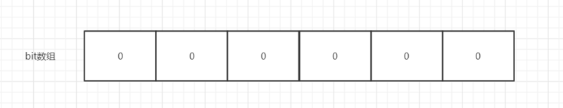

​										布隆过滤器示意图

```tex
	位数组中的每个元素都只占用 1 bit ，并且每个元素只能是 0 或者 1。这样申请一个 100w 个元素的位数组只占用  1000000 / 8 = 125000 B = 15625 byte ≈ 15.3kb 的空间。

	总结：一个名叫 Bloom 的人提出了一种来检索元素是否在给定大集合中的数据结构，这种数据结构是高效且性能很好的，但缺点是具有一定的错误识别率和删除难度。并且，理论情况下，添加到集合中的元素越多，误报的可能性就越大。
```

##### 2. 布隆过滤器的原理介绍

```tex
当一个元素加入布隆过滤器中的时候，会进行如下操作：
1. 使用布隆过滤器中的哈希函数对元素值进行计算，得到哈希值（有几个哈希函数得到几个哈希值）。
2. 根据得到的哈希值，在位数组中把对应下标的值置为 1。

当我们需要判断一个元素是否存在于布隆过滤器的时候，会进行如下操作：
1. 对给定元素再次进行相同的哈希计算；
2. 得到值之后判断位数组中的每个元素是否都为 1，如果值都为 1，那么说明这个值在布隆过滤器中，如果存在一个值不为 1，说明该元素不在布隆过滤器中。
```

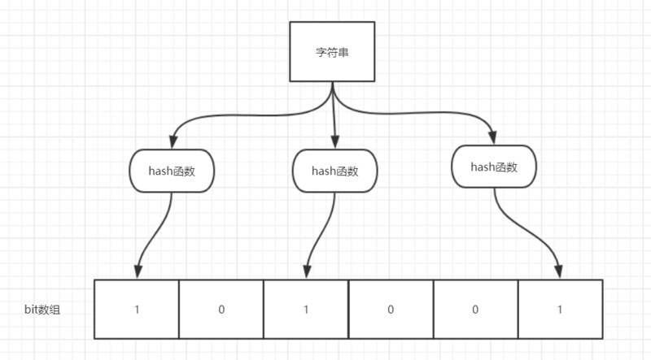

```tex
	如图所示，当字符串存储要加入到布隆过滤器中时，该字符串首先由多个哈希函数生成不同的哈希值，然后在对应的位数组的下表的元素设置为 1（当位数组初始化时 ，所有位置均为0）。当第二次存储相同字符串时，因为先前的对应位置已设置为1，所以很容易知道此值已经存在（去重非常方便）。

	如果我们需要判断某个字符串是否在布隆过滤器中时，只需要对给定字符串再次进行相同的哈希计算，得到值之后判断位数组中的每个元素是否都为 1，如果值都为 1，那么说明这个值在布隆过滤器中，如果存在一个值不为 1，说明该元素不在布隆过滤器中。

	不同的字符串可能哈希出来的位置相同，这种情况我们可以适当增加位数组大小或者调整我们的哈希函数。

	综上，我们可以得出：布隆过滤器说某个元素存在，小概率会误判。布隆过滤器说某个元素不在，那么这个元素一定不在。
```

##### 3. 布隆过滤器使用场景

```tex
1. 判断给定数据是否存在：比如判断一个数字是否在于包含大量数字的数字集中（数字集很大，5亿以上！）、 防止缓存穿透（判断请求的数据是否有效避免直接绕过缓存请求数据库）等等、邮箱的垃圾邮件过滤、黑名单功能等等。
2. 去重：比如爬给定网址的时候对已经爬取过的 URL 去重。
```

##### 4. 通过 Java 编程手动实现布隆过滤器

```tex
我们上面已经说了布隆过滤器的原理，知道了布隆过滤器的原理之后就可以自己手动实现一个了。

如果你想要手动实现一个的话，你需要：
	1. 一个合适大小的位数组保存数据
	2. 几个不同的哈希函数
	3. 添加元素到位数组（布隆过滤器）的方法实现
	4. 判断给定元素是否存在于位数组（布隆过滤器）的方法实现。
下面给出一个我觉得写的还算不错的代码（参考网上已有代码改进得到，对于所有类型对象皆适用）：
```

```java
import java.util.BitSet;

public class MyBloomFilter {

    /**
     * 位数组的大小
     */
    private static final int DEFAULT_SIZE = 2 << 24;
    /**
     * 通过这个数组可以创建 6 个不同的哈希函数
     */
    private static final int[] SEEDS = new int[]{3, 13, 46, 71, 91, 134};

    /**
     * 位数组。数组中的元素只能是 0 或者 1
     */
    private BitSet bits = new BitSet(DEFAULT_SIZE);

    /**
     * 存放包含 hash 函数的类的数组
     */
    private SimpleHash[] func = new SimpleHash[SEEDS.length];

    /**
     * 初始化多个包含 hash 函数的类的数组，每个类中的 hash 函数都不一样
     */
    public MyBloomFilter() {
        // 初始化多个不同的 Hash 函数
        for (int i = 0; i < SEEDS.length; i++) {
            func[i] = new SimpleHash(DEFAULT_SIZE, SEEDS[i]);
        }
    }

    /**
     * 添加元素到位数组
     */
    public void add(Object value) {
        for (SimpleHash f : func) {
            bits.set(f.hash(value), true);
        }
    }

    /**
     * 判断指定元素是否存在于位数组
     */
    public boolean contains(Object value) {
        boolean ret = true;
        for (SimpleHash f : func) {
            ret = ret && bits.get(f.hash(value));
        }
        return ret;
    }

    /**
     * 静态内部类。用于 hash 操作！
     */
    public static class SimpleHash {

        private int cap;
        private int seed;

        public SimpleHash(int cap, int seed) {
            this.cap = cap;
            this.seed = seed;
        }

        /**
         * 计算 hash 值
         */
        public int hash(Object value) {
            int h;
            return (value == null) ? 0 : Math.abs(seed * (cap - 1) & ((h = value.hashCode()) ^ (h >>> 16)));
        }

    }
}
```

**测试**

```java
  		String value1 = "https://javaguide.cn/";
        String value2 = "https://github.com/Snailclimb";
        MyBloomFilter filter = new MyBloomFilter();
        System.out.println(filter.contains(value1));
        System.out.println(filter.contains(value2));
        filter.add(value1);
        filter.add(value2);
        System.out.println(filter.contains(value1));
        System.out.println(filter.contains(value2));
================================================================================
  		false
		false
		true
		true
```

```java
        Integer value1 = 13423;
        Integer value2 = 22131;
        MyBloomFilter filter = new MyBloomFilter();
        System.out.println(filter.contains(value1));
        System.out.println(filter.contains(value2));
        filter.add(value1);
        filter.add(value2);
        System.out.println(filter.contains(value1));
        System.out.println(filter.contains(value2));
===============================================================================
  		false
		false
		true
		true
```

#####5. 利用Google开源的 Guava中自带的布隆过滤器

```tex
	自己实现的目的主要是为了让自己搞懂布隆过滤器的原理，Guava 中布隆过滤器的实现算是比较权威的，所以实际项目中我们不需要手动实现一个布隆过滤器。

首先我们需要在项目中引入 Guava 的依赖：
```

```xml
        <dependency>
            <groupId>com.google.guava</groupId>
            <artifactId>guava</artifactId>
            <version>28.0-jre</version>
        </dependency>
```

```tex
实际使用如下：

我们创建了一个最多存放 最多 1500个整数的布隆过滤器，并且我们可以容忍误判的概率为百分之（0.01）
```

```java
 	 	// 创建布隆过滤器对象
        BloomFilter<Integer> filter = BloomFilter.create(
                Funnels.integerFunnel(),
                1500,
                0.01);
        // 判断指定元素是否存在
        System.out.println(filter.mightContain(1));
        System.out.println(filter.mightContain(2));
        // 将元素添加进布隆过滤器
        filter.put(1);
        filter.put(2);
        System.out.println(filter.mightContain(1));
        System.out.println(filter.mightContain(2));
```

```tex
	在我们的示例中，当mightContain（） 方法返回true时，我们可以99％确定该元素在过滤器中，当过滤器返回false时，我们可以100％确定该元素不存在于过滤器中。

	Guava 提供的布隆过滤器的实现还是很不错的（想要详细了解的可以看一下它的源码实现），但是它有一个重大的缺陷就是只能单机使用（另外，容量扩展也不容易），而现在互联网一般都是分布式的场景。为了解决这个问题，我们就需要用到 Redis 中的布隆过滤器了。
```

### 计算机网络

#### 基础知识

##### 1. Get和Post区别

```tex
1. Get是不安全的，因为在传输过程，数据被放在请求的URL中；Post的所有操作对用户来说都是不可见的。
2. Get传送的数据量较小，这主要是因为受URL长度限制；Post传送的数据量较大，一般被默认为不受限制。
3. Get限制Form表单的数据集的值必须为ASCII字符；而Post支持整个ISO10646字符集。
4. Get执行效率却比Post方法好。Get是form提交的默认方法。
5. GET产生一个TCP数据包；POST产生两个TCP数据包。（非必然，客户端可灵活决定）
```

##### 2. Http请求的完全过程

```tex
1. 浏览器根据域名解析IP地址（DNS）,并查DNS缓存
2. 浏览器与WEB服务器建立一个TCP连接
3. 浏览器给WEB服务器发送一个HTTP请求（GET/POST）：一个HTTP请求报文由请求行（request line）、请求头部（headers）、空行（blank line）和请求数据（request body）4个部分组成。
4. 服务端响应HTTP响应报文，报文由状态行（status line）、相应头部（headers）、空行（blank line）和响应数据（response body）4个部分组成。
5. 浏览器解析渲染
```

##### 3. tcp和udp区别

```tex
1. TCP面向连接，UDP是无连接的，即发送数据之前不需要建立连接。
2. TCP提供可靠的服务。也就是说，通过TCP连接传送的数据，无差错，不丢失，不重复，且按序到达;UDP尽最大努力交付，即不保证可靠交付。
3. TCP面向字节流，实际上是TCP把数据看成一连串无结构的字节流，UDP是面向报文的，UDP没有拥塞控制，因此网络出现拥塞不会使源主机的发送速率降低（对实时应用很有用，如IP电话，实时视频会议等）
4. 每一条TCP连接只能是点到点的，UDP支持一对一，一对多，多对一和多对多的交互通信。
5. TCP首部开销20字节，UDP的首部开销小，只有8个字节。
6. TCP的逻辑通信信道是全双工的可靠信道，UDP则是不可靠信道。
```

#####4. tcp和udp的优点 

```tex
	TCP的优点：可靠，稳定 TCP的可靠体现在TCP在传递数据之前，会有三次握手来建立连接，而且在数据传递时，有确认、窗口、重传、拥塞控制机制，在数据传完后，还会断开连接用来节约系统资源。TCP的缺点：慢，效率低，占用系统资源高，易被攻击 TCP在传递数据之前，要先建连接，这会消耗时间，而且在数据传递时，确认机制、重传机制、拥塞控制机制等都会消耗大量的时间，而且要在每台设备上维护所有的传输连接，事实上，每个连接都会占用系统的CPU、内存等硬件资源。而且，因为TCP有确认机制、三次握手机制，这些也导致TCP容易被人利用，实现DOS、DDOS、CC等攻击。
	UDP的优点：快，比TCP稍安全 UDP没有TCP的握手、确认、窗口、重传、拥塞控制等机制，UDP是一个无状态的传输协议，所以它在传递数据时非常快。没有TCP的这些机制，UDP较TCP被攻击者利用的漏洞就要少一些。但UDP也是无法避免攻击的，比如：UDP Flood攻击…… UDP的缺点：不可靠，不稳定 因为UDP没有TCP那些可靠的机制，在数据传递时，如果网络质量不好，就会很容易丢包。基于上面的优缺点，那么：什么时候应该使用TCP：当对网络通讯质量有要求的时候，比如：整个数据要准确无误的传递给对方，这往往用于一些要求可靠的应用，比如HTTP、HTTPS、FTP等传输文件的协议，POP、SMTP等邮件传输的协议。在日常生活中，常见使用TCP协议的应用如下：浏览器，用的HTTP FlashFXP，用的FTP Outlook，用的POP、SMTP Putty，用的Telnet、SSH QQ文件传输。什么时候应该使用UDP：当对网络通讯质量要求不高的时候，要求网络通讯速度能尽量的快，这时就可以使用UDP。比如，日常生活中，常见使用UDP协议的应用如下：QQ语音 QQ视频 TFTP。
```

##### 5. 三次握手

```tex
第一次握手：建立连接时，客户端发送syn包（syn=x）到服务器，并进入SYN_SENT状态，等待服务器确认；SYN：同步序列编号（Synchronize Sequence Numbers）。
第二次握手：服务器收到syn包，必须确认客户的SYN（ack=x+1），同时自己也发送一个SYN包（syn=y），即SYN+ACK包，此时服务器进入SYN_RECV状态；
第三次握手：客户端收到服务器的SYN+ACK包，向服务器发送确认包ACK(ack=y+1），此包发送完毕，客户端和服务器进入ESTABLISHED（TCP连接成功）状态，完成三次握手。
```

##### 6. 为什么不能两次握手

```tex
TCP是一个双向通信协议，通信双方都有能力发送信息，并接收响应。如果只是两次握手， 至多只有连接发起方的起始序列号能被确认， 另一方选择的序列号则得不到确认
```

##### 7. 四次挥手

```tex
1. 客户端进程发出连接释放报文，并且停止发送数据。释放数据报文首部，FIN=1，其序列号为seq=u（等于前面已经传送过来的数据的最后一个字节的序号加1），此时，客户端进入FIN-WAIT-1（终止等待1）状态。TCP规定，FIN报文段即使不携带数据，也要消耗一个序号。
2. 服务器收到连接释放报文，发出确认报文，ACK=1，ack=u+1，并且带上自己的序列号seq=v，此时，服务端就进入了CLOSE-WAIT（关闭等待）状态。TCP服务器通知高层的应用进程，客户端向服务器的方向就释放了，这时候处于半关闭状态，即客户端已经没有数据要发送了，但是服务器若发送数据，客户端依然要接受。这个状态还要持续一段时间，也就是整个CLOSE-WAIT状态持续的时间。
3. 客户端收到服务器的确认请求后，此时，客户端就进入FIN-WAIT-2（终止等待2）状态，等待服务器发送连接释放报文（在这之前还需要接受服务器发送的最后的数据）。
4. 服务器将最后的数据发送完毕后，就向客户端发送连接释放报文，FIN=1，ack=u+1，由于在半关闭状态，服务器很可能又发送了一些数据，假定此时的序列号为seq=w，此时，服务器就进入了LAST-ACK（最后确认）状态，等待客户端的确认。
5. 客户端收到服务器的连接释放报文后，必须发出确认，ACK=1，ack=w+1，而自己的序列号是seq=u+1，此时，客户端就进入了TIME-WAIT（时间等待）状态。注意此时TCP连接还没有释放，必须经过2∗∗MSL（最长报文段寿命）的时间后，当客户端撤销相应的TCB后，才进入CLOSED状态。
6. 服务器只要收到了客户端发出的确认，立即进入CLOSED状态。同样，撤销TCB后，就结束了这次的TCP连接。可以看到，服务器结束TCP连接的时间要比客户端早一些更多面试题关注订阅号果汁简历，回复面试获取。
```

##### 8. 为什么连接的时候是三次握手，关闭的时候却是四次握手

```tex
因为当Server端收到Client端的SYN连接请求报文后，可以直接发送SYN+ACK报文。其中ACK报文是用来应答的，SYN报文是用来同步的。但是关闭连接时，当Server端收到FIN报文时，很可能并不会立即关闭SOCKET，所以只能先回复一个ACK报文，告诉Client端，"你发的FIN报文我收到了"。只有等到我Server端所有的报文都发送完了，我才能发送FIN报文，因此不能一起发送。故需要四步握手。
```


### 操作系统

#### 其他

##### 1. 进程和线程

```tex
1. 进程是操作系统资源分配的最小单位，线程是CPU任务调度的最小单位。一个进程可以包含多个线程，所以进程和线程都是一个时间段的描述，是CPU工作时间段的描述，不过是颗粒大小不同。
2. 不同进程间数据很难共享，同一进程下不同线程间数据很易共享。
3. 每个进程都有独立的代码和数据空间，进程要比线程消耗更多的计算机资源。线程可以看做轻量级的进程，同一类线程共享代码和数据空间，每个线程都有自己独立的运行栈和程序计数器，线程之间切换的开销小。
4. 进程间不会相互影响，一个线程挂掉将导致整个进程挂掉。
5. 系统在运行的时候会为每个进程分配不同的内存空间；而对线程而言，除了CPU外，系统不会为线程分配内存（线程所使用的资源来自其所属进程的资源），线程组之间只能共享资源。
```

##### 2. 进程的组成部分

```tex
进程由进程控制块（PCB）、程序段、数据段三部分组成。
```

##### 3. 进程的通信方式

```tex
1. 无名管道：半双工的，即数据只能在一个方向上流动，只能用于具有亲缘关系的进程之间的通信，可以看成是一种特殊的文件，对于它的读写也可以使用普通的read、write 等函数。但是它不是普通的文件，并不属于其他任何文件系统，并且只存在于内存中。
2. FIFO命名管道：FIFO是一种文件类型，可以在无关的进程之间交换数据，与无名管道不同，FIFO有路径名与之相关联，它以一种特殊设备文件形式存在于文件系统中。
3. 消息队列：消息队列，是消息的链接表，存放在内核中。一个消息队列由一个标识符（即队列ID）来标识。
4. 信号量：信号量是一个计数器，信号量用于实现进程间的互斥与同步，而不是用于存储进程间通信数据。
5. 共享内存：共享内存指两个或多个进程共享一个给定的存储区，一般配合信号量使用。
```

##### 4. 进程间五种通信方式的比较

```tex
1. 管道：速度慢，容量有限，只有父子进程能通讯。
2. FIFO：任何进程间都能通讯，但速度慢。
3. 消息队列：容量受到系统限制，且要注意第一次读的时候，要考虑上一次没有读完数据的问题。
4. 信号量：不能传递复杂消息，只能用来同步。
5. 共享内存区：能够很容易控制容量，速度快，但要保持同步，比如一个进程在写的时候，另一个进程要注意读写的问题，相当于线程中的线程安全，当然，共享内存区同样可以用作线程间通讯，不过没这个必要，线程间本来就已经共享了同一进程内的一块内存。
```

##### 5. 死锁的4个必要条件

```tex
1. 互斥条件：一个资源每次只能被一个线程使用；
2. 请求与保持条件：一个线程因请求资源而阻塞时，对已获得的资源保持不放；
3. 不剥夺条件：进程已经获得的资源，在未使用完之前，不能强行剥夺；
4. 循环等待条件：若干线程之间形成一种头尾相接的循环等待资源关系。
```

##### 6. 如何避免（预防）死锁

```tex
1. 破坏“请求和保持”条件：让进程在申请资源时，一次性申请所有需要用到的资源，不要一次一次来申请，当申请的资源有一些没空，那就让线程等待。不过这个方法比较浪费资源，进程可能经常处于饥饿状态。还有一种方法是，要求进程在申请资源前，要释放自己拥有的资源。
2. 破坏“不可抢占”条件：允许进程进行抢占，方法一：如果去抢资源，被拒绝，就释放自己的资源。方法二：操作系统允许抢，只要你优先级大，可以抢到。
3. 破坏“循环等待”条件：将系统中的所有资源统一编号，进程可在任何时刻提出资源申请，但所有申请必须按照资源的编号顺序提出（指定获取锁的顺序，顺序加锁）。
```


### 分布式相关

#### Dubbo

##### 1. Dubbo的容错机制

```tex
1. 失败自动切换，当出现失败，重试其它服务器。通常用于读操作，但重试会带来更长延迟。可通过 retries="2" 来设置重试次数
2. 快速失败，只发起一次调用，失败立即报错。通常用于非幂等性的写操作，比如新增记录。
3. 失败安全，出现异常时，直接忽略。通常用于写入审计日志等操作。
4. 失败自动恢复，后台记录失败请求，定时重发。通常用于消息通知操作。
5. 并行调用多个服务器，只要一个成功即返回。通常用于实时性要求较高的读操作，但需要浪费更多服务资源。可通过 forks="2" 来设置最大并行数。
6. 广播调用所有提供者，逐个调用，任意一台报错则报错。通常用于通知所有提供者更新缓存或日志等本地资源信息
```

##### 2. Dubbo注册中心挂了还可以继续通信么

```tex
可以，因为刚开始初始化的时候，消费者会将提供者的地址等信息拉取到本地缓存，所以注册中心挂了可以继续通信。
```

##### 3. Dubbo框架设计结构

```tex
1. 服务接口层：该层是与实际业务逻辑相关的，根据服务提供方和服务消费方的业务设计对应的接口和实现。
2. 配置层：对外配置接口，以ServiceConfig和ReferenceConfig为中心，可以直接new配置类，也可以通过spring解析配置生成配置类。
3. 服务代理层：服务接口透明代理，生成服务的客户端Stub和服务器端Skeleton，以ServiceProxy为中心，扩展接口为ProxyFactory。
4. 服务注册层：封装服务地址的注册与发现，以服务URL为中心，扩展接口为RegistryFactory、Registry和RegistryService。可能没有服务注册中心，此时服务提供方直接暴露服务。
5. 集群层：封装多个提供者的路由及负载均衡，并桥接注册中心，以Invoker为中心，扩展接口为Cluster、Directory、Router和LoadBalance。将多个服务提供方组合为一个服务提供方，实现对服务消费方来透明，只需要与一个服务提供方进行交互。
6. 监控层：RPC调用次数和调用时间监控，以Statistics为中心，扩展接口为MonitorFactory、Monitor和MonitorService。
7. 远程调用层：封将RPC调用，以Invocation和Result为中心，扩展接口为Protocol、Invoker和Exporter。Protocol是服务域，它是Invoker暴露和引用的主功能入口，它负责Invoker的生命周期管理。Invoker是实体域，它是Dubbo的核心模型，其它模型都向它靠扰，或转换成它，它代表一个可执行体，可向它发起invoke调用，它有可能是一个本地的实现，也可能是一个远程的实现，也可能一个集群实现。
8. 信息交换层：封装请求响应模式，同步转异步，以Request和Response为中心，扩展接口为Exchanger、ExchangeChannel、ExchangeClient和ExchangeServer。
9. 网络传输层：抽象mina和netty为统一接口，以Message为中心，扩展接口为Channel、Transporter、Client、Server和Codec。
10. 数据序列化层：可复用的一些工具，扩展接口为Serialization、 ObjectInput、ObjectOutput和ThreadPool。
```


### 消息队列

#### RocketMq

##### 1. 为什么需要消息队列

```tex
1. 解耦
2. 异步处理
3. 削峰/限流
```

#####2. rocketmq部署

###### 1、双机房双节点

```tex
节点A 周浦（10.249.136.93）
节点B 南汇（10.249.130.84）
```

修改安装和数据保存磁盘

使用lsblk命令查看/opt目录所使用的盘符名,如下图


将盘符名替换/opt/rocketmq-all-4.3.2-bin-release/os.sh脚本中的$DISK后使用root执行该脚本；

######2、安装rocketmq

**2.1.下载文件**

从mirrors.deppon.com介质库的mq/RocketMQ4.3目录中下载jdk8.0_201.zip与rocketmq-all-4.3.2-bin-release.tar.gz，上传到所需安装的每个分区的的/opt目录下


**2.2.解压介质,执行**

unzip jdk1.8.0_201.zip

tar zxvf rocketmq-all-4.3.2-bin-release.tar.gz

**2.3.修改java介质执行权限，执行**

chmod -R 775 jdk1.8.0_201

**2.4.配置java环境变量**

(appman用户)，执行vi /home/appman/.bash_profile

加入以下内容并保存

export JAVA_HOME=/opt/jdk1.8.0_201

export PATH=$JAVA_HOME/bin:$PATH

export CLASSPATH=.:$JAVA_HOME/lib/dt.jar:$JAVA_HOME/lib/tools.jar

6.

**2.5.验证java环境**

使用appman用户重新登录，执行java –version，显示如图则成功


#####3.修改配置文件

**3.1.修改broker启动脚本的内存设置**

修改/opt/rocketmq-all-4.3.2-bin-release/bin/runbroker.sh启动文件中的最大最小内存为4G，年轻代内存为2G，如图：


**3.2.RocketMQ配置**

修改properties配置文件

cd /opt/rocketmq-all-4.3.2-bin-release/conf/2m-2s-async

broker-a.properties:主节点配置文件

broker-a-s.properties:从节点配置文件


-------------------------------------------------主要是这两个配置文件--------------------------------------------------------

1. 主节点配置修改

   

2. BrokerName规范：

   ​              第一个主节点名为c1-m1，第二个主节点名为c1-m2，以此类推。

   ​              如一个域有第二套环境，则主节点名c2-m1，以此类推。

3. 监听端口规范：

   ​              统一主节点为10910，从节点为20910。

4. 从节点配置修改

   

5. 备节点的brokerName填写所备的主节点的brokerName。

   ​     消息存放地址的最下层目录对应所备主节点的brokerName，改为c1-s2(节点1上的备节点连接的是节点2的)主节点。

   ​     BrokerRole为SLAVE

6. 日志目录修改,修改/opt/rocketmq-all-4.3.2-bin-release/conf目录下的3个日志配置文件，将三个配置文件中的所有${user.home}替换为/opt/rocketmq-all-4.3.2-bin-release,如下图所示：

   

#####4.启停RocketMQ

1. 启动NAMESRV

   ```shell
   nohup sh /opt/rocketmq-all-4.3.2-bin-release/bin/mqnamesrv &
   ```

2. 启动主节点broker

   ```shell
   nohup   sh /opt/rocketmq-all-4.3.2-bin-release/bin/mqbroker -c /opt/rocketmq-all-4.3.2-bin-release/conf/2m-2s-async/broker-a.properties &
   ```

3. 启动从节点

   ```shell
   nohup sh /opt/rocketmq-all-4.3.2-bin-release/bin/mqbroker -c /opt/rocketmq-all-4.3.2-bin-release/conf/2m-2s-async/broker-a-s.properties &
   ```

4. 启动脚本

   启动命令在启动脚本/opt/rocketmq-all-4.3.2-bin-release/runmq.sh中可见，亦可执行该脚本启动。（原则上先启动主节点，再启动该主节点对应的备节点）

   

5. 启动验证

   执行ps –ef|grep rocketmq查看相关进程状态，或使用内置命令jps查看均可

   

6. 停止RMQ

   使用kill命令查杀进程号即可，正常停止原则上先停备节点，再停对应的主节点

   --关闭nameserver和所有的broker:
      sh mqshutdown namesrv
      sh mqshutdown broker  注：避免使用kill -9，以免引起消息无法落盘的BUG

7. 控制台配置

   登陆RMQ控制台程序分区10.249.141.42,在/app目录下创建BASIC4(代表4.3版本)目录。 

   

8. ​

   从其他目录下复制两个配置文件到该目录下

   

​    

1. 修改两个配置文件相关参数，如下图：

   

   

启动控制台

```shell
nohup /app/jdk1.8.0_77/bin/java -jar /app/jar/rocketmq-console-ng-3.0.0.jar --spring.config.location=/app/BASIC4/BASIC_application.properties &
```

验证

```tex
登陆10.249.141.42:8182打开控制台(端口号在配置文件中配置)

注：园区网访问控制台需要打通到10.249.141.42的端口防火墙。跳板机可以直接访问。也可访问域名rmqmn.deppon.com。

```

其他相关rocketmq常用命令：

```tex
--查看命令用法

   sh mqadmin
   sh mqadmin help updateTopic

--查看所有,新增，删除消费组group:

  sh mqadmin consumerProgress -n 192.168.186.10:9876
  sh mqadmin updateSubGroup -c rocketmq-cluster-a -n 192.168.186.10:9876 -g zkGroup
  sh mqadmin deleteSubGroup -c rocketmq-cluster-a -n 192.168.186.10:9876 -g zkGroup

--查看指定消费组下的所有topic数据堆积情况：

  sh mqadmin consumerProgress -n 192.168.186.10:9876 -g zkGroup
  
--删除topic，新增topic 删除topic

   sh mqadmin topicList -n 192.168.186.10:9876

   sh mqadmin updateTopic -c rocketmq-cluster-a -n 192.168.186.10:9876 -t zkTopic

  sh mqadmin deleteTopic –n 192.168.186.10:9876 –c rocketmq-cluster-a –t zkTopic

--查看topic信息列表详情统计

  sh mqadmin topicstatus -n 192.168.186.10:9876 -t zkTopic

--查询集群消息

   sh mqadmin clusterList -n 192.168.186.10:9876

```

##### 5. RocketMQ消息不丢失

**概述**

```tex
分别从Producer发送机制、Broker的持久化机制，以及消费者的offSet机制来最大程度保证消息不易丢失

1. 从Producer的视角来看：如果消息未能正确的存储在MQ中，或者消费者未能正确的消费到这条消息，都是消息丢失。
2. 从Broker的视角来看：如果消息已经存在Broker里面了，如何保证不会丢失呢（宕机、磁盘崩溃）
3. 从Consumer的视角来看：如果消息已经完成持久化了，但是Consumer取了，但是未消费成功且没有反馈，就是消息丢失

```

**Producer**

```tex
从Producer分析：如何确保消息正确的发送到了Broker?

1. 默认情况下，可以通过同步的方式阻塞式的发送，check SendStatus，状态是OK，表示消息一定成功的投递到了Broker，状态超时或者失败，则会触发默认的2次重试。此方法的发送结果，可能Broker存储成功了，也可能没成功
2. 采取事务消息的投递方式，并不能保证消息100%投递成功到了Broker，但是如果消息发送Ack失败的话，此消息会存储在CommitLog当中，但是对ConsumerQueue是不可见的。可以在日志中查看到这条异常的消息，严格意义上来讲，也并没有完全丢失
3. RocketMQ支持 日志的索引，如果一条消息发送之后超时，也可以通过查询日志的API，来check是否在Broker存储成功

```

**Broker**

```tex
从Broker分析：如果确保接收到的消息不会丢失?

1. 消息支持持久化到Commitlog里面，即使宕机后重启，未消费的消息也是可以加载出来的
2. Broker自身支持同步刷盘、异步刷盘的策略，可以保证接收到的消息一定存储在本地的内存中
3. Broker集群支持 1主N从的策略，支持同步复制和异步复制的方式，同步复制可以保证即使Master 磁盘崩溃，消息仍然不会丢失

```

**Consumer**

```tex
从Cunmser分析：如何确保拉取到的消息被成功消费？

1. 消费者可以根据自身的策略批量Pull消息
2. Consumer自身维护一个持久化的offset（对应MessageQueue里面的min offset），标记已经成功消费或者已经成功发回到broker的消息下标
3. 如果Consumer消费失败，那么它会把这个消息发回给Broker，发回成功后，再更新自己的offset
4. 如果Consumer消费失败，发回给broker时，broker挂掉了，那么Consumer会定时重试这个操作
5. 如果Consumer和broker一起挂了，消息也不会丢失，因为consumer 里面的offset是定时持久化的，重启之后，继续拉取offset之前的消息到本地

```


### Spring.io相关（Spring技术栈）

#### Spring相关

##### 1. 什么是三级缓存

```tex
1. 第一级缓存：单例缓存池singletonObjects。
2. 第二级缓存：早期提前暴露的对象缓存earlySingletonObjects。（属性还没有值对象也没有被初始化）
3. 第三级缓存：singletonFactories单例对象工厂缓存。
```

##### 2. 创建Bean的整个过程

```tex
	1.getBean方法肯定不陌生，必经之路，然后调用doGetBean，进来以后首先会执行transformedBeanName找别名，看你的Bean上面是否起了别名。然后进行很重要的一步，getSingleton，这段代码就是从你的单例缓存池中获取Bean的实例。那么你第一次进来肯定是没有的，缓存里肯定是拿不到的。也就是一级缓存里是没有的。那么它怎么办呢？他会尝试去二级缓存中去拿，但是去二级缓存中拿并不是无条件的，首先要判断isSingletonCurrentlyInCreation(beanName)他要看你这个对象是否正在创建当中，如果不是直接就退出该方法，如果是的话，他就会去二级缓存earlySingletonObjects里面取，如果没拿到，它还接着判断allowEarlyReference这个东西是否为true。它的意思是说，是否允许让你从单例工厂对象缓存中去拿对象。默认为true。好了，此时如果进来那么就会通过singletonFactory.getObject()去单例工厂缓存中去拿。然后将缓存级别提升至二级缓存也就早期暴露的缓存。
	2. getSingleton执行完以后会走dependsOn方法，判断是否有dependsOn标记的循环引用，有的话直接卡死，抛出异常。比如说A依赖于B，B依赖于A 通过dependsOn注解去指定。此时执行到这里就会抛出异常。这里所指并非是构造函数的循环依赖。
	3. beforeSingletonCreation在这里方法里。就把你的对象标记为了早期暴露的对象。提前暴露对象用于创建Bean的实例。
	4. 紧接着就走创建Bean的流程开始。在创建Bean之前执行了一下resolveBeforeInstantiation。它的意思是说，代理AOPBean定义注册信息但是这里并不是实际去代理你的对象，因为对象还没有被创建。只是代理了Bean定义信息，还没有被实例化。把Bean定义信息放进缓存，以便我想代理真正的目标对象的时候，直接去缓存里去拿。
	5. 接下来就真正的走创建Bean流程，首先走进真正做事儿的方法doCreateBean然后找到createBeanInstance这个方法，在这里面它将为你创建你的Bean实例信息（Bean的实例）。如果说创建成功了，那么就把你的对象放入缓存中去（将创建好的提前曝光的对象放入singletonFactories三级缓存中）将对象从二级缓存中移除因为它已经不是提前暴露的对象了。但是。如果说在createBeanInstance这个方法中在创建Bean的时候它会去检测你的依赖关系，会去检测你的构造器。然后，如果说它在创建A对象的时候，发现了构造器里依赖了B，然后它又会重新走getBean的这个流程，当在走到这里的时候，又发现依赖了A此时就会抛出异常。为什么会抛出异常，因为，走getBean的时候他会去从你的单例缓存池中去拿，因为你这里的Bean还没有被创建好。自然不会被放进缓存中，所以它是在缓存中拿不到B对象的。反过来也是拿不到A对象的。造成了死循环故此直接抛异常。这就是为什么Spring IOC不能解决构造器循环依赖的原因。因为你还没来的急放入缓存你的对象是不存在的。所以不能创建。同理@Bean标注的循环依赖方法也是不能解决的，跟这个同理。那么多例就更不能解决了。为什么？因为在走createBeanInstance的时候，会判断是否是单例的Bean定义信息mbd.isSingleton()；如果是才会进来。所以多例的Bean压根就不会走进来，而是走了另一段逻辑，这里不做介绍。至此，构造器循环依赖和@Bean的循环依赖还有多例Bean的循环依赖为什么不能解决已经解释清楚。然后如果说，Bean创建成功了。那么会走后面的逻辑。
	6. 将创建好的Bean放入缓存，addSingletonFactory方法就是将你创建好的Bean放入三级缓存中。并且移除早期暴露的对象。
	7. 通过populateBean给属性赋值，我们知道，创建好的对象，并不是一个完整的对象，里面的属性还没有被赋值。所以这个方法就是为创建好的Bean为它的属性赋值。并且调用了我们实现的的XXXAware接口进行回调初始化，。然后调用我们实现的Bean的后置处理器，给我们最后一次机会去修改Bean的属性。
```

##### 3. Spring如何解决循环依赖问题

```tex
	Spring使用了三级缓存解决了循环依赖的问题。在populateBean()给属性赋值阶段里面Spring会解析你的属性，并且赋值，当发现，A对象里面依赖了B，此时又会走getBean方法，但这个时候，你去缓存中是可以拿的到的。因为我们在对createBeanInstance对象创建完成以后已经放入了缓存当中，所以创建B的时候发现依赖A，直接就从缓存中去拿，此时B创建完，A也创建完，一共执行了4次。至此Bean的创建完成，最后将创建好的Bean放入单例缓存池中。
```

##### 4. BeanFactory和ApplicationContext的区别

```tex
	1.BeanFactory是Spring里面最低层的接口，提供了最简单的容器的功能，只提供了实例化对象和拿对象的功能。
ApplicationContext应用上下文，继承BeanFactory接口，它是Spring的一各更高级的容器，提供了更多的有用的功能。如国际化，访问资源，载入多个（有继承关系）上下文 ，使得每一个上下文都专注于一个特定的层次，消息发送、响应机制，AOP等。
	2. BeanFactory在启动的时候不会去实例化Bean，中有从容器中拿Bean的时候才会去实例化。				3.ApplicationContext在启动的时候就把所有的Bean全部实例化了。它还可以为Bean配置lazy-init=true来让Bean延迟实例化
```

##### 5. 动态代理的实现方式，AOP的实现方式

```tex
1. JDK动态代理：利用反射机制生成一个实现代理接口的匿名类，在调用具体方法前调用InvokeHandler来处理。
2. CGlib动态代理：利用ASM（开源的Java字节码编辑库，操作字节码）开源包，将代理对象类的class文件加载进来，通过修改其字节码生成子类来处理。

区别：JDK代理只能对实现接口的类生成代理；CGlib是针对类实现代理，对指定的类生成一个子类，并覆盖其中的方法，这种通过继承类的实现方式，不能代理final修饰的类。
```

##### 6. Spring的的事务传播机制

```tex
1. REQUIRED（默认）：支持使用当前事务，如果当前事务不存在，创建一个新事务。
2. SUPPORTS：支持使用当前事务，如果当前事务不存在，则不使用事务。
3. MANDATORY：强制，支持使用当前事务，如果当前事务不存在，则抛出Exception。
4. REQUIRES_NEW：创建一个新事务，如果当前事务存在，把当前事务挂起。
5. NOT_SUPPORTED：无事务执行，如果当前事务存在，把当前事务挂起。
6. NEVER：无事务执行，如果当前有事务则抛出Exception。
7. NESTED：嵌套事务，如果当前事务存在，那么在嵌套的事务中执行。如果当前事务不存在，则表现跟REQUIRED一样。
```

##### 7. Spring的后置处理器

```tex
1. BeanPostProcessor：Bean的后置处理器，主要在bean初始化前后工作。
2. InstantiationAwareBeanPostProcessor：继承于BeanPostProcessor，主要在实例化bean前后工作；AOP创建代理对象就是通过该接口实现。
3. BeanFactoryPostProcessor：Bean工厂的后置处理器，在bean定义(bean definitions)加载完成后，bean尚未初始化前执行。
4. BeanDefinitionRegistryPostProcessor：继承于BeanFactoryPostProcessor。其自定义的方法postProcessBeanDefinitionRegistry会在bean定义(bean definitions)将要加载，bean尚未初始化前真执行，即在BeanFactoryPostProcessor的postProcessBeanFactory方法前被调用
```


### Java基础相关

#### Java基础

##### 1. HashSet和HashMap

```tex
HashSet的value存的是一个static finial PRESENT = newObject()。而HashSet的remove是使用HashMap实现,则是map.remove而map的移除会返回value,如果底层value都是存null,显然将无法分辨是否移除成功。
```

#### JUC相关

##### 1.  HashMap和ConcurrentHashMap

```tex
由于HashMap是线程不同步的，虽然处理数据的效率高，但是在多线程的情况下存在着安全问题，因此设计了CurrentHashMap来解决多线程安全问题。

HashMap在put的时候，插入的元素超过了容量（由负载因子决定）的范围就会触发扩容操作，就是rehash，这个会重新将原数组的内容重新hash到新的扩容数组中，在多线程的环境下，存在同时其他的元素也在进行put操作，如果hash值相同，可能出现同时在同一数组下用链表表示，造成闭环，导致在get时会出现死循环，所以HashMap是线程不安全的。

HashMap的环：若当前线程此时获得ertry节点，但是被线程中断无法继续执行，此时线程二进入transfer函数，并把函数顺利执行，此时新表中的某个位置有了节点，之后线程一获得执行权继续执行，因为并发transfer，所以两者都是扩容的同一个链表，当线程一执行到e.next = new table[i] 的时候，由于线程二之前数据迁移的原因导致此时new table[i] 上就有ertry存在，所以线程一执行的时候，会将next节点，设置为自己，导致自己互相使用next引用对方，因此产生链表，导致死循环。

在JDK1.7版本中，ConcurrentHashMap维护了一个Segment数组，Segment这个类继承了重入锁ReentrantLock，并且该类里面维护了一个 HashEntry[] table数组，在写操作put，remove，扩容的时候，会对Segment加锁，所以仅仅影响这个Segment，不同的Segment还是可以并发的，所以解决了线程的安全问题，同时又采用了分段锁也提升了并发的效率。在JDK1.8版本中，ConcurrentHashMap摒弃了Segment的概念，而是直接用Node数组+链表+红黑树的数据结构来实现，并发控制使用Synchronized和CAS来操作，整个看起来就像是优化过且线程安全的HashMap。
```

##### 2. HashMap如果我想要让自己的Object作为K应该怎么办

```tex
1. 重写hashCode()是因为需要计算存储数据的存储位置，需要注意不要试图从散列码计算中排除掉一个对象的关键部分来提高性能，这样虽然能更快但可能会导致更多的Hash碰撞；
2. 重写equals()方法，需要遵守自反性、对称性、传递性、一致性以及对于任何非null的引用值x，x.equals(null)必须返回false的这几个特性，目的是为了保证key在哈希表中的唯一性；
```

##### 3. volatile

```tex
	1. volatile在多处理器开发中保证了共享变量的“ 可见性”。可见性的意思是当一个线程修改一个共享变量时，另外一个线程能读到这个修改的值。(共享内存，私有内存)
	2. 禁止指令重排。
```

**synchronized 关键字和 volatile 关键字的区别**

```tex
synchronized关键字和volatile关键字比较
	1. volatile关键字是线程同步的轻量级实现，所以volatile性能肯定比synchronized关键字要好。但是volatile关键字只能用于变量而synchronized关键字可以修饰方法以及代码块。synchronized关键字在JavaSE1.6之后进行了主要包括为了减少获得锁和释放锁带来的性能消耗而引入的偏向锁和轻量级锁以及其它各种优化之后执行效率有了显著提升，实际开发中使用 synchronized 关键字的场景还是更多一些。
	2. 多线程访问volatile关键字不会发生阻塞，而synchronized关键字可能会发生阻塞
	3. volatile关键字能保证数据的可见性，但不能保证数据的原子性。synchronized关键字两者都能保证。
	4. volatile关键字主要用于解决变量在多个线程之间的可见性，而 synchronized关键字解决的是多个线程之间访问资源的同步性。
```

##### 4. Atomic类的CAS操作

```tex
	Atomic 翻译成中文是原子的意思。在化学上，我们知道原子是构成一般物质的最小单位，在化学反应中是不可分割的。在我们这里 Atomic 是指一个操作是不可中断的。即使是在多个线程一起执行的时候，一个操作一旦开始，就不会被其他线程干扰。
	所以，所谓原子类说简单点就是具有原子/原子操作特征的类。
	并发包 java.util.concurrent 的原子类都存放在java.util.concurrent.atomic下,如下图所示。
```

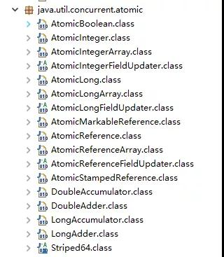

**JUC 包中的原子类是哪4类?**

```tex
基本类型
	使用原子的方式更新基本类型
		1. AtomicInteger：整形原子类
		2. AtomicLong：长整型原子类
		3. AtomicBoolean：布尔型原子类
数组类型
	使用原子的方式更新数组里的某个元素
		1. AtomicIntegerArray：整形数组原子类
		2. AtomicLongArray：长整形数组原子类
		3. AtomicReferenceArray：引用类型数组原子类
引用类型
	1. AtomicReference：引用类型原子类
	2. AtomicStampedReference：原子更新引用类型里的字段原子类
	3. AtomicMarkableReference ：原子更新带有标记位的引用类型
对象的属性修改类型
	1. AtomicIntegerFieldUpdater：原子更新整形字段的更新器
	2. AtomicLongFieldUpdater：原子更新长整形字段的更新器
	3. AtomicStampedReference：原子更新带有版本号的引用类型。该类将整数值与引用关联起来，可用于解决原子的更新数据和数据的版本号，可以解决使用 CAS 进行原子更新时可能出现的 ABA 问题
```

**AtomicInteger 的使用**

```java
public final int get() //获取当前的值
public final int getAndSet(int newValue)//获取当前的值，并设置新的值
public final int getAndIncrement()//获取当前的值，并自增
public final int getAndDecrement() //获取当前的值，并自减
public final int getAndAdd(int delta) //获取当前的值，并加上预期的值
boolean compareAndSet(int expect, int update) //如果输入的数值等于预期值，则以原子方式将该值设置为输入值（update）
public final void lazySet(int newValue)//最终设置为newValue,使用 lazySet 设置之后可能导致其他线程在之后
```

**AtomicInteger 类的使用示例**

```tex
使用 AtomicInteger 之后，不用对 increment() 方法加锁也可以保证线程安全。
```

```java
class AtomicIntegerTest {
        private AtomicInteger count = new AtomicInteger();
      //使用AtomicInteger之后，不需要对该方法加锁，也可以实现线程安全。
        public void increment() {
                  count.incrementAndGet();
        }
     
       public int getCount() {
                return count.get();
        }
}
```

**AtomicInteger 类的原理**

```java
// AtomicInteger 线程安全原理简单分析
// AtomicInteger 类的部分源码：
// setup to use Unsafe.compareAndSwapInt for updates（更新操作时提供“比较并替换”的作用）
    privatestaticfinal Unsafe unsafe = Unsafe.getUnsafe();
    privatestaticfinallong valueOffset;

    static {
        try {
            valueOffset = unsafe.objectFieldOffset
                (AtomicInteger.class.getDeclaredField("value"));
        } catch (Exception ex) { thrownew Error(ex); }
    }

    privatevolatileint value;
```

```tex
	AtomicInteger 类主要利用 CAS (compare and swap) + volatile 和 native 方法来保证原子操作，从而避免 synchronized 的高开销，执行效率大为提升。
	CAS的原理是拿期望的值和原本的一个值作比较，如果相同则更新成新的值。UnSafe 类的 objectFieldOffset() 方法是一个本地方法，这个方法是用来拿到“原来的值”的内存地址，返回值是 valueOffset。另外 value 是一个volatile变量，在内存中可见，因此 JVM 可以保证任何时刻任何线程总能拿到该变量的最新值。
```

```tex
	CAS是英文单词CompareAndSwap的缩写，中文意思是：比较并替换。CAS需要有3个操作数：内存地址V，旧的预期值A，即将要更新的目标值B。CAS指令执行时，当且仅当内存地址V的值与预期值A相等时，将内存地址V的值修改为B，否则就什么都不做。整个比较并替换的操作是一个原子操作。如 Intel 处理器，比较并交换通过指令的 cmpxchg 系列实现
```

##### 5. CAS操作ABA问题：

```tex
	如果在这段期间它的值曾经被改成了B，后来又被改回为A，那CAS操作就会误认为它从来没有被改变过。Java并发包为了解决这个问题，提供了一个带有标记的原子引用类“AtomicStampedReference”，它可以通过控制变量值的版本来保证CAS的正确性。
```

##### 6. Synchronized和Lock的区别

**synchronized 关键字**

```tex
	synchronized关键字解决的是多个线程之间访问资源的同步性，synchronized关键字可以保证被它修饰的方法或者代码块在任意时刻只能有一个线程执行。
	另外，在 Java 早期版本中，synchronized属于重量级锁，效率低下，因为监视器锁（monitor）是依赖于底层的操作系统的 Mutex Lock 来实现的，Java 的线程是映射到操作系统的原生线程之上的。如果要挂起或者唤醒一个线程，都需要操作系统帮忙完成，而操作系统实现线程之间的切换时需要从用户态转换到内核态，这个状态之间的转换需要相对比较长的时间，时间成本相对较高，这也是为什么早期的 synchronized 效率低的原因。庆幸的是在 Java 6 之后 Java 官方对从 JVM 层面对synchronized 较大优化，所以现在的 synchronized 锁效率也优化得很不错了。JDK1.6对锁的实现引入了大量的优化，如自旋锁、适应性自旋锁、锁消除、锁粗化、偏向锁、轻量级锁等技术来减少锁操作的开销。
```

**synchronized关键字最主要的三种使用方式**

```tex
	1. 修饰实例方法: 作用于当前对象实例加锁，进入同步代码前要获得当前对象实例的锁
	2. 修饰静态方法: 也就是给当前类加锁，会作用于类的所有对象实例，因为静态成员不属于任何一个实例对象，是类成员（ static 表明这是该类的一个静态资源，不管new了多少个对象，只有一份）。所以如果一个线程A调用一个实例对象的非静态 synchronized 方法，而线程B需要调用这个实例对象所属类的静态 synchronized 方法，是允许的，不会发生互斥现象，因为访问静态 synchronized 方法占用的锁是当前类的锁，而访问非静态 synchronized 方法占用的锁是当前实例对象锁。
	3. 修饰代码块: 指定加锁对象，对给定对象加锁，进入同步代码库前要获得给定对象的锁。
```

```tex
	总结： synchronized 关键字加到 static 静态方法和 synchronized(class)代码块上都是是给 Class 类上锁。synchronized 关键字加到实例方法上是给对象实例上锁。尽量不要使用 synchronized(String a) 因为JVM中，字符串常量池具有缓存功能！
下面我以一个常见的面试题为例讲解一下 synchronized 关键字的具体使用。
面试中面试官经常会说：“单例模式了解吗？来给我手写一下！给我解释一下双重检验锁方式实现单例模式的原理呗！”
```

**双重校验锁实现对象单例（线程安全）**

```java
publicclass Singleton {

    privatevolatilestatic Singleton uniqueInstance;

    private Singleton() {
    }

    public static Singleton getUniqueInstance() {
       //先判断对象是否已经实例过，没有实例化过才进入加锁代码
        if (uniqueInstance == null) {
            //类对象加锁
            synchronized (Singleton.class) {
                if (uniqueInstance == null) {
                    uniqueInstance = new Singleton();
                }
            }
        }
        return uniqueInstance;
    }
}
```

```tex
另外，需要注意 uniqueInstance 采用 volatile 关键字修饰也是很有必要。
uniqueInstance 采用 volatile 关键字修饰也是很有必要的， uniqueInstance = new Singleton(); 这段代码其实是分为三步执行：
	1. 为 uniqueInstance 分配内存空间
	2. 初始化 uniqueInstance
	3. 将 uniqueInstance 指向分配的内存地址
	
	但是由于 JVM 具有指令重排的特性，执行顺序有可能变成 1->3->2。指令重排在单线程环境下不会出现问题，但是在多线程环境下会导致一个线程获得还没有初始化的实例。例如，线程 T1 执行了 1 和 3，此时 T2 调用 getUniqueInstance() 后发现 uniqueInstance 不为空，因此返回 uniqueInstance，但此时 uniqueInstance 还未被初始化。
	使用 volatile 可以禁止 JVM 的指令重排，保证在多线程环境下也能正常运行。
```

**synchronized 关键字的底层原理**

```tex
synchronized 关键字底层原理属于 JVM 层面。
① synchronized 同步语句块的情况
```

```java
publicclass SynchronizedDemo {
	public void method() {
		synchronized (this) {
			System.out.println("synchronized 代码块");
		}
	}
}
```

```tex
	通过 JDK 自带的 javap 命令查看 SynchronizedDemo 类的相关字节码信息：首先切换到类的对应目录执行 javac SynchronizedDemo.java 命令生成编译后的 .class 文件，然后执行javap -c -s -v -l SynchronizedDemo.class。
```

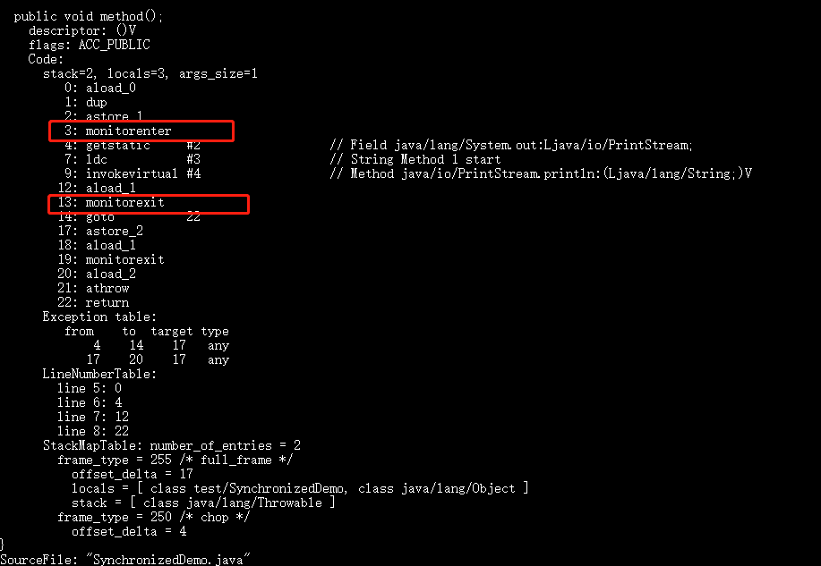

```tex
从上面我们可以看出：
	synchronized 同步语句块的实现使用的是 monitorenter 和 monitorexit 指令，其中 monitorenter 指令指向同步代码块的开始位置，monitorexit 指令则指明同步代码块的结束位置。 当执行 monitorenter 指令时，线程试图获取锁也就是获取 monitor(monitor对象存在于每个Java对象的对象头中，synchronized 锁便是通过这种方式获取锁的，也是为什么Java中任意对象可以作为锁的原因) 的持有权。当计数器为0则可以成功获取，获取后将锁计数器设为1也就是加1。相应的在执行 monitorexit 指令后，将锁计数器设为0，表明锁被释放。如果获取对象锁失败，那当前线程就要阻塞等待，直到锁被另外一个线程释放为止。
```

```tex
② synchronized 修饰方法的的情况
```

```java
publicclass SynchronizedDemo2 {
	public synchronized void method() {
		System.out.println("synchronized 方法");
	}
}
```

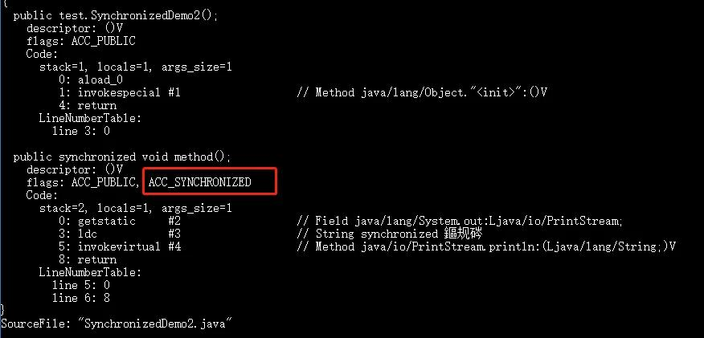

```tex
	synchronized 修饰的方法并没有 monitorenter 指令和 monitorexit 指令，取得代之的确实是 ACC_SYNCHRONIZED 标识，该标识指明了该方法是一个同步方法，JVM 通过该 ACC_SYNCHRONIZED 访问标志来辨别一个方法是否声明为同步方法，从而执行相应的同步调用。
```

**JDK1.6 之后的synchronized 关键字底层做了哪些优化**

```tex
	JDK1.6 对锁的实现引入了大量的优化，如偏向锁、轻量级锁、自旋锁、适应性自旋锁、锁消除、锁粗化等技术来减少锁操作的开销。
	锁主要存在四种状态，依次是：无锁状态、偏向锁状态、轻量级锁状态、重量级锁状态，他们会随着竞争的激烈而逐渐升级。注意锁可以升级不可降级，这种策略是为了提高获得锁和释放锁的效率。
```

**谈谈 synchronized和ReentrantLock 的区别**

```tex
① 两者都是可重入锁
	两者都是可重入锁。“可重入锁”概念是：自己可以再次获取自己的内部锁。比如一个线程获得了某个对象的锁，此时这个对象锁还没有释放，当其再次想要获取这个对象的锁的时候还是可以获取的，如果不可锁重入的话，就会造成死锁。同一个线程每次获取锁，锁的计数器都自增1，所以要等到锁的计数器下降为0时才能释放锁。
```

```tex
② synchronized 依赖于 JVM 而 ReentrantLock 依赖于 API
	synchronized 是依赖于 JVM 实现的，前面我们也讲到了 虚拟机团队在 JDK1.6 为 synchronized 关键字进行了很多优化，但是这些优化都是在虚拟机层面实现的，并没有直接暴露给我们。ReentrantLock 是 JDK 层面实现的（也就是 API 层面，需要 lock() 和 unlock() 方法配合 try/finally 语句块来完成），所以我们可以通过查看它的源代码，来看它是如何实现的。
```

```tex
③ ReentrantLock 比 synchronized 增加了一些高级功能
	相比synchronized，ReentrantLock增加了一些高级功能。主要来说主要有三点：①等待可中断；②可实现公平锁；③可实现选择性通知（锁可以绑定多个条件）
	
	1. ReentrantLock提供了一种能够中断等待锁的线程的机制，通过lock.lockInterruptibly()来实现这个机制。也就是说正在等待的线程可以选择放弃等待，改为处理其他事情。
	2. ReentrantLock可以指定是公平锁还是非公平锁。而synchronized只能是非公平锁。所谓的公平锁就是先等待的线程先获得锁。 ReentrantLock默认情况是非公平的，可以通过 ReentrantLock类的ReentrantLock(boolean fair)构造方法来制定是否是公平的。
	3. synchronized关键字与wait()和notify()/notifyAll()方法相结合可以实现等待/通知机制，ReentrantLock类当然也可以实现，但是需要借助于Condition接口与newCondition() 方法。Condition是JDK1.5之后才有的，它具有很好的灵活性，比如可以实现多路通知功能也就是在一个Lock对象中可以创建多个Condition实例（即对象监视器），线程对象可以注册在指定的Condition中，从而可以有选择性的进行线程通知，在调度线程上更加灵活。在使用notify()/notifyAll()方法进行通知时，被通知的线程是由 JVM 选择的，用ReentrantLock类结合Condition实例可以实现“选择性通知” ，这个功能非常重要，而且是Condition接口默认提供的。而synchronized关键字就相当于整个Lock对象中只有一个Condition实例，所有的线程都注册在它一个身上。如果执行notifyAll()方法的话就会通知所有处于等待状态的线程这样会造成很大的效率问题，而Condition实例的signalAll()方法 只会唤醒注册在该Condition实例中的所有等待线程。
如果你想使用上述功能，那么选择ReentrantLock是一个不错的选择。
```

```tex
④ 性能已不是选择标准
```

**===================================================================================**

```tex
1. 首先synchronized是java内置关键字在jvm层面，Lock是个java类。
2. synchronized无法判断是否获取锁的状态，Lock可以判断是否获取到锁，并且可以主动尝试去获取锁。
3. synchronized会自动释放锁(a 线程执行完同步代码会释放锁 ；b 线程执行过程中发生异常会释放锁)，Lock需在finally中手工释放锁（unlock()方法释放锁），否则容易造成线程死锁。
4. 用synchronized关键字的两个线程1和线程2，如果当前线程1获得锁，线程2线程等待。如果线程1阻塞，线程2则会一直等待下去，而Lock锁就不一定会等待下去，如果尝试获取不到锁，线程可以不用一直等待就结束了。
5. synchronized的锁可重入、不可中断、非公平，而Lock锁可重入、可判断、可公平（两者皆可）
6. Lock锁适合大量同步的代码的同步问题，synchronized锁适合代码少量的同步问题。
```

#####7. 为什么要使用线程池

```tex
	池化技术相比大家已经屡见不鲜了，线程池、数据库连接池、Http 连接池等等都是对这个思想的应用。池化技术的思想主要是为了减少每次获取资源的消耗，提高对资源的利用率。
```

**实现Runnable接口和Callable接口的区别**

```tex
	Runnable自Java 1.0以来一直存在，但Callable仅在Java 1.5中引入,目的就是为了来处理Runnable不支持的用例。Runnable 接口不会返回结果或抛出检查异常，但是**Callable 接口**可以。所以，如果任务不需要返回结果或抛出异常推荐使用 Runnable 接口，这样代码看起来会更加简洁。
	工具类 Executors 可以实现 Runnable 对象和 Callable 对象之间的相互转换。（Executors.callable（Runnable task）或 Executors.callable（Runnable task，Object resule））。
```

```java
// Runnable.java

@FunctionalInterface
public interface Runnable {
   /**
    * 被线程执行，没有返回值也无法抛出异常
    */
    public abstract void run();
}
```

```java
// Callable.java

@FunctionalInterface
publicinterface Callable<V> {
    /**
     * 计算结果，或在无法这样做时抛出异常。
     * @return 计算得出的结果
     * @throws 如果无法计算结果，则抛出异常
     */
    V call() throws Exception;
}
```

**执行execute()方法和submit()方法的区别是什么呢？**

```tex
1. execute()方法用于提交不需要返回值的任务，所以无法判断任务是否被线程池执行成功与否；
2. submit()方法用于提交需要返回值的任务。线程池会返回一个 Future 类型的对象，通过这个 Future 对象可以判断任务是否执行成功，并且可以通过 Future 的 get()方法来获取返回值，get()方法会阻塞当前线程直到任务完成，而使用 get（long timeout，TimeUnit unit）方法则会阻塞当前线程一段时间后立即返回，这时候有可能任务没有执行完。
```

```tex
AbstractExecutorService**接口中的一个 submit 方法为例子来看看源代码：
```

```java
public Future<?> submit(Runnable task) {
        if (task == null) thrownew NullPointerException();
        RunnableFuture<Void> ftask = newTaskFor(task, null);
        execute(ftask);
        return ftask;
    }
```

```tex
上面方法调用的 newTaskFor 方法返回了一个 FutureTask 对象。
```

```java
protected <T> RunnableFuture<T> newTaskFor(Runnable runnable, T value) {
        returnnew FutureTask<T>(runnable, value);
   }
```

```tex
我们再来看看execute()方法：
```

```java
public void execute(Runnable command) {
      ...
    }
```

```tex
1. 减少创建和销毁线程的次数，每个工作线程都可以被重复利用，可执行多个任务。
2. 可以根据系统的承受能力，调整线程池中工作线程的数目，放置因为消耗过多的内存，而把服务器累趴下
-----------------------------------------------------
1. 降低资源消耗。通过重复利用已创建的线程降低线程创建和销毁造成的消耗。
2. 提高响应速度。当任务到达时，任务可以不需要的等到线程创建就能立即执行。
3. 提高线程的可管理性。线程是稀缺资源，如果无限制的创建，不仅会消耗系统资源，还会降低系统的稳定性，使用线程池可以进行统一的分配，调优和监控。
```

##### 8. 核心线程池ThreadPoolExecutor内部参数

**如何创建线程池**

```tex
《阿里巴巴Java开发手册》中强制线程池不允许使用 Executors 去创建，而是通过 ThreadPoolExecutor 的方式，这样的处理方式让写的同学更加明确线程池的运行规则，规避资源耗尽的风险.

Executors 返回线程池对象的弊端如下：
	FixedThreadPool 和 SingleThreadExecutor ：允许请求的队列长度为 Integer.MAX_VALUE ，可能堆积大量的请求，从而导致OOM。
	CachedThreadPool 和 ScheduledThreadPool ：允许创建的线程数量为 Integer.MAX_VALUE ，可能会创建大量线程，从而导致OOM。
```

```tex
方式一：通过构造方法实现
```

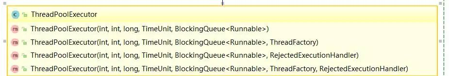

```tex
方式二：通过Executor 框架的工具类Executors来实现我们可以创建三种类型的ThreadPoolExecutor：
	1. FixedThreadPool ：该方法返回一个固定线程数量的线程池。该线程池中的线程数量始终不变。当有一个新的任务提交时，线程池中若有空闲线程，则立即执行。若没有，则新的任务会被暂存在一个任务队列中，待有线程空闲时，便处理在任务队列中的任务。
	2. SingleThreadExecutor： 方法返回一个只有一个线程的线程池。若多余一个任务被提交到该线程池，任务会被保存在一个任务队列中，待线程空闲，按先入先出的顺序执行队列中的任务。
	3. CachedThreadPool： 该方法返回一个可根据实际情况调整线程数量的线程池。线程池的线程数量不确定，但若有空闲线程可以复用，则会优先使用可复用的线程。若所有线程均在工作，又有新的任务提交，则会创建新的线程处理任务。所有线程在当前任务执行完毕后，将返回线程池进行复用。
```

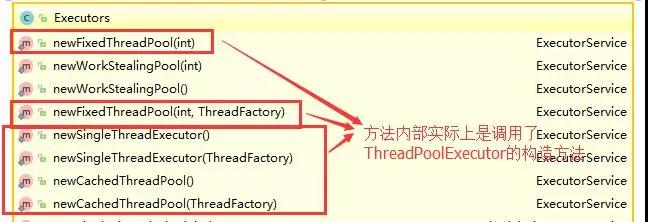

**ThreadPoolExecutor 类分析**

```tex
	ThreadPoolExecutor 类中提供的四个构造方法。我们来看最长的那个，其余三个都是在这个构造方法的基础上产生（其他几个构造方法说白点都是给定某些默认参数的构造方法比如默认制定拒绝策略是什么），这里就不贴代码讲了，比较简单。
```

```java
	/**
     * 用给定的初始参数创建一个新的ThreadPoolExecutor。
     */
    public ThreadPoolExecutor(int corePoolSize,
                              int maximumPoolSize,
                              long keepAliveTime,
                              TimeUnit unit,
                              BlockingQueue<Runnable> workQueue,
                              ThreadFactory threadFactory,
                              RejectedExecutionHandler handler) {
        if (corePoolSize < 0 ||
            maximumPoolSize <= 0 ||
            maximumPoolSize < corePoolSize ||
            keepAliveTime < 0)
            thrownew IllegalArgumentException();
        if (workQueue == null || threadFactory == null || handler == null)
            thrownew NullPointerException();
        this.corePoolSize = corePoolSize;
        this.maximumPoolSize = maximumPoolSize;
        this.workQueue = workQueue;
        this.keepAliveTime = unit.toNanos(keepAliveTime);
        this.threadFactory = threadFactory;
        this.handler = handler;
    }
```

```tex
1. corePoolSize：指定了线程池中的线程数量
2. maximumPoolSize：指定了线程池中的最大线程数量
3. keepAliveTime：线程池维护线程所允许的空闲时间
4. unit: keepAliveTime 的单位。
5. workQueue：任务队列，被提交但尚未被执行的任务。
6. threadFactory：线程工厂，用于创建线程，一般用默认的即可。
7. handler：拒绝策略。当任务太多来不及处理，如何拒绝任务。
```

**一个简单的线程池Demo:`Runnable`+`ThreadPoolExecutor`**

```tex
	为了让大家更清楚上面的面试题中的一些概念，我写了一个简单的线程池 Demo。
	首先创建一个 Runnable 接口的实现类（当然也可以是 Callable 接口，我们上面也说了两者的区别。）
```

```java
// MyRunnable.java
import java.util.Date;

/**
 * 这是一个简单的Runnable类，需要大约5秒钟来执行其任务。
 * @author shuang.kou
 */
publicclass MyRunnable implements Runnable {

    private String command;

    public MyRunnable(String s) {
        this.command = s;
    }

    @Override
    public void run() {
        System.out.println(Thread.currentThread().getName() + " Start. Time = " + new Date());
        processCommand();
        System.out.println(Thread.currentThread().getName() + " End. Time = " + new Date());
    }

    private void processCommand() {
        try {
            Thread.sleep(5000);
        } catch (InterruptedException e) {
            e.printStackTrace();
        }
    }

    @Override
    public String toString() {
        returnthis.command;
    }
}
```

```tex
编写测试程序，我们这里以阿里巴巴推荐的使用 ThreadPoolExecutor 构造函数自定义参数的方式来创建线程池。
```

```java
// ThreadPoolExecutorDemo.java
import java.util.concurrent.ArrayBlockingQueue;
import java.util.concurrent.ThreadPoolExecutor;
import java.util.concurrent.TimeUnit;

publicclass ThreadPoolExecutorDemo {

    privatestaticfinalint CORE_POOL_SIZE = 5;
    privatestaticfinalint MAX_POOL_SIZE = 10;
    privatestaticfinalint QUEUE_CAPACITY = 100;
    privatestaticfinal Long KEEP_ALIVE_TIME = 1L;
    public static void main(String[] args) {

        //使用阿里巴巴推荐的创建线程池的方式
        //通过ThreadPoolExecutor构造函数自定义参数创建
        ThreadPoolExecutor executor = new ThreadPoolExecutor(
                CORE_POOL_SIZE,
                MAX_POOL_SIZE,
                KEEP_ALIVE_TIME,
                TimeUnit.SECONDS,
                new ArrayBlockingQueue<>(QUEUE_CAPACITY),
                new ThreadPoolExecutor.CallerRunsPolicy());

        for (int i = 0; i < 10; i++) {
            //创建WorkerThread对象（WorkerThread类实现了Runnable 接口）
            Runnable worker = new MyRunnable("" + i);
            //执行Runnable
            executor.execute(worker);
        }
        //终止线程池
        executor.shutdown();
        while (!executor.isTerminated()) {
        }
        System.out.println("Finished all threads");
    }
}
```

```tex
可以看到我们上面的代码指定了：
	1. corePoolSize: 核心线程数为 5。
	2. maximumPoolSize ：最大线程数 10
	3. keepAliveTime : 等待时间为 1L。
	4. unit: 等待时间的单位为 TimeUnit.SECONDS。
	5. workQueue：任务队列为 ArrayBlockingQueue，并且容量为 100;
	6. handler:饱和策略为 CallerRunsPolicy。
```

```java
pool-1-thread-2 Start. Time = Tue Nov 12 20:59:44 CST 2019
pool-1-thread-5 Start. Time = Tue Nov 12 20:59:44 CST 2019
pool-1-thread-4 Start. Time = Tue Nov 12 20:59:44 CST 2019
pool-1-thread-1 Start. Time = Tue Nov 12 20:59:44 CST 2019
pool-1-thread-3 Start. Time = Tue Nov 12 20:59:44 CST 2019
pool-1-thread-5 End. Time = Tue Nov 12 20:59:49 CST 2019
pool-1-thread-3 End. Time = Tue Nov 12 20:59:49 CST 2019
pool-1-thread-2 End. Time = Tue Nov 12 20:59:49 CST 2019
pool-1-thread-4 End. Time = Tue Nov 12 20:59:49 CST 2019
pool-1-thread-1 End. Time = Tue Nov 12 20:59:49 CST 2019
pool-1-thread-2 Start. Time = Tue Nov 12 20:59:49 CST 2019
pool-1-thread-1 Start. Time = Tue Nov 12 20:59:49 CST 2019
pool-1-thread-4 Start. Time = Tue Nov 12 20:59:49 CST 2019
pool-1-thread-3 Start. Time = Tue Nov 12 20:59:49 CST 2019
pool-1-thread-5 Start. Time = Tue Nov 12 20:59:49 CST 2019
pool-1-thread-2 End. Time = Tue Nov 12 20:59:54 CST 2019
pool-1-thread-3 End. Time = Tue Nov 12 20:59:54 CST 2019
pool-1-thread-4 End. Time = Tue Nov 12 20:59:54 CST 2019
pool-1-thread-5 End. Time = Tue Nov 12 20:59:54 CST 2019
pool-1-thread-1 End. Time = Tue Nov 12 20:59:54 CST 2019
```

**线程池原理分析**

```tex
承接 4.6 节，我们通过代码输出结果可以看出：线程池每次会同时执行 5 个任务，这 5 个任务执行完之后，剩余的 5 个任务才会被执行。 大家可以先通过上面讲解的内容，分析一下到底是咋回事？（自己独立思考一会）

现在，我们就分析上面的输出内容来简单分析一下线程池原理。

**为了搞懂线程池的原理，我们需要首先分析一下 execute方法。**在 4.6 节中的 Demo 中我们使用 executor.execute(worker)来提交一个任务到线程池中去，这个方法非常重要，下面我们来看看它的源码：
```

```java
	// 存放线程池的运行状态 (runState) 和线程池内有效线程的数量 (workerCount)
   private final AtomicInteger ctl = new AtomicInteger(ctlOf(RUNNING, 0));

    private static int workerCountOf(int c) {
        return c & CAPACITY;
    }

    private final BlockingQueue<Runnable> workQueue;

    public void execute(Runnable command) {
        // 如果任务为null，则抛出异常。
        if (command == null)
            thrownew NullPointerException();
        // ctl 中保存的线程池当前的一些状态信息
        int c = ctl.get();

        //  下面会涉及到 3 步 操作
        // 1.首先判断当前线程池中之行的任务数量是否小于 corePoolSize
        // 如果小于的话，通过addWorker(command, true)新建一个线程，并将任务(command)添加到该线程中；然后，启动该线程从而执行任务。
        if (workerCountOf(c) < corePoolSize) {
            if (addWorker(command, true))
                return;
            c = ctl.get();
        }
        // 2.如果当前之行的任务数量大于等于 corePoolSize 的时候就会走到这里
        // 通过 isRunning 方法判断线程池状态，线程池处于 RUNNING 状态才会被并且队列可以加入任务，该任务才会被加入进去
        if (isRunning(c) && workQueue.offer(command)) {
            int recheck = ctl.get();
            // 再次获取线程池状态，如果线程池状态不是 RUNNING 状态就需要从任务队列中移除任务，并尝试判断线程是否全部执行完毕。同时执行拒绝策略。
            if (!isRunning(recheck) && remove(command))
                reject(command);
                // 如果当前线程池为空就新创建一个线程并执行。
            elseif (workerCountOf(recheck) == 0)
                addWorker(null, false);
        }
        //3. 通过addWorker(command, false)新建一个线程，并将任务(command)添加到该线程中；然后，启动该线程从而执行任务。
        //如果addWorker(command, false)执行失败，则通过reject()执行相应的拒绝策略的内容。
        elseif (!addWorker(command, false))
            reject(command);
    }
```

```tex
通过下图可以更好的对上面这 3 步做一个展示，下图是我为了省事直接从网上找到，原地址不明。
```

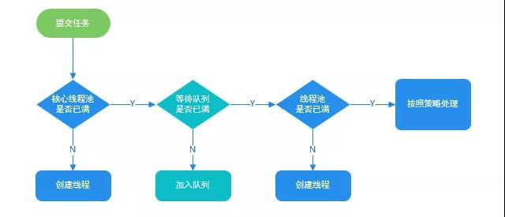

```tex
现在，让我们在回到 4.6 节我们写的 Demo， 现在应该是不是很容易就可以搞懂它的原理了呢？
没搞懂的话，也没关系，可以看看我的分析：
	我们在代码中模拟了 10 个任务，我们配置的核心线程数为 5 、等待队列容量为 100 ，所以每次只可能存在 5 个任务同时执行，剩下的 5 个任务会被放到等待队列中去。当前的 5 个任务之行完成后，才会之行剩下的 5 个任务。
```

##### 9. 线程池的拒绝策略

```tex
1. ThreadPoolExecutor.AbortPolicy:丢弃任务并抛出RejectedExecutionException异常。
2. ThreadPoolExecutor.DiscardPolicy：丢弃任务，但是不抛出异常。
3. ThreadPoolExecutor.DiscardOldestPolicy：丢弃队列最前面的任务，然后重新提交被拒绝的任务
4. ThreadPoolExecutor.CallerRunsPolicy：由调用线程（提交任务的线程）处理该任务
```

##### 10. 线程池的线程数量怎么确定

```tex
1. 一般来说，如果是CPU密集型应用，则线程池大小设置为N+1。
2. 一般来说，如果是IO密集型应用，则线程池大小设置为2N+1。
3. 在IO优化中，线程等待时间所占比例越高，需要越多线程，线程CPU时间所占比例越高，需要越少线程。这样的估算公式可能更适合：最佳线程数目 = （（线程等待时间+线程CPU时间）/线程CPU时间 ）* CPU数目
```

##### 11. ThreadLocal的原理和实现

```tex
	通常情况下，我们创建的变量是可以被任何一个线程访问并修改的。如果想实现每一个线程都有自己的专属本地变量该如何解决呢？ JDK中提供的ThreadLocal类正是为了解决这样的问题。ThreadLocal类主要解决的就是让每个线程绑定自己的值，可以将ThreadLocal类形象的比喻成存放数据的盒子，盒子中可以存储每个线程的私有数据。
	如果你创建了一个ThreadLocal变量，那么访问这个变量的每个线程都会有这个变量的本地副本，这也是ThreadLocal变量名的由来。他们可以使用 get（） 和 set（） 方法来获取默认值或将其值更改为当前线程所存的副本的值，从而避免了线程安全问题。
```

```tex
	再举个简单的例子：
	比如有两个人去宝屋收集宝物，这两个共用一个袋子的话肯定会产生争执，但是给他们两个人每个人分配一个袋子的话就不会出现这样的问题。如果把这两个人比作线程的话，那么ThreadLocal就是用来避免这两个线程竞争的。
```

**ThreadLocal示例**

```java
import java.text.SimpleDateFormat;
import java.util.Random;

publicclass ThreadLocalExample implements Runnable{

     // SimpleDateFormat 不是线程安全的，所以每个线程都要有自己独立的副本
    privatestaticfinal ThreadLocal<SimpleDateFormat> formatter = ThreadLocal.withInitial(() -> new SimpleDateFormat("yyyyMMdd HHmm"));

    public static void main(String[] args) throws InterruptedException {
        ThreadLocalExample obj = new ThreadLocalExample();
        for(int i=0 ; i<10; i++){
            Thread t = new Thread(obj, ""+i);
            Thread.sleep(new Random().nextInt(1000));
            t.start();
        }
    }

    @Override
    public void run() {
        System.out.println("Thread Name= "+Thread.currentThread().getName()+" default Formatter = "+formatter.get().toPattern());
        try {
            Thread.sleep(new Random().nextInt(1000));
        } catch (InterruptedException e) {
            e.printStackTrace();
        }
        //formatter pattern is changed here by thread, but it won't reflect to other threads
        formatter.set(new SimpleDateFormat());

        System.out.println("Thread Name= "+Thread.currentThread().getName()+" formatter = "+formatter.get().toPattern());
    }

}
```

```java
Thread Name= 0 default Formatter = yyyyMMdd HHmm
Thread Name= 0 formatter = yy-M-d ah:mm
Thread Name= 1 default Formatter = yyyyMMdd HHmm
Thread Name= 2 default Formatter = yyyyMMdd HHmm
Thread Name= 1 formatter = yy-M-d ah:mm
Thread Name= 3 default Formatter = yyyyMMdd HHmm
Thread Name= 2 formatter = yy-M-d ah:mm
Thread Name= 4 default Formatter = yyyyMMdd HHmm
Thread Name= 3 formatter = yy-M-d ah:mm
Thread Name= 4 formatter = yy-M-d ah:mm
Thread Name= 5 default Formatter = yyyyMMdd HHmm
Thread Name= 5 formatter = yy-M-d ah:mm
Thread Name= 6 default Formatter = yyyyMMdd HHmm
Thread Name= 6 formatter = yy-M-d ah:mm
Thread Name= 7 default Formatter = yyyyMMdd HHmm
Thread Name= 7 formatter = yy-M-d ah:mm
Thread Name= 8 default Formatter = yyyyMMdd HHmm
Thread Name= 9 default Formatter = yyyyMMdd HHmm
Thread Name= 8 formatter = yy-M-d ah:mm
Thread Name= 9 formatter = yy-M-d ah:mm
```

```tex
	从输出中可以看出，Thread-0已经改变了formatter的值，但仍然是thread-2默认格式化程序与初始化值相同，其他线程也一样。
	上面有一段代码用到了创建 ThreadLocal 变量的那段代码用到了 Java8 的知识，它等于下面这段代码，如果你写了下面这段代码的话，IDEA会提示你转换为Java8的格式(IDEA真的不错！)。因为ThreadLocal类在Java 8中扩展，使用一个新的方法withInitial()，将Supplier功能接口作为参数。
```

```java
privatestaticfinal ThreadLocal<SimpleDateFormat> formatter = new ThreadLocal<SimpleDateFormat>(){
        @Override
        protected SimpleDateFormat initialValue()
        {
            returnnew SimpleDateFormat("yyyyMMdd HHmm");
        }
    };
```

**ThreadLocal 内存泄露问题**

```tex
	ThreadLocalMap 中使用的 key 为 ThreadLocal 的弱引用,而 value 是强引用。所以，如果 ThreadLocal 没有被外部强引用的情况下，在垃圾回收的时候，key 会被清理掉，而 value 不会被清理掉。这样一来，ThreadLocalMap 中就会出现key为null的Entry。假如我们不做任何措施的话，value 永远无法被GC 回收，这个时候就可能会产生内存泄露。ThreadLocalMap实现中已经考虑了这种情况，在调用 set()、get()、remove() 方法的时候，会清理掉 key 为 null 的记录。使用完 ThreadLocal方法后 最好手动调用remove()方法
```

```java
static class Entry extends WeakReference<ThreadLocal<?>> {
            /** The value associated with this ThreadLocal. */
            Object value;

            Entry(ThreadLocal<?> k, Object v) {
                super(k);
                value = v;
            }
        }
```


```tex
	ThreadLoal 变量，线程局部变量，同一个 ThreadLocal 所包含的对象，在不同的 Thread 中有不同的副本。ThreadLocal 变量通常被private static修饰。当一个线程结束时，它所使用的所有 ThreadLocal 相对的实例副本都可被回收。

	一个线程内可以存在多个 ThreadLocal 对象，所以其实是 ThreadLocal 内部维护了一个 Map ，这个 Map 不是直接使用的 HashMap ，而是 ThreadLocal 实现的一个叫做 ThreadLocalMap 的静态内部类。而我们使用的 get()、set() 方法其实都是调用了这个ThreadLocalMap类对应的 get()、set() 方法。
```

##### 12. AQS

```tex
	AQS核心思想是，如果被请求的共享资源空闲，则将当前请求资源的线程设置为有效的工作线程，并且将共享资源设置为锁定状态。如果被请求的共享资源被占用，那么就需要一套线程阻塞等待以及被唤醒时锁分配的机制，这个机制AQS是用CLH队列锁实现的，即将暂时获取不到锁的线程加入到队列中。
```

```tex
	CLH(Craig,Landin,and Hagersten)队列是一个虚拟的双向队列（虚拟的双向队列即不存在队列实例，仅存在结点之间的关联关系）。AQS是将每条请求共享资源的线程封装成一个CLH锁队列的一个结点（Node）来实现锁的分配。
```

```tex
看个AQS(AbstractQueuedSynchronizer)原理图：
```

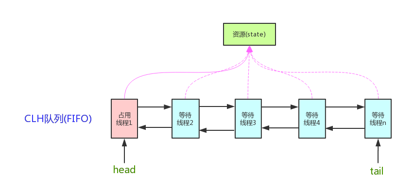

```tex
	AQS 使用一个 int 成员变量来表示同步状态，通过内置的 FIFO 队列来完成获取资源线程的排队工作。AQS 使用CAS 对该同步状态进行原子操作实现对其值的修改。
	状态信息通过protected类型的getState，setState，compareAndSetState进行操作
```

```java
private volatileint state;//共享变量，使用volatile修饰保证线程可见性

//返回同步状态的当前值
protected final int getState() {
        return state;
}
 // 设置同步状态的值
protected final void setState(int newState) {
        state = newState;
}
//原子地（CAS操作）将同步状态值设置为给定值update如果当前同步状态的值等于expect（期望值）
protected final boolean compareAndSetState(int expect, int update) {
        return unsafe.compareAndSwapInt(this, stateOffset, expect, update);
}
```

**AQS 对资源的共享方式**

```tex
AQS定义两种资源共享方式
	Exclusive（独占）：只有一个线程能执行，如ReentrantLock。又可分为公平锁和非公平锁：
		公平锁：按照线程在队列中的排队顺序，先到者先拿到锁
		非公平锁：当线程要获取锁时，无视队列顺序直接去抢锁，谁抢到就是谁的
	Share（共享）：多个线程可同时执行，如Semaphore/CountDownLatch。Semaphore、CountDownLatch、 CyclicBarrier、ReadWriteLock 我们都会在后面讲到。
	
	ReentrantReadWriteLock 可以看成是组合式，因为ReentrantReadWriteLock也就是读写锁允许多个线程同时对某一资源进行读。
	不同的自定义同步器争用共享资源的方式也不同。自定义同步器在实现时只需要实现共享资源 state 的获取与释放方式即可，至于具体线程等待队列的维护（如获取资源失败入队/唤醒出队等），AQS已经在顶层实现好了。
```

**AQS底层使用了模板方法模式**

```tex
同步器的设计是基于模板方法模式的，如果需要自定义同步器一般的方式是这样（模板方法模式很经典的一个应用）：
	1. 使用者继承AbstractQueuedSynchronizer并重写指定的方法。（这些重写方法很简单，无非是对于共享资源state的获取和释放）
	2. 将AQS组合在自定义同步组件的实现中，并调用其模板方法，而这些模板方法会调用使用者重写的方法。
这和我们以往通过实现接口的方式有很大区别，这是模板方法模式很经典的一个运用。
```

```java
// AQS使用了模板方法模式，自定义同步器时需要重写下面几个AQS提供的模板方法
isHeldExclusively()//该线程是否正在独占资源。只有用到condition才需要去实现它。
tryAcquire(int)//独占方式。尝试获取资源，成功则返回true，失败则返回false。
tryRelease(int)//独占方式。尝试释放资源，成功则返回true，失败则返回false。
tryAcquireShared(int)//共享方式。尝试获取资源。负数表示失败；0表示成功，但没有剩余可用资源；正数表示成功，且有剩余资源。
tryReleaseShared(int)//共享方式。尝试释放资源，成功则返回true，失败则返回false。

```

```tex
	默认情况下，每个方法都抛出 UnsupportedOperationException。这些方法的实现必须是内部线程安全的，并且通常应该简短而不是阻塞。AQS类中的其他方法都是final ，所以无法被其他类使用，只有这几个方法可以被其他类使用。
	以ReentrantLock为例，state初始化为0，表示未锁定状态。A线程lock()时，会调用tryAcquire()独占该锁并将state+1。此后，其他线程再tryAcquire()时就会失败，直到A线程unlock()到state=0（即释放锁）为止，其它线程才有机会获取该锁。当然，释放锁之前，A线程自己是可以重复获取此锁的（state会累加），这就是可重入的概念。但要注意，获取多少次就要释放多么次，这样才能保证state是能回到零态的。
	再以CountDownLatch以例，任务分为N个子线程去执行，state也初始化为N（注意N要与线程个数一致）。这N个子线程是并行执行的，每个子线程执行完后countDown()一次，state会CAS(Compare and Swap)减1。等到所有子线程都执行完后(即state=0)，会unpark()主调用线程，然后主调用线程就会从await()函数返回，继续后余动作。
	一般来说，自定义同步器要么是独占方法，要么是共享方式，他们也只需实现tryAcquire-tryRelease、tryAcquireShared-tryReleaseShared中的一种即可。但AQS也支持自定义同步器同时实现独占和共享两种方式，如ReentrantReadWriteLock。
```


#### 实际问题

#####1. 高并发系统的设计与实现

```tex
在开发高并发系统时有三把利器用来保护系统：缓存、降级和限流。

	缓存：缓存比较好理解，在大型高并发系统中，如果没有缓存数据库将分分钟被爆，系统也会瞬间瘫痪。使用缓存不单单能够提升系统访问速度、提高并发访问量，也是保护数据库、保护系统的有效方式。大型网站一般主要是“读”，缓存的使用很容易被想到。在大型“写”系统中，缓存也常常扮演者非常重要的角色。比如累积一些数据批量写入，内存里面的缓存队列（生产消费），以及HBase写数据的机制等等也都是通过缓存提升系统的吞吐量或者实现系统的保护措施。甚至消息中间件，你也可以认为是一种分布式的数据缓存。
	降级：服务降级是当服务器压力剧增的情况下，根据当前业务情况及流量对一些服务和页面有策略的降级，以此释放服务器资源以保证核心任务的正常运行。降级往往会指定不同的级别，面临不同的异常等级执行不同的处理。根据服务方式：可以拒接服务，可以延迟服务，也有时候可以随机服务。根据服务范围：可以砍掉某个功能，也可以砍掉某些模块。总之服务降级需要根据不同的业务需求采用不同的降级策略。主要的目的就是服务虽然有损但是总比没有好。
	限流：限流可以认为服务降级的一种，限流就是限制系统的输入和输出流量已达到保护系统的目的。一般来说系统的吞吐量是可以被测算的，为了保证系统的稳定运行，一旦达到的需要限制的阈值，就需要限制流量并采取一些措施以完成限制流量的目的。比如：延迟处理，拒绝处理，或者部分拒绝处理等等。
```

##### 2. 常见的限流算法：

```tex
常见的限流算法有计数器、漏桶和令牌桶算法。漏桶算法在分布式环境中消息中间件或者Redis都是可选的方案。发放令牌的频率增加可以提升整体数据处理的速度，而通过每次获取令牌的个数增加或者放慢令牌的发放速度和降低整体数据处理速度。而漏桶不行，因为它的流出速率是固定的，程序处理速度也是固定的。
```

##### 3. 秒杀并发情况下库存为负数问题

```tex
1. for update显示加锁
2. 把udpate语句写在前边，先把数量-1，之后select出库存如果>-1就commit,否则rollback。

update products set quantity = quantity-1 WHERE id=3;
select quantity from products WHERE id=3 for update;

3. update语句在更新的同时加上一个条件
quantity = select quantity from products WHERE id=3;
update products set quantity = ($quantity-1) WHERE id=3 and queantity = $quantity;
```


### JVM相关

#### JMM模型

##### Java内存模型


#### JVM结构

#### 运行时数据区域


```tex
虚拟机栈：描述的是方法执行时的内存模型,是线程私有的，生命周期与线程相同,每个方法被执行的同时会创建栈桢（下文会看到），主要保存执行方法时的局部变量表、操作数栈、动态连接和方法返回地址等信息,方法执行时入栈，方法执行完出栈，出栈就相当于清空了数据，入栈出栈的时机很明确，所以这块区域不需要进行 GC。
```

```tex
本地方法栈：与虚拟机栈功能非常类似，主要区别在于虚拟机栈为虚拟机执行 Java 方法时服务，而本地方法栈为虚拟机执行本地方法时服务的。这块区域也不需要进行 GC
```

```tex
	程序计数器：线程独有的， 可以把它看作是当前线程执行的字节码的行号指示器，比如如下字节码内容，在每个字节码`前面都有一个数字（行号），我们可以认为它就是程序计数器存储的内容.
	记录这些数字（指令地址）有啥用呢，我们知道 Java 虚拟机的多线程是通过线程轮流切换并分配处理器的时间来完成的，在任何一个时刻，一个处理器只会执行一个线程，如果这个线程被分配的时间片执行完了（线程被挂起），处理器会切换到另外一个线程执行，当下次轮到执行被挂起的线程（唤醒线程）时，怎么知道上次执行到哪了呢，通过记录在程序计数器中的行号指示器即可知道，所以程序计数器的主要作用是记录线程运行时的状态，方便线程被唤醒时能从上一次被挂起时的状态继续执行，需要注意的是，程序计数器是唯一一个在 Java 虚拟机规范中没有规定任何 OOM 情况的区域，所以这块区域也不需要进行 GC.
```


```tex
	本地内存：线程共享区域，Java 8 中，本地内存，也是我们通常说的堆外内存，包含元空间和直接内存,注意到上图中 Java 8 和 Java 8 之前的 JVM 内存区域的区别了吗，在 Java 8 之前有个永久代的概念，实际上指的是 HotSpot 虚拟机上的永久代，它用永久代实现了 JVM 规范定义的方法区功能，主要存储类的信息，常量，静态变量，即时编译器编译后代码等，这部分由于是在堆中实现的，受 GC 的管理，不过由于永久代有 -XX:MaxPermSize 的上限，所以如果动态生成类（将类信息放入永久代）或大量地执行 String.intern （将字段串放入永久代中的常量区），很容易造成 OOM，有人说可以把永久代设置得足够大，但很难确定一个合适的大小，受类数量，常量数量的多少影响很大。所以在 Java 8 中就把方法区的实现移到了本地内存中的元空间中，这样方法区就不受 JVM 的控制了,也就不会进行 GC，也因此提升了性能（发生 GC 会发生 Stop The Word,造成性能受到一定影响，后文会提到），也就不存在由于永久代限制大小而导致的 OOM 异常了（假设总内存1G，JVM 被分配内存 100M， 理论上元空间可以分配 2G-100M = 1.9G，空间大小足够），也方便在元空间中统一管理。综上所述，在 Java 8 以后这一区域也不需要进行 GC
```

```tex
	堆：前面几块数据区域都不进行 GC，那只剩下堆了，是的，这里是 GC 发生的区域！对象实例和数组都是在堆上分配的，GC 也主要对这两类数据进行回收，这块也是我们之后重点需要分析的区域
```


**分割线**

```tex
1. 程序计数器：程序计数器是一块较小的内存空间，它可以看作是当前线程所执行的字节码的行号指示器。在虚拟机的概念模型里，字节码解释器工作时就是通过改变这个计数器的值来选取下一条需要执行的字节码指令，分支、循环、跳转、异常处理、线程恢复等基础功能都需要依赖这个计数器来完成。是线程私有”的内存。

2. Java虚拟机栈：与程序计数器一样，Java虚拟机栈（Java Virtual Machine Stacks）也是线程私有的，它的生命周期与线程相同。虚拟机栈描述的是Java方法执行的内存模型：每个方法在执行的同时都会创建一个栈帧 ，用于存储局部变量表、操作数栈、动态链接、方法出口等信息。每一个方法从调用直至执行完成的过程，就对应着一个栈帧在虚拟机栈中入栈到出栈的过程。

3. 本地方法栈：本地方法栈（Native Method Stack）与虚拟机栈所发挥的作用是非常相似的，它们之间的区别不过是虚拟机栈为虚拟机执行Java方法（也就是字节码）服务，而本地方法栈则为虚拟机使用到的Native方法服务。

4. Java堆：对于大多数应用来说，Java堆是Java虚拟机所管理的内存中最大的一块。Java堆是被所有线程共享的一块内存区域，在虚拟机启动时创建。此内存区域的唯一目的就是存放对象实例，几乎所有的对象实例都在这里分配内存。
```

#### GC垃圾回收

**简介**

```tex
	Java 相比 C/C++ 最显著的特点便是引入了自动垃圾回收 (下文统一用 GC 指代自动垃圾回收)，它解决了 C/C++ 最令人头疼的内存管理问题，让程序员专注于程序本身，不用关心内存回收这些恼人的问题，这也是 Java 能大行其道的重要原因之一，GC 真正让程序员的生产力得到了释放，但是程序员很难感知到它的存在，这就好比，我们吃完饭后在桌上放下餐盘即走，服务员会替你收拾好这些餐盘，你不会关心服务员什么时候来收，怎么收。
有人说既然 GC 已经自动我们完成了清理,不了解 GC 貌似也没啥问题。在大多数情况下确实没问题，不过如果涉及到一些性能调优，问题排查等，深入地了解 GC 还是必不可少的，曾经美团通过调整 JVM 相关 GC 参数让服务响应时间 TP90，TP99都下降了10ms+，服务可用性得到了很大的提升！所以深入了解 GC 是成为一名优秀 Java 程序员的必修课！
```

##### 1. Stop the world（STW）

```tex
	在执行垃圾收集算法时，Java应用程序的其他所有除了垃圾收集收集器线程之外的线程都被挂起。此时，系统只能允许GC线程进行运行，其他线程则会全部暂停，等待GC线程执行完毕后才能再次运行。这些工作都是由虚拟机在后台自动发起和自动完成的，是在用户不可见的情况下把用户正常工作的线程全部停下来，这对于很多的应用程序，尤其是那些对于实时性要求很高的程序来说是难以接受的。

	但不是说GC必须STW,你也可以选择降低运行速度但是可以并发执行的收集算法，这取决于你的业务。
```

##### 2. 垃圾判定方法

```tex
1. 引用计数法：引用计数法是一种简单但速度很慢的垃圾回收技术。每个对象都含有一个引用计数器,当有引用连接至对象时,引用计数加1。当引用离开作用域或被置为null时,引用计数减1。虽然管理引用计数的开销不大,但这项开销在整个程序生命周期中将持续发生。垃圾回收器会在含有全部对象的列表上遍历,当发现某个对象引用计数为0时,就释放其占用的空间。
2. 可达性分析算法：这个算法的基本思路就是通过一系列的称为“GC Roots”的对象作为起始点，从这些节点开始向下搜索，搜索所走过的路径称为引用链，当一个对象到GC Roots没有任何引用链相连（用图论的话来说，就是从GC Roots到这个对象不可达）时，则证明此对象是不可用的。
```

**引用计数法**

```tex
	简单地说，就是对象被引用一次，在它的对象头上加一次引用次数，如果没有被引用（引用次数为 0），则此对象可回收。
	
String ref = new String("Java");

以上代码 ref1 引用了右侧定义的对象，所以引用次数是 1。
如果在上述代码后面添加一个 ref = null，则由于对象没被引用，引用次数置为 0，由于不被任何变量引用，此时即被回收。
```

**循环引用**

```java
public  class TestRC {

    TestRC instance;
    public TestRC(String name) {
    }

    public static  void main(String[] args) {
        // 第一步
		A a = new TestRC("a");
		B b = new TestRC("b");

        // 第二步
	a.instance = b;
	b.instance = a;

        // 第三步
	a = null;
	b = null;
    }
}
```


```tex
	到了第三步，虽然 a，b 都被置为 null 了，但是由于之前它们指向的对象互相指向了对方（引用计数都为 1），所以无法回收，也正是由于无法解决循环引用的问题，所以现代虚拟机都不用引用计数法来判断对象是否应该被回收。
```

**可达性分析**

```tex
	现代虚拟机基本都是采用这种算法来判断对象是否存活，可达性算法的原理是以一系列叫做  GC Root  的对象为起点出发，引出它们指向的下一个节点，再以下个节点为起点，引出此节点指向的下一个结点。。。（这样通过 GC Root 串成的一条线就叫引用链），直到所有的结点都遍历完毕,如果相关对象不在任意一个以 GC Root 为起点的引用链中，则这些对象会被判断为「垃圾」,会被 GC 回收。
```


```tex
	如图示，如果用可达性算法即可解决上述循环引用的问题，因为从GC Root 出发没有到达 a,b,所以 a，b 可回收
a, b 对象可回收，就一定会被回收吗?并不是，对象的 finalize 方法给了对象一次垂死挣扎的机会，当对象不可达（可回收）时，当发生GC时，会先判断对象是否执行了 finalize 方法，如果未执行，则会先执行 finalize 方法，我们可以在此方法里将当前对象与 GC Roots 关联，这样执行 finalize 方法之后，GC 会再次判断对象是否可达，如果不可达，则会被回收，如果可达，则不回收！
	注意： finalize 方法只会被执行一次，如果第一次执行 finalize 方法此对象变成了可达确实不会回收，但如果对象再次被 GC，则会忽略 finalize 方法，对象会被回收！这一点切记!
那么这些 GC Roots 到底是什么东西呢，哪些对象可以作为 GC Root 呢，有以下几类
	1. 虚拟机栈（栈帧中的本地变量表）中引用的对象		
	2. 方法区中类静态属性引用的对象
	3. 方法区中常量引用的对象
	4. 本地方法栈中 JNI（即一般说的 Native 方法）引用的对象
```

**虚拟机栈中引用的对象**

```tex
	如下代码所示，a 是栈帧中的本地变量，当 a = null 时，由于此时 a 充当了 GC Root 的作用，a 与原来指向的实例 new Test() 断开了连接，所以对象会被回收。
```

```java
public class Test {
    public static  void main(String[] args) {
	Test a = new Test();
	a = null;
    }
}
```

**方法区中类静态属性引用的对象**

```tex
	如下代码所示，当栈帧中的本地变量 a = null 时，由于 a 原来指向的对象与 GC Root (变量 a) 断开了连接，所以 a 原来指向的对象会被回收，而由于我们给 s 赋值了变量的引用，s 在此时是类静态属性引用，充当了 GC Root 的作用，它指向的对象依然存活!
```

```java
public  class Test {
    public  static Test s;
    public static  void main(String[] args) {
	Test a = new Test();
	a.s = new Test();
	a = null;
    }
}
```

**方法区中常量引用的对象**

```tex
如下代码所示，常量 s 指向的对象并不会因为 a 指向的对象被回收而回收
```

```java
public  class Test {
	public  static  final Test s = new Test();
        public static void main(String[] args) {
	    Test a = new Test();
	    a = null;
        }
}
```

**本地方法栈中 JNI 引用的对象**

```tex
	这是简单给不清楚本地方法为何物的童鞋简单解释一下：所谓本地方法就是一个 java 调用非 java 代码的接口，该方法并非 Java 实现的，可能由 C 或 Python等其他语言实现的， Java 通过 JNI 来调用本地方法， 而本地方法是以库文件的形式存放的（在 WINDOWS 平台上是 DLL 文件形式，在 UNIX 机器上是 SO 文件形式）。通过调用本地的库文件的内部方法，使 JAVA 可以实现和本地机器的紧密联系，调用系统级的各接口方法，还是不明白？见文末参考，对本地方法定义与使用有详细介绍。
	当调用 Java 方法时，虚拟机会创建一个栈桢并压入 Java 栈，而当它调用的是本地方法时，虚拟机会保持 Java 栈不变，不会在 Java 栈祯中压入新的祯，虚拟机只是简单地动态连接并直接调用指定的本地方法。
```

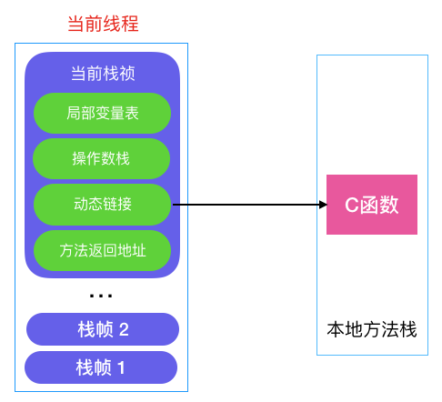

```tex
如上代码所示，当 java 调用以上本地方法时，jc 会被本地方法栈压入栈中, jc 就是我们说的本地方法栈中 JNI 的对象引用，因此只会在此本地方法执行完成后才会被释放。
```


##### 3. GC Roots

```tex
1. 虚拟机栈（栈帧中的本地变量表）中引用的对象。
2. 方法区中类静态属性引用的对象。
3. 方法区中常量引用的对象。
4. 本地方法栈中JNI（即一般说的Native方法）引用的对象。
```

##### 4. 垃圾回收算法

```tex
	引用计数算法。
	分代收集算法：把Java堆分为新生代和老年代，然后根据各个年代的特点采用最合适的收集算法。新生代中，对象的存活率比较低，所以选用复制算法，老年代中对象存活率高且没有额外空间对它进行分配担保，所以使用“标记-清除”或“标记-整理”算法进行回收。
	停止-复制：先暂停程序的运行,然后将所有存活的对象从当前堆复制到另一个堆,没有被复制的对象全部都是垃圾。当对象被复制到新堆时,它们是一个挨着一个的,所以新堆保持紧凑排列,然后就可以按前述方法简单,直接的分配了。缺点是一浪费空间,两个堆之间要来回倒腾,二是当程序进入稳定态时,可能只会产生极少的垃圾,甚至不产生垃圾,尽管如此,复制式回收器仍会将所有内存自一处复制到另一处。
	标记-清除：同样是从堆栈和静态存储区出发,遍历所有的引用,进而找出所有存活的对象。每当它找到一个存活的对象,就会给对象一个标记,这个过程中不会回收任何对象。只有全部标记工作完成的时候,清理动作才会开始。在清理过程中,没有标记的对象会被释放,不会发生任何复制动作。所以剩下的堆空间是不连续的,垃圾回收器如果要希望得到连续空间的话,就得重新整理剩下的对象。
	标记-整理：它的第一个阶段与标记/清除算法是一模一样的，均是遍历GC Roots，然后将存活的对象标记。移动所有存活的对象，且按照内存地址次序依次排列，然后将末端内存地址以后的内存全部回收。因此，第二阶段才称为整理阶段。
```

**以下是同一出处=======================================================================**

**分代收集算法**

```tex
	分代收集算法整合了以上算法，综合了这些算法的优点，最大程度避免了它们的缺点，所以是现代虚拟机采用的首选算法,与其说它是算法，倒不是说它是一种策略，因为它是把上述几种算法整合在了一起，为啥需要分代收集呢，来看一下对象的分配有啥规律
```

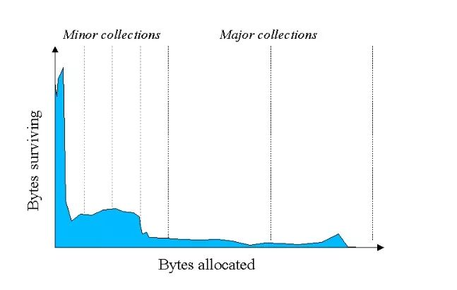

​			*如图示：**纵轴代表已分配的字节，而横轴代表程序运行时间*

```tex
	由图可知，大部分的对象都很短命，都在很短的时间内都被回收了（IBM 专业研究表明，一般来说，98%的对象都是朝生夕死的，经过一次 Minor GC 后就会被回收），所以分代收集算法根据对象存活周期的不同将堆分成新生代和老生代（Java8以前还有个永久代）,默认比例为 1 : 2，新生代又分为 Eden 区， from Survivor 区（简称S0），to Survivor 区(简称 S1),三者的比例为 8: 1 : 1，这样就可以根据新老生代的特点选择最合适的垃圾回收算法，我们把新生代发生的 GC 称为 Young GC（也叫 Minor GC）,老年代发生的 GC 称为 Old GC（也称为 Full GC）。
```


**分代收集工作原理**

```tex
1、对象在新生代的分配与回收
	由以上的分析可知，大部分对象在很短的时间内都会被回收，对象一般分配在 Eden 区
```


```tex
当 Eden 区将满时，触发 Minor GC
```


```tex
	我们之前怎么说来着，大部分对象在短时间内都会被回收, 所以经过 Minor GC 后只有少部分对象会存活，它们会被移到 S0 区（这就是为啥空间大小  Eden: S0: S1 = 8:1:1, Eden 区远大于 S0,S1 的原因，因为在 Eden 区触发的 Minor GC 把大部对象（接近98%）都回收了,只留下少量存活的对象，此时把它们移到 S0 或 S1 绰绰有余）同时对象年龄加一（对象的年龄即发生 Minor GC 的次数），最后把 Eden 区对象全部清理以释放出空间,动图如下
```


```tex
	当触发下一次 Minor GC 时，会把 Eden 区的存活对象和 S0（或S1） 中的存活对象（S0 或 S1 中的存活对象经过每次 Minor GC 都可能被回收）一起移到 S1（Eden 和 S0 的存活对象年龄+1）, 同时清空 Eden 和 S0 的空间。
```


```tex
	若再触发下一次 Minor GC，则重复上一步，只不过此时变成了 从 Eden，S1 区将存活对象复制到 S0 区,每次垃圾回收, S0, S1 角色互换，都是从 Eden ,S0(或S1) 将存活对象移动到 S1(或S0)。也就是说在 Eden 区的垃圾回收我们采用的是复制算法，因为在 Eden 区分配的对象大部分在 Minor GC 后都消亡了，只剩下极少部分存活对象（这也是为啥 Eden:S0:S1 默认为 8:1:1 的原因），S0,S1 区域也比较小，所以最大限度地降低了复制算法造成的对象频繁拷贝带来的开销。
```

```tex
2、对象何时晋升老年代
	当对象的年龄达到了我们设定的阈值，则会从S0（或S1）晋升到老年代
```


```tex
	如图示：年龄阈值设置为 15， 当发生下一次 Minor GC 时，S0 中有个对象年龄达到 15，达到我们的设定阈值，晋升到老年代！
	大对象 当某个对象分配需要大量的连续内存时，此时对象的创建不会分配在 Eden 区，会直接分配在老年代，因为如果把大对象分配在 Eden 区, Minor GC 后再移动到 S0,S1 会有很大的开销（对象比较大，复制会比较慢，也占空间），也很快会占满 S0,S1 区，所以干脆就直接移到老年代.
	还有一种情况也会让对象晋升到老年代，即在 S0（或S1） 区相同年龄的对象大小之和大于 S0（或S1）空间一半以上时，则年龄大于等于该年龄的对象也会晋升到老年代。
```

```tex
3、空间分配担保
在发生 MinorGC 之前，虚拟机会先检查老年代最大可用的连续空间是否大于新生代所有对象的总空间，如果大于，那么Minor GC 可以确保是安全的,如果不大于，那么虚拟机会查看 HandlePromotionFailure 设置值是否允许担保失败。如果允许，那么会继续检查老年代最大可用连续空间是否大于历次晋升到老年代对象的平均大小，如果大于则进行 Minor GC，否则可能进行一次 Full GC。
```

```tex
4、Stop The World
如果老年代满了，会触发 Full GC, Full GC 会同时回收新生代和老年代（即对整个堆进行GC），它会导致 Stop The World（简称 STW）,造成挺大的性能开销。
什么是 STW ？所谓的 STW, 即在 GC（minor GC 或 Full GC）期间，只有垃圾回收器线程在工作，其他工作线程则被挂起。
```

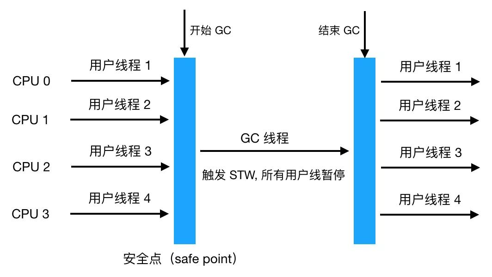

```tex
	一般 Full GC 会导致工作线程停顿时间过长（因为Full GC 会清理整个堆中的不可用对象，一般要花较长的时间），如果在此 server 收到了很多请求，则会被拒绝服务！所以我们要尽量减少 Full GC（Minor GC 也会造成 STW,但只会触发轻微的 STW,因为 Eden 区的对象大部分都被回收了，只有极少数存活对象会通过复制算法转移到 S0 或 S1 区，所以相对还好）。
	现在我们应该明白把新生代设置成 Eden, S0，S1区或者给对象设置年龄阈值或者默认把新生代与老年代的空间大小设置成 1:2 都是为了尽可能地避免对象过早地进入老年代，尽可能晚地触发 Full GC。想想新生代如果只设置 Eden 会发生什么，后果就是每经过一次 Minor GC，存活对象会过早地进入老年代，那么老年代很快就会装满，很快会触发 Full GC，而对象其实在经过两三次的 Minor GC 后大部分都会消亡，所以有了 S0,S1的缓冲，只有少数的对象会进入老年代，老年代大小也就不会这么快地增长，也就避免了过早地触发 Full GC。
	由于 Full GC（或Minor GC） 会影响性能，所以我们要在一个合适的时间点发起 GC，这个时间点被称为 Safe Point，这个时间点的选定既不能太少以让 GC 时间太长导致程序过长时间卡顿，也不能过于频繁以至于过分增大运行时的负荷。一般当线程在这个时间点上状态是可以确定的，如确定 GC Root 的信息等，可以使 JVM 开始安全地 GC。
Safe Point 主要指的是以下特定位置：
	循环的末尾
	方法返回前
	调用方法的 call 之后
	抛出异常的位置 另外需要注意的是由于新生代的特点（大部分对象经过 Minor GC后会消亡）， Minor GC 用的是复制算法，而在老生代由于对象比较多，占用的空间较大，使用复制算法会有较大开销（复制算法在对象存活率较高时要进行多次复制操作，同时浪费一半空间）所以根据老生代特点，在老年代进行的 GC 一般采用的是标记整理法来进行回收。
```

垃圾回收主要方法**

```tex
标记清除算法
复制算法
标记整理法
```

**标记清除算法**

```tex
1. 先根据可达性算法标记出相应的可回收对象（图中黄色部分）
2. 对可回收的对象进行回收
```


```tex
操作起来确实很简单，也不用做移动数据的操作，那有啥问题呢？仔细看上图，没错，内存碎片！假如我们想在上图中的堆中分配一块需要连续内存占用 4M 或 5M 的区域，显然是会失败，怎么解决呢，如果能把上面未使用的 2M， 2M，1M 内存能连起来就能连成一片可用空间为 5M 的区域即可，怎么做呢?
```

**复制算法**

```tex
把堆等分成两块区域, A 和 B，区域 A 负责分配对象，区域 B 不分配, 对区域 A 使用以上所说的标记法把存活的对象标记出来（下图有误无需清除），然后把区域 A 中存活的对象都复制到区域 B（存活对象都依次紧邻排列）最后把 A 区对象全部清理掉释放出空间，这样就解决了内存碎片的问题了。
```


```tex
不过复制算法的缺点很明显，比如给堆分配了 500M 内存，结果只有 250M 可用，空间平白无故减少了一半！这肯定是不能接受的！另外每次回收也要把存活对象移动到另一半，效率低下（我们可以想想删除数组元素再把非删除的元素往一端移，效率显然堪忧）
```

**标记整理法**

```tex
前面两步和标记清除法一样，不同的是它在标记清除法的基础上添加了一个整理的过程 ，即将所有的存活对象都往一端移动,紧邻排列（如图示），再清理掉另一端的所有区域，这样的话就解决了内存碎片的问题。
但是缺点也很明显：每进一次垃圾清除都要频繁地移动存活的对象，效率十分低下。
```


##### 5. 复制算法

```tex
	HotSpot JVM把年轻代分为了三部分：1个Eden区和2个Survivor区（分别叫from和to）。一般情况下，新创建的对象都会被分配到Eden区(一些大对象特殊处理),这些对象经过第一次Minor GC后，如果仍然存活，将会被移到Survivor区。对象在Survivor区中每熬过一次Minor GC，年龄就会增加1岁，当它的年龄增加到一定程度时，就会被移动到年老代中。

	因为年轻代中的对象基本都是朝生夕死的，所以在年轻代的垃圾回收算法使用的是复制算法，复制算法的基本思想就是将内存分为两块，每次只用其中一块，当这一块内存用完，就将还活着的对象复制到另外一块上面。复制算法不会产生内存碎片。

	在GC开始的时候，对象只会存在于Eden区和名为“From”的Survivor区，Survivor区“To”是空的。紧接着进行GC，Eden区中所有存活的对象都会被复制到“To”，而在“From”区中，仍存活的对象会根据他们的年龄值来决定去向。年龄达到一定值(年龄阈值，可以通过-XX:MaxTenuringThreshold来设置)的对象会被移动到年老代中，没有达到阈值的对象会被复制到“To”区域。经过这次GC后，Eden区和From区已经被清空。这个时候，“From”和“To”会交换他们的角色，也就是新的“To”就是上次GC前的“From”，新的“From”就是上次GC前的“To”。不管怎样，都会保证名为To的Survivor区域是空的。Minor GC会一直重复这样的过程，直到“To”区被填满，“To”区被填满之后，会将所有对象移动到年老代中。
```

##### 6. 垃圾收集器种类

```tex
	如果说收集算法是内存回收的方法论，那么垃圾收集器就是内存回收的具体实现。Java 虚拟机规范并没有规定垃圾收集器应该如何实现，因此一般来说不同厂商，不同版本的虚拟机提供的垃圾收集器实现可能会有差别，一般会给出参数来让用户根据应用的特点来组合各个年代使用的收集器，主要有以下垃圾收集器
```


```tex
	在新生代工作的垃圾回收器：Serial, ParNew, ParallelScavenge
	在老年代工作的垃圾回收器：CMS，Serial Old, Parallel Old
	同时在新老生代工作的垃圾回收器：G1
图片中的垃圾收集器如果存在连线，则代表它们之间可以配合使用，接下来我们来看看各个垃圾收集器的具体功能。
```

**新生代收集器**

```tex
Serial 收集器

	Serial 收集器是工作在新生代的，单线程的垃圾收集器，单线程意味着它只会使用一个 CPU 或一个收集线程来完成垃圾回收，不仅如此，还记得我们上文提到的 STW 了吗，它在进行垃圾收集时，其他用户线程会暂停，直到垃圾收集结束，也就是说在 GC 期间，此时的应用不可用。
	看起来单线程垃圾收集器不太实用，不过我们需要知道的任何技术的使用都不能脱离场景，在 Client 模式下，它简单有效（与其他收集器的单线程比），对于限定单个 CPU 的环境来说，Serial 单线程模式无需与其他线程交互，减少了开销，专心做 GC 能将其单线程的优势发挥到极致，另外在用户的桌面应用场景，分配给虚拟机的内存一般不会很大，收集几十甚至一两百兆（仅是新生代的内存，桌面应用基本不会再大了），STW 时间可以控制在一百多毫秒内，只要不是频繁发生，这点停顿是可以接受的，所以对于运行在 Client 模式下的虚拟机，Serial 收集器是新生代的默认收集器
```

```tex
ParNew 收集器

ParNew 收集器是 Serial 收集器的多线程版本，除了使用多线程，其他像收集算法,STW,对象分配规则，回收策略与 Serial 收集器完成一样，在底层上，这两种收集器也共用了相当多的代码，它的垃圾收集过程如下
```

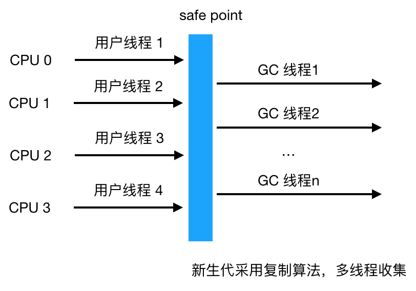

```tex
ParNew 主要工作在 Server 模式，我们知道服务端如果接收的请求多了，响应时间就很重要了，多线程可以让垃圾回收得更快，也就是减少了 STW 时间，能提升响应时间，所以是许多运行在 Server 模式下的虚拟机的首选新生代收集器，另一个与性能无关的原因是因为除了 Serial  收集器，只有它能与 CMS 收集器配合工作，CMS 是一个划时代的垃圾收集器，是真正意义上的并发收集器，它第一次实现了垃圾收集线程与用户线程（基本上）同时工作，它采用的是传统的 GC 收集器代码框架，与 Serial,ParNew 共用一套代码框架，所以能与这两者一起配合工作，而后文提到的 Parallel Scavenge 与 G1 收集器没有使用传统的 GC 收集器代码框架，而是另起炉灶独立实现的，另外一些收集器则只是共用了部分的框架代码,所以无法与 CMS 收集器一起配合工作。
在多 CPU 的情况下，由于 ParNew 的多线程回收特性，毫无疑问垃圾收集会更快，也能有效地减少 STW 的时间，提升应用的响应速度。
```

```tex
Parallel Scavenge 收集器

	Parallel Scavenge 收集器也是一个使用复制算法，多线程，工作于新生代的垃圾收集器，看起来功能和 ParNew 收集器一样，它有啥特别之处吗
	关注点不同，CMS 等垃圾收集器关注的是尽可能缩短垃圾收集时用户线程的停顿时间，而 Parallel Scavenge 目标是达到一个可控制的吞吐量（吞吐量 = 运行用户代码时间 / （运行用户代码时间+垃圾收集时间）），也就是说 CMS 等垃圾收集器更适合用到与用户交互的程序，因为停顿时间越短，用户体验越好，而 Parallel Scavenge 收集器关注的是吞吐量，所以更适合做后台运算等不需要太多用户交互的任务。
	Parallel Scavenge 收集器提供了两个参数来精确控制吞吐量，分别是控制最大垃圾收集时间的 -XX:MaxGCPauseMillis 参数及直接设置吞吐量大小的 -XX:GCTimeRatio（默认99%）
除了以上两个参数，还可以用 Parallel Scavenge 收集器提供的第三个参数 -XX:UseAdaptiveSizePolicy，开启这个参数后，就不需要手工指定新生代大小,Eden 与 Survivor 比例（SurvivorRatio）等细节，只需要设置好基本的堆大小（-Xmx 设置最大堆）,以及最大垃圾收集时间与吞吐量大小，虚拟机就会根据当前系统运行情况收集监控信息，动态调整这些参数以尽可能地达到我们设定的最大垃圾收集时间或吞吐量大小这两个指标。自适应策略也是 Parallel Scavenge  与 ParNew 的重要区别！
```

**老年代收集器**

```tex
Serial Old 收集器

	上文我们知道， Serial 收集器是工作于新生代的单线程收集器，与之相对地，Serial Old 是工作于老年代的单线程收集器，此收集器的主要意义在于给 Client 模式下的虚拟机使用，如果在 Server 模式下，则它还有两大用途：一种是在 JDK 1.5 及之前的版本中与 Parallel Scavenge 配合使用，另一种是作为 CMS 收集器的后备预案,在并发收集发生 Concurrent Mode Failure 时使用（后文讲述）,它与 Serial 收集器配合使用示意图如下
```


```tex
Parallel Old 收集器

Parallel Old 是相对于 Parallel Scavenge 收集器的老年代版本，使用多线程和标记整理法，两者组合示意图如下,这两者的组合由于都是多线程收集器，真正实现了「吞吐量优先」的目标
```


```tex
CMS 收集器

CMS 收集器是以实现最短 STW 时间为目标的收集器，如果应用很重视服务的响应速度，希望给用户最好的体验，则 CMS 收集器是个很不错的选择！
我们之前说老年代主要用标记整理法，而 CMS 虽然工作于老年代，但采用的是标记清除法，主要有以下四个步骤
	初始标记
	并发标记
	重新标记
	并发清除
```

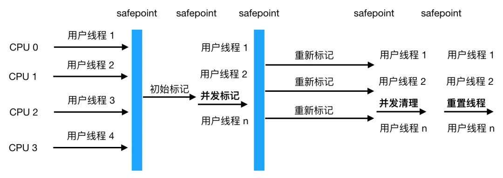

```tex
	从图中可以的看到初始标记和重新标记两个阶段会发生 STW，造成用户线程挂起，不过初始标记仅标记 GC Roots 能关联的对象，速度很快，并发标记是进行 GC Roots  Tracing 的过程，重新标记是为了修正并发标记期间因用户线程继续运行而导致标记产生变动的那一部分对象的标记记录，这一阶段停顿时间一般比初始标记阶段稍长，但远比并发标记时间短。
	整个过程中耗时最长的是并发标记和标记清理，不过这两个阶段用户线程都可工作，所以不影响应用的正常使用，所以总体上看，可以认为 CMS 收集器的内存回收过程是与用户线程一起并发执行的。
	但是 CMS 收集器远达不到完美的程度，主要有以下三个缺点
	
	CMS 收集器对 CPU 资源非常敏感  原因也可以理解，比如本来我本来可以有 10 个用户线程处理请求，现在却要分出 3 个作为回收线程，吞吐量下降了30%，CMS 默认启动的回收线程数是 （CPU数量+3）/ 4, 如果 CPU 数量只有一两个，那吞吐量就直接下降 50%,显然是不可接受的
	
	CMS 无法处理浮动垃圾（Floating Garbage）,可能出现 「Concurrent Mode Failure」而导致另一次 Full GC 的产生，由于在并发清理阶段用户线程还在运行，所以清理的同时新的垃圾也在不断出现，这部分垃圾只能在下一次 GC 时再清理掉（即浮云垃圾），同时在垃圾收集阶段用户线程也要继续运行，就需要预留足够多的空间要确保用户线程正常执行，这就意味着 CMS 收集器不能像其他收集器一样等老年代满了再使用，JDK 1.5 默认当老年代使用了68%空间后就会被激活，当然这个比例可以通过 -XX:CMSInitiatingOccupancyFraction 来设置，但是如果设置地太高很容易导致在 CMS 运行期间预留的内存无法满足程序要求，会导致 Concurrent Mode Failure 失败，这时会启用 Serial Old 收集器来重新进行老年代的收集，而我们知道 Serial Old 收集器是单线程收集器，这样就会导致 STW 更长了。
	
	CMS 采用的是标记清除法，上文我们已经提到这种方法会产生大量的内存碎片，这样会给大内存分配带来很大的麻烦，如果无法找到足够大的连续空间来分配对象，将会触发 Full GC，这会影响应用的性能。当然我们可以开启 -XX:+UseCMSCompactAtFullCollection（默认是开启的），用于在 CMS 收集器顶不住要进行 FullGC 时开启内存碎片的合并整理过程，内存整理会导致 STW，停顿时间会变长，还可以用另一个参数 -XX:CMSFullGCsBeforeCompation 用来设置执行多少次不压缩的 Full GC 后跟着带来一次带压缩的。
```

```tex
G1（Garbage First） 收集器

G1 收集器是面向服务端的垃圾收集器，被称为驾驭一切的垃圾回收器，主要有以下几个特点
	像 CMS 收集器一样，能与应用程序线程并发执行。
	整理空闲空间更快。
	需要 GC 停顿时间更好预测。
	不会像 CMS 那样牺牲大量的吞吐性能。
	不需要更大的 Java Heap
```

```tex
与 CMS 相比，它在以下两个方面表现更出色
	1. 运作期间不会产生内存碎片，G1 从整体上看采用的是标记-整理法，局部（两个 Region）上看是基于复制算法实现的，两个算法都不会产生内存碎片，收集后提供规整的可用内存，这样有利于程序的长时间运行。
	2. 在 STW 上建立了可预测的停顿时间模型，用户可以指定期望停顿时间，G1 会将停顿时间控制在用户设定的停顿时间以内。
	
	为什么G1能建立可预测的停顿模型呢，主要原因在于 G1 对堆空间的分配与传统的垃圾收集器不一器，传统的内存分配就像我们前文所述，是连续的，分成新生代，老年代，新生代又分 Eden,S0,S1,如下
```


```tex
而 G1 各代的存储地址不是连续的，每一代都使用了 n 个不连续的大小相同的 Region，每个Region占有一块连续的虚拟内存地址，如图示
```

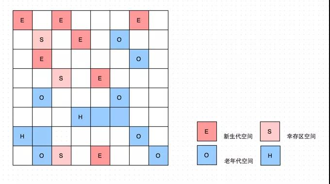

```tex
	除了和传统的新老生代，幸存区的空间区别，Region还多了一个H，它代表Humongous，这表示这些Region存储的是巨大对象（humongous object，H-obj），即大小大于等于region一半的对象，这样超大对象就直接分配到了老年代，防止了反复拷贝移动。那么 G1 分配成这样有啥好处呢？
	传统的收集器如果发生 Full GC 是对整个堆进行全区域的垃圾收集，而分配成各个 Region 的话，方便 G1 跟踪各个 Region 里垃圾堆积的价值大小（回收所获得的空间大小及回收所需经验值），这样根据价值大小维护一个优先列表，根据允许的收集时间，优先收集回收价值最大的 Region,也就避免了整个老年代的回收，也就减少了 STW 造成的停顿时间。同时由于只收集部分 Region,可就做到了 STW 时间的可控。
```

```tex
G1 收集器的工作步骤如下
	初始标记
	并发标记
	最终标记
	筛选回收
```


```tex
	可以看到整体过程与 CMS 收集器非常类似，筛选阶段会根据各个 Region 的回收价值和成本进行排序，根据用户期望的 GC 停顿时间来制定回收计划。
```

**CMS和G1的比较**

```tex
1. CMS收集器是获取最短回收停顿时间为目标的收集器，因为CMS工作时，GC工作线程与用户线程可以并发执行，以此来达到降低手机停顿时间的目的（只有初始标记和重新标记会STW）。但是CMS收集器对CPU资源非常敏感。在并发阶段，虽然不会导致用户线程停顿，但是会占用CPU资源而导致引用程序变慢，总吞吐量下降。
2. CMS仅作用于老年代，是基于标记清除算法，所以清理的过程中会有大量的空间碎片。
3. CMS收集器无法处理浮动垃圾，由于CMS并发清理阶段用户线程还在运行，伴随程序的运行自热会有新的垃圾不断产生，这一部分垃圾出现在标记过程之后，CMS无法在本次收集中处理它们，只好留待下一次GC时将其清理掉。
4. G1是一款面向服务端应用的垃圾收集器，适用于多核处理器、大内存容量的服务端系统。G1能充分利用CPU、多核环境下的硬件优势，使用多个CPU（CPU或者CPU核心）来缩短STW的停顿时间，它满足短时间停顿的同时达到一个高的吞吐量。
5. 从JDK 9开始，G1成为默认的垃圾回收器。当应用有以下任何一种特性时非常适合用G1：Full GC持续时间太长或者太频繁；对象的创建速率和存活率变动很大；应用不希望停顿时间长(长于0.5s甚至1s)。
6. G1将空间划分成很多块（Region），然后他们各自进行回收。堆比较大的时候可以采用，采用复制算法，碎片化问题不严重。整体上看属于标记整理算法,局部(region之间)属于复制算法。
7. G1 需要记忆集 (具体来说是卡表)来记录新生代和老年代之间的引用关系，这种数据结构在 G1 中需要占用大量的内存，可能达到整个堆内存容量的 20% 甚至更多。而且 G1 中维护记忆集的成本较高，带来了更高的执行负载，影响效率。所以 CMS 在小内存应用上的表现要优于 G1，而大内存应用上 G1 更有优势，大小内存的界限是6GB到8GB。
```

##### 7. Minor GC和Full GC触发条件

```tex
Minor GC触发条件：当Eden区满时，触发Minor GC。
Full GC触发条件：
	调用System.gc时，系统建议执行Full GC，但是不必然执行
	老年代空间不足
	方法区空间不足
	通过Minor GC后进入老年代的平均大小大于老年代的可用内存
	由Eden区、From Space区向To Space区复制时，对象大小大于To Space可用内存，则把该对象转存到老年代，且老年代的可用内存小于该对象大小
```

##### 8. JVM锁优化和膨胀过程

```tex
1. 自旋锁：自旋锁其实就是在拿锁时发现已经有线程拿了锁，自己如果去拿会阻塞自己，这个时候会选择进行一次忙循环尝试。也就是不停循环看是否能等到上个线程自己释放锁。自适应自旋锁指的是例如第一次设置最多自旋10次，结果2. 在自旋的过程中成功获得了锁，那么下一次就可以设置成最多自旋20次。
3. 锁粗化：虚拟机通过适当扩大加锁的范围以避免频繁的拿锁释放锁的过程。
4. 锁消除：通过逃逸分析发现其实根本就没有别的线程产生竞争的可能（别的线程没有临界量的引用），或者同步块内进行的是原子操作，而“自作多情”地给自己加上了锁。有可能虚拟机会直接去掉这个锁。
5. 偏向锁：在大多数的情况下，锁不仅不存在多线程的竞争，而且总是由同一个线程获得。因此为了让线程获得锁的代价更低引入了偏向锁的概念。偏向锁的意思是如果一个线程获得了一个偏向锁，如果在接下来的一段时间中没有其他线程来竞争锁，那么持有偏向锁的线程再次进入或者退出同一个同步代码块，不需要再次进行抢占锁和释放锁的操作。
6. 轻量级锁：当存在超过一个线程在竞争同一个同步代码块时，会发生偏向锁的撤销。当前线程会尝试使用CAS来获取锁，当自旋超过指定次数(可以自定义)时仍然无法获得锁，此时锁会膨胀升级为重量级锁。
7. 重量级锁：重量级锁依赖对象内部的monitor锁来实现，而monitor又依赖操作系统的MutexLock（互斥锁）。当系统检查到是重量级锁之后，会把等待想要获取锁的线程阻塞，被阻塞的线程不会消耗CPU，但是阻塞或者唤醒一个线程，都需要通过操作系统来实现。
```

##### 9. 强 软 弱 虚 引用

```tex
	无论是通过引用计数法判断对象引用数量，还是通过可达性分析法判断对象的引用链是否可达，判定对象的存活都与“引用”有关。

	JDK1.2 之前，Java 中引用的定义很传统：如果 reference 类型的数据存储的数值代表的是另一块内存的起始地址，就称这块内存代表一个引用。

	JDK1.2 以后，Java 对引用的概念进行了扩充，将引用分为强引用、软引用、弱引用、虚引用四种（引用强度逐渐减弱）
```

```tex
1．强引用（StrongReference）

以前我们使用的大部分引用实际上都是强引用，这是使用最普遍的引用。如果一个对象具有强引用，那就类似于必不可少的生活用品，垃圾回收器绝不会回收它。当内存空间不足，Java 虚拟机宁愿抛出 OutOfMemoryError 错误，使程序异常终止，也不会靠随意回收具有强引用的对象来解决内存不足问题。
```

```tex
2．软引用（SoftReference）

如果一个对象只具有软引用，那就类似于可有可无的生活用品。如果内存空间足够，垃圾回收器就不会回收它，如果内存空间不足了，就会回收这些对象的内存。只要垃圾回收器没有回收它，该对象就可以被程序使用。软引用可用来实现内存敏感的高速缓存。

软引用可以和一个引用队列（ReferenceQueue）联合使用，如果软引用所引用的对象被垃圾回收，JAVA 虚拟机就会把这个软引用加入到与之关联的引用队列中。
```

```tex
3．弱引用（WeakReference）

如果一个对象只具有弱引用，那就类似于可有可无的生活用品。弱引用与软引用的区别在于：只具有弱引用的对象拥有更短暂的生命周期。在垃圾回收器线程扫描它所管辖的内存区域的过程中，一旦发现了只具有弱引用的对象，不管当前内存空间足够与否，都会回收它的内存。不过，由于垃圾回收器是一个优先级很低的线程， 因此不一定会很快发现那些只具有弱引用的对象。

弱引用可以和一个引用队列（ReferenceQueue）联合使用，如果弱引用所引用的对象被垃圾回收，Java 虚拟机就会把这个弱引用加入到与之关联的引用队列中。
```

```tex
4．虚引用（PhantomReference）

"虚引用"顾名思义，就是形同虚设，与其他几种引用都不同，虚引用并不会决定对象的生命周期。如果一个对象仅持有虚引用，那么它就和没有任何引用一样，在任何时候都可能被垃圾回收。

虚引用主要用来跟踪对象被垃圾回收的活动。

虚引用与软引用和弱引用的一个区别在于： 虚引用必须和引用队列（ReferenceQueue）联合使用。当垃圾回收器准备回收一个对象时，如果发现它还有虚引用，就会在回收对象的内存之前，把这个虚引用加入到与之关联的引用队列中。程序可以通过判断引用队列中是否已经加入了虚引用，来了解被引用的对象是否将要被垃圾回收。程序如果发现某个虚引用已经被加入到引用队列，那么就可以在所引用的对象的内存被回收之前采取必要的行动。

特别注意，在程序设计中一般很少使用弱引用与虚引用，使用软引用的情况较多，这是因为软引用可以加速 JVM 对垃圾内存的回收速度，可以维护系统的运行安全，防止内存溢出（OutOfMemory）等问题的产生。
```

##### 10. 废物测试

**不可达的对象并非“非死不可”**

```tex
	即使在可达性分析法中不可达的对象，也并非是“非死不可”的，这时候它们暂时处于“缓刑阶段”，要真正宣告一个对象死亡，至少要经历两次标记过程；可达性分析法中不可达的对象被第一次标记并且进行一次筛选，筛选的条件是此对象是否有必要执行 finalize 方法。当对象没有覆盖 finalize 方法，或 finalize 方法已经被虚拟机调用过时，虚拟机将这两种情况视为没有必要执行。

	被判定为需要执行的对象将会被放在一个队列中进行第二次标记，除非这个对象与引用链上的任何一个对象建立关联，否则就会被真的回收。
```

**如何判断一个常量是废弃常量**

```tex
	运行时常量池主要回收的是废弃的常量。那么，我们如何判断一个常量是废弃常量呢？

	假如在常量池中存在字符串 "abc"，如果当前没有任何 String 对象引用该字符串常量的话，就说明常量 "abc" 就是废弃常量，如果这时发生内存回收的话而且有必要的话，"abc" 就会被系统清理出常量池。

	注意：我们在 可能是把 Java 内存区域讲的最清楚的一篇文章 也讲了 JDK1.7 及之后版本的 JVM 已经将运行时常量池从方法区中移了出来，在 Java 堆（Heap）中开辟了一块区域存放运行时常量池。
```

**如何判断一个类是无用的类**

```tex
方法区主要回收的是无用的类，那么如何判断一个类是无用的类的呢？

判定一个常量是否是“废弃常量”比较简单，而要判定一个类是否是“无用的类”的条件则相对苛刻许多。类需要同时满足下面 3 个条件才能算是 “无用的类” ：

	该类所有的实例都已经被回收，也就是 Java 堆中不存在该类的任何实例。
	加载该类的 ClassLoader 已经被回收。
	该类对应的 java.lang.Class 对象没有在任何地方被引用，无法在任何地方通过反射访问该类的方法。
虚拟机可以对满足上述 3 个条件的无用类进行回收，这里说的仅仅是“可以”，而并不是和对象一样不使用了就会必然被回收。
```

### SQL相关

#### MySQL

##### 1. 事务的基本要素

```tex
1. 原子性：事务是一个原子操作单元，其对数据的修改，要么全都执行，要么全都不执行
2. 一致性：事务开始前和结束后，数据库的完整性约束没有被破坏。
3. 隔离性：同一时间，只允许一个事务请求同一数据，不同的事务之间彼此没有任何干扰。
4. 持久性：事务完成后，事务对数据库的所有更新将被保存到数据库，不能回滚。
```

##### 2. 事务的并发问题

```tex
1. 脏读：事务A读取了事务B更新的数据，然后B回滚操作，那么A读取到的数据是脏数据
2. 不可重复读：事务A多次读取同一数据，事务B在事务A多次读取的过程中，对数据作了更新并提交，导致事务A多次读取同一数据时，结果不一致。
3. 幻读：A事务读取了B事务已经提交的新增数据。注意和不可重复读的区别，这里是新增，不可重复读是更改（或删除）。select某记录是否存在，不存在，准备插入此记录，但执行 insert 时发现此记录已存在，无法插入，此时就发生了幻读。
```

##### 3. MySQL事务隔离级别

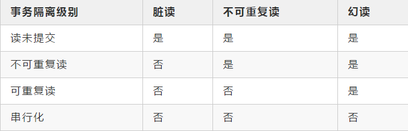

```tex
1. 在MySQL可重复读的隔离级别中并不是完全解决了幻读的问题，而是解决了读数据情况下的幻读问题。而对于修改的操作依旧存在幻读问题，就是说MVCC对于幻读的解决时不彻底的。
2. 通过索引加锁，间隙锁，next key lock可以解决幻读的问题。
```

##### 4. Mysql的逻辑结构

```tex
1. 最上层的服务类似其他CS结构，比如连接处理，授权处理。
2. 第二层是Mysql的服务层，包括SQL的解析分析优化，存储过程触发器视图等也在这一层实现。
3. 最后一层是存储引擎的实现，类似于Java接口的实现，Mysql的执行器在执行SQL的时候只会关注API的调用，完全屏蔽了不同引擎实现间的差异。比如Select语句，先会判断当前用户是否拥有权限，其次到缓存（内存）查询是否有相应的结果集，如果没有再执行解析sql，优化生成执行计划，调用API执行。
```

##### 5. SQL执行顺序

```tex
SQL的执行顺序：from---where--group by---having---select---order by
```

##### 6.  MVCC,redolog,undolog,binlog

```tex
1. undoLog 也就是我们常说的回滚日志文件 主要用于事务中执行失败，进行回滚，以及MVCC中对于数据历史版本的查看。由引擎层的InnoDB引擎实现,是逻辑日志,记录数据修改被修改前的值,比如"把id='B' 修改为id = 'B2' ，那么undo日志就会用来存放id ='B'的记录”。当一条数据需要更新前,会先把修改前的记录存储在undolog中,如果这个修改出现异常,,则会使用undo日志来实现回滚操作,保证事务的一致性。当事务提交之后，undo log并不能立马被删除,而是会被放到待清理链表中,待判断没有事物用到该版本的信息时才可以清理相应undolog。它保存了事务发生之前的数据的一个版本，用于回滚，同时可以提供多版本并发控制下的读（MVCC），也即非锁定读。
2. redoLog 是重做日志文件是记录数据修改之后的值，用于持久化到磁盘中。redo log包括两部分：一是内存中的日志缓冲(redo log buffer)，该部分日志是易失性的；二是磁盘上的重做日志文件(redo log file)，该部分日志是持久的。由引擎层的InnoDB引擎实现,是物理日志,记录的是物理数据页修改的信息,比如“某个数据页上内容发生了哪些改动”。当一条数据需要更新时,InnoDB会先将数据更新，然后记录redoLog 在内存中，然后找个时间将redoLog的操作执行到磁盘上的文件上。不管是否提交成功我都记录，你要是回滚了，那我连回滚的修改也记录。它确保了事务的持久性。
3. MVCC多版本并发控制是MySQL中基于乐观锁理论实现隔离级别的方式，用于读已提交和可重复读取隔离级别的实现。在MySQL中，会在表中每一条数据后面添加两个字段：最近修改该行数据的事务ID，指向该行（undolog表中）回滚段的指针。Read View判断行的可见性，创建一个新事务时，copy一份当前系统中的活跃事务列表。意思是，当前不应该被本事务看到的其他事务id列表。
4. binlog由Mysql的Server层实现,是逻辑日志,记录的是sql语句的原始逻辑，比如"把id='B' 修改为id = ‘B2’。binlog会写入指定大小的物理文件中,是追加写入的,当前文件写满则会创建新的文件写入。产生:事务提交的时候,一次性将事务中的sql语句,按照一定的格式记录到binlog中。用于复制和恢复在主从复制中，从库利用主库上的binlog进行重播(执行日志中记录的修改逻辑),实现主从同步。业务数据不一致或者错了，用binlog恢复。
```

##### 7. binlog和redolog的区别

```tex
1. redolog是在InnoDB存储引擎层产生，而binlog是MySQL数据库的上层服务层产生的。
2. 两种日志记录的内容形式不同。MySQL的binlog是逻辑日志，其记录是对应的SQL语句。而innodb存储引擎层面的重做日志是物理日志。
3. 两种日志与记录写入磁盘的时间点不同，binlog日志只在事务提交完成后进行一次写入。而innodb存储引擎的重做日志在事务进行中不断地被写入，并日志不是随事务提交的顺序进行写入的。
4. binlog不是循环使用，在写满或者重启之后，会生成新的binlog文件，redolog是循环使用。
5. binlog可以作为恢复数据使用，主从复制搭建，redolog作为异常宕机或者介质故障后的数据恢复使用。
```

##### 8. Mysql如何保证一致性和持久性

```tex
MySQL为了保证ACID中的一致性和持久性，使用了WAL(Write-Ahead Logging,先写日志再写磁盘)。Redo log就是一种WAL的应用。当数据库忽然掉电，再重新启动时，MySQL可以通过Redo log还原数据。也就是说，每次事务提交时，不用同步刷新磁盘数据文件，只需要同步刷新Redo log就足够了。
```

#####9. InnoDB的行锁模式

```tex
1. 共享锁(S)：用法lock in share mode，又称读锁，允许一个事务去读一行，阻止其他事务获得相同数据集的排他锁。若事务T对数据对象A加上S锁，则事务T可以读A但不能修改A，其他事务只能再对A加S锁，而不能加X锁，直到T释放A上的S锁。这保证了其他事务可以读A，但在T释放A上的S锁之前不能对A做任何修改。
2. 排他锁(X)：用法for update，又称写锁，允许获取排他锁的事务更新数据，阻止其他事务取得相同的数据集共享读锁和排他写锁。若事务T对数据对象A加上X锁，事务T可以读A也可以修改A，其他事务不能再对A加任何锁，直到T释放A上的锁。在没有索引的情况下，InnoDB只能使用表锁。
```

##### 10. 为什么选择B+树作为索引结构

```tex
1. Hash索引：Hash索引底层是哈希表，哈希表是一种以key-value存储数据的结构，所以多个数据在存储关系上是完全没有任何顺序关系的，所以，对于区间查询是无法直接通过索引查询的，就需要全表扫描。所以，哈希索引只适用于等值查询的场景。而B+ 树是一种多路平衡查询树，所以他的节点是天然有序的（左子节点小于父节点、父节点小于右子节点），所以对于范围查询的时候不需要做全表扫描
2. 二叉查找树：解决了排序的基本问题，但是由于无法保证平衡，可能退化为链表。
3. 平衡二叉树：通过旋转解决了平衡的问题，但是旋转操作效率太低。
红黑树：通过舍弃严格的平衡和引入红黑节点，解决了    AVL旋转效率过低的问题，但是在磁盘等场景下，树仍然太高，IO次数太多。
4. B+树：在B树的基础上，将非叶节点改造为不存储数据纯索引节点，进一步降低了树的高度；此外将叶节点使用指针连接成链表，范围查询更加高效。
```

##### 11. B+树的叶子节点都可以存哪些东西

```tex
可能存储的是整行数据，也有可能是主键的值。B+树的叶子节点存储了整行数据的是主键索引，也被称之为聚簇索引。而索引B+ Tree的叶子节点存储了主键的值的是非主键索引，也被称之为非聚簇索引
```

##### 12. 覆盖索引

```tex
指一个查询语句的执行只用从索引中就能够取得，不必从数据表中读取。也可以称之为实现了索引覆盖。
```

##### 13. 查询在什么时候不走（预期中的）索引

```tex
1. 模糊查询 %like
2. 索引列参与计算,使用了函数
3. 非最左前缀顺序
4. where对null判断
5. where不等于
6. or操作有至少一个字段没有索引
7. 需要回表的查询结果集过大（超过配置的范围）
```

##### 14. 数据库优化指南

```tex
1. 创建并使用正确的索引
2. 只返回需要的字段
3. 减少交互次数（批量提交）
4. 设置合理的Fetch Size（数据每次返回给客户端的条数）
```


###NOSQL相关

#### Redis

#####1. Redis 是什么

```tex
	（这不就是总结下 Redis 的定义和特点嘛）Redis 是 C 语言开发的一个开源的（遵从 BSD 协议）高性能键值对（key-value）的内存数据库，可以用作数据库、缓存、消息中间件等。它是一种 NoSQL（not-only sql，泛指非关系型数据库）的数据库。
	
Redis 作为一个内存数据库：
	1. 性能优秀，数据在内存中，读写速度非常快，支持并发 10W QPS。
	2. 单进程单线程，是线程安全的，采用 IO 多路复用机制。
	3.丰富的数据类型，支持字符串（strings）、散列（hashes）、列表（lists）、集合（sets）、有序集合（sorted sets）等。
	4. 支持数据持久化。
	5. 可以将内存中数据保存在磁盘中，重启时加载。
	6. 主从复制，哨兵，高可用。
	7. 可以用作分布式锁。
	8. 可以作为消息中间件使用，支持发布订阅。
```

#####2. Redis 的五种数据类型

```tex
	当然可以，但是在说之前，我觉得有必要先来了解下 Redis 内部内存管理是如何描述这 5 种数据类型的。说着，我拿着笔给面试官画了一张图：
```

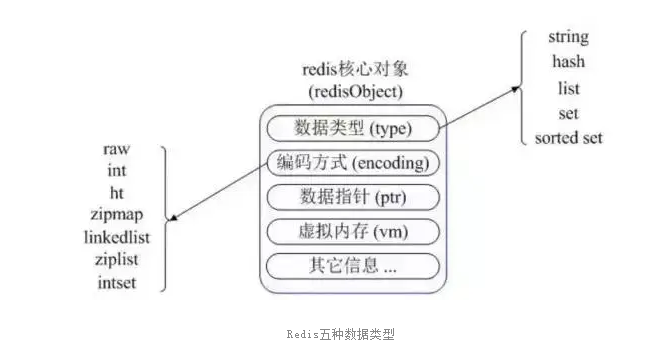

```tex
	首先 Redis 内部使用一个 redisObject 对象来表示所有的 key 和 value。redisObject 最主要的信息如上图所示：type 表示一个 value 对象具体是何种数据类型，encoding 是不同数据类型在 Redis 内部的存储方式。比如：type=string 表示 value 存储的是一个普通字符串，那么 encoding 可以是 raw 或者 int。
```

```tex
1.string

介绍： string 是 redis 最基本的类型，可以理解成与 memcached 一模一样的类型，一个 key 对应一个 value。value 不仅是 string，也可以是数字。string 类型是二进制安全的，意思是 redis 的 string 类型可以包含任何数据，比如 jpg 图片或者序列化的对象。string 类型的值最大能存储 512M。
常用命令: set,get,decr,incr,mget 等。
应用场景 ：常规 key-value 缓存应用；常规计数：微博数，粉丝数等。
2.Hash

介绍 ：Hash 是一个键值（key-value）的集合。redis 的 hash 是一个 string 的 key 和 value 的映射表，Hash 特别适合存储对象。常用命令：hget,hset,hgetall 等。
常用命令 ：hget,hset,hgetall 等。
应用场景 ：hash 特别适合用于存储对象，后续操作的时候，你可以直接仅仅修改这个对象中的某个字段的值。比如我们可以 hash 数据结构来存储用户信息，商品信息等等。

3.list

介绍 ：list 列表是简单的字符串列表，按照插入顺序排序。可以添加一个元素到列表的头部（左边）或者尾部（右边） ：
**常用命令：**lpush、rpush、lpop、rpop、lrange(获取列表片段)等。
应用场景 ：list 应用场景非常多，也是 Redis 最重要的数据结构之一，比如 twitter 的关注列表，粉丝列表都可以用 list 结构来实现。

list 就是链表，可以用来当消息队列用。redis 提供了 List 的 push 和 pop 操作，还提供了操作某一段的 api，可以直接查询或者删除某一段的元素。redis list 的是实现是一个双向链表，既可以支持反向查找和遍历，更方便操作，不过带来了额外的内存开销。

4.set

介绍 ：set 是 string 类型的无序集合。集合是通过 hashtable 实现的。set 中的元素是没有顺序的，而且是没有重复的。
常用命令： sdd、spop、smembers、sunion 等。
应用场景 ：redis set 对外提供的功能和 list 一样是一个列表，特殊之处在于 set 是自动去重的，而且 set 提供了判断某个成员是否在一个 set 集合中。

5.zset

介绍 ：zset 和 set 一样是 string 类型元素的集合，且不允许重复的元素。
常用命令： zadd、zrange、zrem、zcard 等。
**使用场景：**sorted set 可以通过用户额外提供一个优先级（score）的参数来为成员排序，并且是插入有序的，即自动排序。当你需要一个有序的并且不重复的集合列表，那么可以选择 sorted set 结构。和 set 相比，sorted set 关联了一个 double 类型权重的参数 score，使得集合中的元素能够按照 score 进行有序排列，redis 正是通过分数来为集合中的成员进行从小到大的排序。

Redis sorted set 的内部使用 HashMap 和跳跃表(skipList)来保证数据的存储和有序，HashMap 里放的是成员到 score 的映射，而跳跃表里存放的是所有的成员，排序依据是 HashMap 里存的 score，使用跳跃表的结构可以获得比较高的查找效率，并且在实现上比较简单。
```

**Redis 数据类型应用场景总结:**

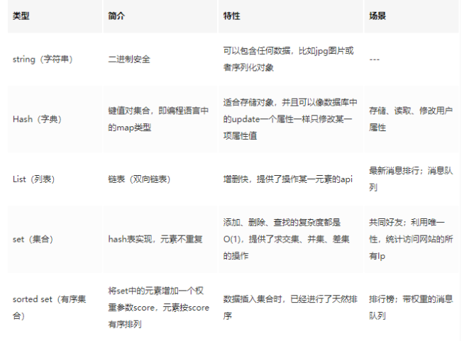

##### 3. Redis 的使用

```tex
面试官 ：想不到你平时也下了不少工夫，那 Redis 缓存你一定用过的吧？
我： 用过的。
面试官：**那你跟我说下你是怎么用的？

我 ：我是结合 Spring Boot 使用的。一般有两种方式：
	1.接通过 RedisTemplate 来使用
	2.使用 Spring Cache 集成 Redis pom.xml 中加入以下依赖：
```

###### 1、简单说一下代码吧！

```xml
<dependencies>
    <dependency>
        <groupId>org.springframework.boot</groupId>
        <artifactId>spring-boot-starter-data-redis</artifactId>
    </dependency>
    <dependency>
        <groupId>org.apache.commons</groupId>
        <artifactId>commons-pool2</artifactId>
    </dependency>
    <dependency>
        <groupId>org.springframework.boot</groupId>
        <artifactId>spring-boot-starter-web</artifactId>
    </dependency>
    <dependency>
        <groupId>org.springframework.session</groupId>
        <artifactId>spring-session-data-redis</artifactId>
    </dependency>

    <dependency>
        <groupId>org.projectlombok</groupId>
        <artifactId>lombok</artifactId>
        <optional>true</optional>
    </dependency>
    <dependency>
        <groupId>org.springframework.boot</groupId>
        <artifactId>spring-boot-starter-test</artifactId>
        <scope>test</scope>
    </dependency>
</dependencies>
```

```tex
1. spring-boot-starter-data-redis :在 spring boot 2.x 以后底层不再使用 Jedis，而是换成了 Lettuce。
2. commons-pool2 ：用作 redis 连接池，如不引入启动会报错
3. spring-session-data-redis ：spring session 引入，用作共享 session。配置文件
```

######2、application.yml 的配置：

```yaml
server:
  port: 8082
  servlet:
    session:
      timeout: 30ms
spring:
  cache:
    type: redis
  redis:
    host: 127.0.0.1
    port: 6379
    password:
    # redis默认情况下有16个分片，这里配置具体使用的分片，默认为0
    database: 0
    lettuce:
      pool:
        # 连接池最大连接数(使用负数表示没有限制),默认8
        max-active: 100
```

###### 3、创建实体类 User.java

```java
public class User implements Serializable{

    private static final long serialVersionUID = 662692455422902539L;

    private Integer id;

    private String name;

    private Integer age;

    public User() {
    }

    public User(Integer id, String name, Integer age) {
        this.id = id;
        this.name = name;
        this.age = age;
    }

    public Integer getId() {
        return id;
    }

    public void setId(Integer id) {
        this.id = id;
    }

    public String getName() {
        return name;
    }

    public void setName(String name) {
        this.name = name;
    }

    public Integer getAge() {
        return age;
    }

    public void setAge(Integer age) {
        this.age = age;
    }

    @Override
    public String toString() {
        return "User{" +
                "id=" + id +
                ", name='" + name + '\'' +
                ", age=" + age +
                '}';
    }
}
```

###### 4、 RedisTemplate 的使用方式

```tex
	默认情况下的模板只能支持 RedisTemplate<String, String>，也就是只能存入字符串，所以自定义模板很有必要。添加配置类 RedisCacheConfig.java
```

```java
@Configuration
@AutoConfigureAfter(RedisAutoConfiguration.class)
public class RedisCacheConfig {

    @Bean
    public RedisTemplate<String, Serializable> redisCacheTemplate(LettuceConnectionFactory connectionFactory) {

        RedisTemplate<String, Serializable> template = new RedisTemplate<>();
        template.setKeySerializer(new StringRedisSerializer());
        template.setValueSerializer(new GenericJackson2JsonRedisSerializer());
        template.setConnectionFactory(connectionFactory);
        return template;
    }
}

```

###### 测试类

```java
@RestController
@RequestMapping("/user")
public class UserController {

    public static Logger logger = LogManager.getLogger(UserController.class);

    @Autowired
    private StringRedisTemplate stringRedisTemplate;

    @Autowired
    private RedisTemplate<String, Serializable> redisCacheTemplate;

    @RequestMapping("/test")
    public void test() {
        redisCacheTemplate.opsForValue().set("userkey", new User(1, "张三", 25));
        User user = (User) redisCacheTemplate.opsForValue().get("userkey");
        logger.info("当前获取对象：{}", user.toString());
    }
```

```tex
然后在浏览器访问，观察后台日志 http://localhost:8082/user/test 。
```

###### 5、使用 Spring Cache 集成 Redis

```tex
	Spring Cache 具备很好的灵活性，不仅能够使用 SPEL（spring expression language）来定义缓存的 Key 和各种 Condition，还提供了开箱即用的缓存临时存储方案，也支持和主流的专业缓存如 EhCache、Redis、Guava 的集成。
```

###### 定义接口 UserService.java

```java
public interface UserService {

    User save(User user);

    void delete(int id);

    User get(Integer id);
}
```

###### 接口实现类 UserServiceImpl.java

```java
@Service
public class UserServiceImpl implements UserService{

    public static Logger logger = LogManager.getLogger(UserServiceImpl.class);

    private static Map<Integer, User> userMap = new HashMap<>();
    static {
        userMap.put(1, new User(1, "肖战", 25));
        userMap.put(2, new User(2, "王一博", 26));
        userMap.put(3, new User(3, "杨紫", 24));
    }


    @CachePut(value ="user", key = "#user.id")
    @Override
    public User save(User user) {
        userMap.put(user.getId(), user);
        logger.info("进入save方法，当前存储对象：{}", user.toString());
        return user;
    }

    @CacheEvict(value="user", key = "#id")
    @Override
    public void delete(int id) {
        userMap.remove(id);
        logger.info("进入delete方法，删除成功");
    }

    @Cacheable(value = "user", key = "#id")
    @Override
    public User get(Integer id) {
        logger.info("进入get方法，当前获取对象：{}", userMap.get(id)==null?null:userMap.get(id).toString());
        return userMap.get(id);
    }
}
```

```tex
为了方便演示数据库的操作，这里直接定义了一个Map<Integer,User> userMap。

这里的核心是三个注解：
	@Cachable
	@CachePut
	@CacheEvict
```

###### 测试类：UserController

```java
@RestController
@RequestMapping("/user")
public class UserController {

    public static Logger logger = LogManager.getLogger(UserController.class);

    @Autowired
    private StringRedisTemplate stringRedisTemplate;

    @Autowired
    private RedisTemplate<String, Serializable> redisCacheTemplate;

    @Autowired
    private UserService userService;

    @RequestMapping("/test")
    public void test() {
        redisCacheTemplate.opsForValue().set("userkey", new User(1, "张三", 25));
        User user = (User) redisCacheTemplate.opsForValue().get("userkey");
        logger.info("当前获取对象：{}", user.toString());
    }


    @RequestMapping("/add")
    public void add() {
        User user = userService.save(new User(4, "李现", 30));
        logger.info("添加的用户信息：{}",user.toString());
    }

    @RequestMapping("/delete")
    public void delete() {
        userService.delete(4);
    }

    @RequestMapping("/get/{id}")
    public void get(@PathVariable("id") String idStr) throws Exception{
        if (StringUtils.isBlank(idStr)) {
            throw new Exception("id为空");
        }
        Integer id = Integer.parseInt(idStr);
        User user = userService.get(id);
        logger.info("获取的用户信息：{}",user.toString());
    }
}
```

###### 用缓存要注意，启动类要加上一个注解开启缓存：

```java
@SpringBootApplication(exclude=DataSourceAutoConfiguration.class)
@EnableCaching
public class Application {

    public static void main(String[] args) {
        SpringApplication.run(Application.class, args);
    }

}
```

###### 测试

```tex
1、先调用添加接口：http://localhost:8082/user/add
2、再调用查询接口，查询 id=4 的用户信息：
3、可以看出，这里已经从缓存中获取数据了，因为上一步 add 方法已经把 id=4 的用户数据放入了 redis 缓存 3、调用删除方法，删除 id=4 的用户信息，同时清除缓存
4、再次调用查询接口，查询 id=4 的用户信息：
5、没有了缓存，所以进入了 get 方法，从 userMap 中获取。
```

###### 5、缓存注解

```tex
1、@Cacheable 根据方法的请求参数对其结果进行缓存
	key：缓存的 key，可以为空，如果指定要按照 SPEL 表达式编写，如果不指定，则按照方法的所有参数进行组合。
	value：缓存的名称，必须指定至少一个（如 @Cacheable (value='user')或者@Cacheable(value={'user1','user2'})）
	condition：缓存的条件，可以为空，使用 SPEL 编写，返回 true 或者 false，只有为 true 才进行缓存。
	
	@Cacheable 注解不支持配置过期时间，所有需要通过配置 cacheManager来配置默认的过期时间和针对每个类或者是方法进行缓存失效时间配置。

2、@CachePut根据方法的请求参数对其结果进行缓存，和@Cacheable 不同的是，它每次都会触发真实方法的调用。参数描述见上。

3、@CacheEvict根据条件对缓存进行清空
	key：同上
	value：同上
	condition：同上
	allEntries：是否清空所有缓存内容，缺省为 false，如果指定为 true，则方法调用后将立即清空所有缓存
	beforeInvocation：是否在方法执行前就清空，缺省为 false，如果指定为 true，则在方法还没有执行的时候就清空缓存。缺省情况下，如果方法执行抛出异常，则不会清空缓存。
```

##### 4. 缓存问题

###### 1、缓存有遇到什么问题或者会遇到什么问题？

```tex
	缓存和数据库数据一致性问题：分布式环境下非常容易出现缓存和数据库间数据一致性问题，针对这一点，如果项目对缓存的要求是强一致性的，那么就不要使用缓存。我们只能采取合适的策略来降低缓存和数据库间数据不一致的概率，而无法保证两者间的强一致性。合适的策略包括合适的缓存更新策略，更新数据库后及时更新缓存、缓存失败时增加重试机制。
```

###### 2、**Redis 雪崩**了解吗？

```tex
	我了解的，目前电商首页以及热点数据都会去做缓存，一般缓存都是定时任务去刷新，或者查不到之后去更新缓存的，定时任务刷新就有一个问题。举个栗子：如果首页所有 Key 的失效时间都是 12 小时，中午 12 点刷新的，我零点有个大促活动大量用户涌入，假设每秒 6000 个请求，本来缓存可以抗住每秒 5000 个请求，但是缓存中所有 Key 都失效了。此时 6000 个/秒的请求全部落在了数据库上，数据库必然扛不住，真实情况可能 DBA 都没反应过来直接挂了，此时，如果没什么特别的方案来处理，DBA 很着急，重启数据库，但是数据库立马又被新流量给打死了。这就是我理解的缓存雪崩。
	我心想：同一时间大面积失效，瞬间 Redis 跟没有一样，那这个数量级别的请求直接打到数据库几乎是灾难性的，你想想如果挂的是一个用户服务的库，那其他依赖他的库所有接口几乎都会报错，如果没做熔断等策略基本上就是瞬间挂一片的节奏，你怎么重启用户都会把你打挂，等你重启好的时候，用户早睡觉去了，临睡之前，骂骂咧咧“什么垃圾产品”。
```

###### 3、那这种情况你都是怎么应对的？

```tex
	处理缓存雪崩简单，在批量往 Redis 存数据的时候，把每个 Key 的失效时间都加个随机值就好了，这样可以保证数据不会再同一时间大面积失效。
	
	setRedis（key, value, time+Math.random()*10000）;	
	
	如果 Redis 是集群部署，将热点数据均匀分布在不同的 Redis 库中也能避免全部失效。或者设置热点数据永不过期，有更新操作就更新缓存就好了（比如运维更新了首页商品，那你刷下缓存就好了，不要设置过期时间），电商首页的数据也可以用这个操作，保险。
```

###### 4、那你了解**缓存穿透和击穿**么，可以说说他们跟雪崩的区别吗？

```tex
	嗯，了解，先说下缓存穿透吧，缓存穿透是指缓存和数据库中都没有的数据，而用户（黑客）不断发起请求，举个栗子：我们数据库的 id 都是从 1 自增的，如果发起 id=-1 的数据或者 id 特别大不存在的数据，这样的不断攻击导致数据库压力很大，严重会击垮数据库。
	我又接着说：至于缓存击穿嘛，这个跟缓存雪崩有点像，但是又有一点不一样，缓存雪崩是因为大面积的缓存失效，打崩了 DB，而缓存击穿不同的是缓存击穿是指一个 Key 非常热点，在不停地扛着大量的请求，大并发集中对这一个点进行访问，当这个 Key 在失效的瞬间，持续的大并发直接落到了数据库上，就在这个 Key 的点上击穿了缓存。
```

###### 5、分别怎么解决

```tex
	缓存穿透我会在接口层增加校验，比如用户鉴权，参数做校验，不合法的校验直接 return，比如 id 做基础校验，id<=0 直接拦截。
	我记得 Redis 里还有一个高级用法**布隆过滤器（Bloom Filter）**这个也能很好的预防缓存穿透的发生，他的原理也很简单，就是利用高效的数据结构和算法快速判断出你这个 Key 是否在数据库中存在，不存在你 return 就好了，存在你就去查 DB 刷新 KV 再 return。缓存击穿的话，设置热点数据永不过期，或者加上互斥锁就搞定了。
	
```

作为暖男，代码给你准备好了，拿走不谢。

```java
public static String getData(String key) throws InterruptedException {
        //从Redis查询数据
        String result = getDataByKV(key);
        //参数校验
        if (StringUtils.isBlank(result)) {
            try {
                //获得锁
                if (reenLock.tryLock()) {
                    //去数据库查询
                    result = getDataByDB(key);
                    //校验
                    if (StringUtils.isNotBlank(result)) {
                        //插进缓存
                        setDataToKV(key, result);
                    }
                } else {
                    //睡一会再拿
                    Thread.sleep(100L);
                    result = getData(key);
                }
            } finally {
                //释放锁
                reenLock.unlock();
            }
        }
        return result;
    }
```

##### 5. Redis为何这么快

```tex
🙍‍♂️ 面试官 ：redis 作为缓存大家都在用，那 redis 一定很快咯？
🙋 我 ：当然了，官方提供的数据可以达到 100000+的 QPS（每秒内的查询次数），这个数据不比 Memcached 差！

🙍‍♂️ 面试官 ：redis 这么快，它的“多线程模型”你了解吗？（露出邪魅一笑）
🙋 我 ：您是想问 Redis 这么快，为什么还是单线程的吧。Redis 确实是单进程单线程的模型，因为 Redis 完全是基于内存的操作，CPU 不是 Redis 的瓶颈，Redis 的瓶颈最有可能是机器内存的大小或者网络带宽。既然单线程容易实现，而且 CPU 不会成为瓶颈，那就顺理成章的采用单线程的方案了（毕竟采用多线程会有很多麻烦）。

🙍‍♂️ 面试官 ：嗯，是的。那你能说说 Redis 是单线程的，为什么还能这么快吗？
🙋 我 ：可以这么说吧。第一：Redis 完全基于内存，绝大部分请求是纯粹的内存操作，非常迅速，数据存在内存中，类似于 HashMap，HashMap 的优势就是查找和操作的时间复杂度是 O(1)。第二：数据结构简单，对数据操作也简单。第三：采用单线程，避免了不必要的上下文切换和竞争条件，不存在多线程导致的 CPU 切换，不用去考虑各种锁的问题，不存在加锁释放锁操作，没有死锁问题导致的性能消耗。第四：使用多路复用 IO 模型，非阻塞 IO。
```

##### 6. Redis 和 Memcached 的区别

```java
🙍‍♂️ 面试官：嗯嗯，说的很详细。那你为什么选择 Redis 的缓存方案而不用 memcached 呢?
  
🙋 我 ：
	1. 存储方式上 ：memcache 会把数据全部存在内存之中，断电后会挂掉，数据不能超过内存大小。redis 有部分数据存在硬盘上，这样能保证数据的持久性。
	2. 数据支持类型上 ：memcache 对数据类型的支持简单，只支持简单的 key-value，，而 redis 支持五种数据类型。
	3. 使用底层模型不同： 它们之间底层实现方式以及与客户端之间通信的应用协议不一样。redis 直接自己构建了 VM 机制，因为一般的系统调用系统函数的话，会浪费一定的时间去移动和请求。
	4. value 的大小 ：redis 可以达到 1GB，而 memcache 只有 1MB。
```

##### 7. 淘汰策略

```tex
🙍‍♂️ 面试官 ：那你说说你知道的 redis 的淘汰策略有哪些？
🙋 我 ：Redis 有六种淘汰策略
```

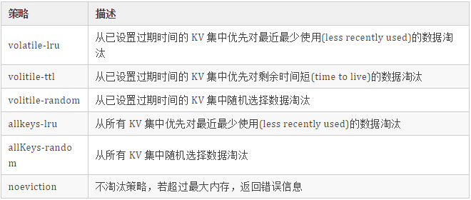

##### 8. redis 持久化机制

```java
🙍‍♂️ 面试官 ：你对 redis 的持久化机制了解吗？怎么保证 redis 挂掉之后再重启数据可以进行恢复?能讲一下吗？

🙋 我 ：redis 为了保证效率，数据缓存在了内存中，但是会周期性的把更新的数据写入磁盘或者把修改操作写入追加的记录文件中，以保证数据的持久化。Redis 的持久化策略有两种：1、RDB：快照形式是直接把内存中的数据保存到一个 dump 的文件中，定时保存，保存策略。2、AOF：把所有的对 Redis 的服务器进行修改的命令都存到一个文件里，命令的集合。Redis 默认是快照 RDB 的持久化方式。当 Redis 重启的时候，它会优先使用 AOF 文件来还原数据集，因为 AOF 文件保存的数据集通常比 RDB 文件所保存的数据集更完整。你甚至可以关闭持久化功能，让数据只在服务器运行时存。

🙍‍♂️ 面试官 ：那你再说下 RDB 是怎么工作的？
🙋 我 ：默认 Redis 是会以快照"RDB"的形式将数据持久化到磁盘的一个二进制文件 dump.rdb。工作原理简单说一下：当 Redis 需要做持久化时，Redis 会 fork 一个子进程，子进程将数据写到磁盘上一个临时 RDB 文件中。当子进程完成写临时文件后，将原来的 RDB 替换掉，这样的好处是可以 copy-on-write。
🙋 我 ：RDB 的优点是：这种文件非常适合用于备份：比如，你可以在最近的 24 小时内，每小时备份一次，并且在每个月的每一天也备份一个 RDB 文件。这样的话，即使遇上问题，也可以随时将数据集还原到不同的版本。RDB 非常适合灾难恢复。RDB 的缺点是：如果你需要尽量避免在服务器故障时丢失数据，那么 RDB 不合适你。

🙍‍♂️ 面试官 ：那你要不再说下 AOF？？
🙋 我 ：（说就一起说下吧）使用 AOF 做持久化，每一个写命令都通过 write 函数追加到 appendonly.aof 中，配置方式如下：
		
		appendfsync yes
		appendfsync always     #每次有数据修改发生时都会写入AOF文件。
		appendfsync everysec   #每秒钟同步一次，该策略为AOF的缺省策略。
		
AOF 可以做到全程持久化，只需要在配置中开启 appendonly yes。这样 redis 每执行一个修改数据的命令，都会把它添加到 AOF 文件中，当 redis 重启时，将会读取 AOF 文件进行重放，恢复到 redis 关闭前的最后时刻。

🙋 我顿了一下，继续说 ：使用 AOF 的优点是会让 redis 变得非常耐久。可以设置不同的 fsync 策略，aof 的默认策略是每秒钟 fsync 一次，在这种配置下，就算发生故障停机，也最多丢失一秒钟的数据。缺点是对于相同的数据集来说，AOF 的文件体积通常要大于 RDB 文件的体积。根据所使用的 fsync 策略，AOF 的速度可能会慢于 RDB。	
		
🙍‍♂️ 面试官又问 ：你说了这么多，那我该用哪一个呢？
🙋 我 ：如果你非常关心你的数据，但仍然可以承受数分钟内的数据丢失，那么可以额只使用 RDB 持久。AOF 将 Redis 执行的每一条命令追加到磁盘中，处理巨大的写入会降低 Redis 的性能，不知道你是否可以接受。数据库备份和灾难恢复：定时生成 RDB 快照非常便于进行数据库备份，并且 RDB 恢复数据集的速度也要比 AOF 恢复的速度快。当然了，redis 支持同时开启 RDB 和 AOF，系统重启后，redis 会优先使用 AOF 来恢复数据，这样丢失的数据会最少。

Redis 4.0 对于持久化机制的优化
Redis 4.0 开始支持 RDB 和 AOF 的混合持久化（默认关闭，可以通过配置项 aof-use-rdb-preamble 开启）。
如果把混合持久化打开，AOF 重写的时候就直接把 RDB 的内容写到 AOF 文件开头。这样做的好处是可以结合 RDB 和 AOF 的优点, 快速加载同时避免丢失过多的数据。当然缺点也是有的， AOF 里面的 RDB 部分是压缩格式不再是 AOF 格式，可读性较差。
```

```tex
补充内容：AOF 重写
	AOF 重写可以产生一个新的 AOF 文件，这个新的 AOF 文件和原有的 AOF 文件所保存的数据库状态一样，但体积更小。
	AOF 重写是一个有歧义的名字，该功能是通过读取数据库中的键值对来实现的，程序无须对现有 AOF 文件进行任何读入、分析或者写入操作。
	在执行 BGREWRITEAOF 命令时，Redis 服务器会维护一个 AOF 重写缓冲区，该缓冲区会在子进程创建新 AOF 文件期间，记录服务器执行的所有写命令。当子进程完成创建新 AOF 文件的工作之后，服务器会将重写缓冲区中的所有内容追加到新 AOF 文件的末尾，使得新旧两个 AOF 文件所保存的数据库状态一致。最后，服务器用新的 AOF 文件替换旧的 AOF 文件，以此来完成 AOF 文件重写操作
```

##### 9. 主从复制

```tex
🙍‍♂️ 面试官 ：redis 单节点存在单点故障问题，为了解决单点问题，一般都需要对 redis 配置从节点，然后使用哨兵来监听主节点的存活状态，如果主节点挂掉，从节点能继续提供缓存功能，你能说说 redis 主从复制的过程和原理吗？
🙋 我 ：我有点懵，这个说来就话长了。但幸好提前准备了：主从配置结合哨兵模式能解决单点故障问题，提高 redis 可用性。从节点仅提供读操作，主节点提供写操作。对于读多写少的状况，可给主节点配置多个从节点，从而提高响应效率。
🙋 我顿了一下，接着说： 关于复制过程，是这样的：
	1. 从节点执行slaveof[masterIP][masterPort]，保存主节点信息
	2. 从节点中的定时任务发现主节点信息，建立和主节点的 socket 连接
	3. 从节点发送 Ping 信号，主节点返回 Pong，两边能互相通信
	4. 连接建立后，主节点将所有数据发送给从节点（数据同步）
	5. 主节点把当前的数据同步给从节点后，便完成了复制的建立过程。接下来，主节点就会持续的把写命令发送给从节点，保证主从数据一致性。
	
🙍‍♂️ 面试官 ：那你能详细说下数据同步的过程吗？
🙋 我 ：（我心想：这也问的太细了吧）可以。redis2.8 之前使用sync[runId][offset]同步命令，redis2.8 之后使用psync[runId][offset]命令。两者不同在于，sync 命令仅支持全量复制过程，psync 支持全量和部分复制。
介绍同步之前，先介绍几个概念：
1.runId：每个 redis 节点启动都会生成唯一的 uuid，每次 redis 重启后，runId 都会发生变化。
2.offset：主节点和从节点都各自维护自己的主从复制偏移量 offset，当主节点有写入命令时，offset=offset+命令的字节长度。从节点在收到主节点发送的命令后，也会增加自己的 offset，并把自己的 offset 发送给主节点。这样，主节点同时保存自己的 offset 和从节点的 offset，通过对比 offset 来判断主从节点数据是否一致。
3.repl_backlog_size：保存在主节点上的一个固定长度的先进先出队列，默认大小是 1MB。
	（1）主节点发送数据给从节点过程中，主节点还会进行一些写操作，这时候的数据存储在复制缓冲区中。从节点同步主节点数据完成后，主节点将缓冲区的数据继续发送给从节点，用于部分复制。
	（2）主节点响应写命令时，不但会把命名发送给从节点，还会写入复制积压缓冲区，用于复制命令丢失的数据补救。
	
从节点发送 psync[runId][offset]命令，主节点有三种响应：
	1. FULLRESYNC ：第一次连接，进行全量复制
	2. CONTINUE ：进行部分复制
	3. ERR ：不支持 psync 命令，进行全量复制
```

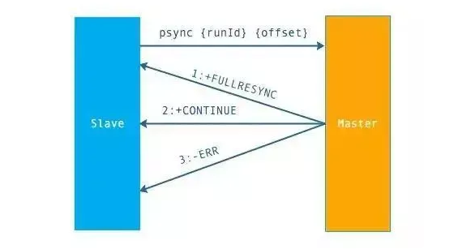

​									上面是 psync 的执行流程

```tex
🙍‍♂️ 面试官 ：很好，那你能具体说下全量复制和部分复制的过程吗？
🙋 我 ：可以
	1. 从节点发送 psync ? -1 命令（因为第一次发送，不知道主节点的 runId，所以为?，因为是第一次复制，所以 offset=-1）。
	2. 主节点发现从节点是第一次复制，返回 FULLRESYNC {runId} {offset}，runId 是主节点的 runId，offset 是主节点目前的 offset。
	3. 从节点接收主节点信息后，保存到 info 中。
	4. 主节点在发送 FULLRESYNC 后，启动 bgsave 命令，生成 RDB 文件（数据持久化）。
	5. 主节点发送 RDB 文件给从节点。到从节点加载数据完成这段期间主节点的写命令放入缓冲区。
	6. 从节点清理自己的数据库数据。
	7. 从节点加载 RDB 文件，将数据保存到自己的数据库中。
	8. 如果从节点开启了 AOF，从节点会异步重写 AOF 文件。

关于部分复制有以下几点说明：
	1. 部分复制主要是 Redis 针对全量复制的过高开销做出的一种优化措施，使用psync[runId][offset]命令实现。当从节点正在复制主节点时，如果出现网络闪断或者命令丢失等异常情况时，从节点会向主节点要求补发丢失的命令数据，主节点的复制积压缓冲区将这部分数据直接发送给从节点，这样就可以保持主从节点复制的一致性。补发的这部分数据一般远远小于全量数据。
	2. 主从连接中断期间主节点依然响应命令，但因复制连接中断命令无法发送给从节点，不过主节点内的复制积压缓冲区依然可以保存最近一段时间的写命令数据。
	3. 当主从连接恢复后，由于从节点之前保存了自身已复制的偏移量和主节点的运行 ID。因此会把它们当做 psync 参数发送给主节点，要求进行部分复制。
	4. 主节点接收到 psync 命令后首先核对参数 runId 是否与自身一致，如果一致，说明之前复制的是当前主节点；之后根据参数 offset 在复制积压缓冲区中查找，如果 offset 之后的数据存在，则对从节点发送+COUTINUE 命令，表示可以进行部分复制。因为缓冲区大小固定，若发生缓冲溢出，则进行全量复制。
	5. 主节点根据偏移量把复制积压缓冲区里的数据发送给从节点，保证主从复制进入正常状态。
```

​		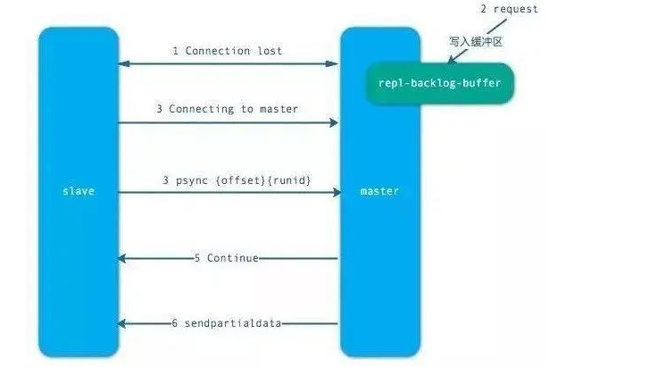	

​							全量复制的流程

##### 10. 哨兵

```tex
🙍‍♂️ 面试官 ：那主从复制会存在哪些问题呢？
🙋 我 ：主从复制会存在以下问题：
	1. 一旦主节点宕机，从节点晋升为主节点，同时需要修改应用方的主节点地址，还需要命令所有从节点去复制新的主节点，整个过程需要人工干预。
	2. 主节点的写能力受到单机的限制。
	3. 主节点的存储能力受到单机的限制。
	4. 原生复制的弊端在早期的版本中也会比较突出，比如：redis 复制中断后，从节点会发起 psync。此时如果同步不成功，则会进行全量同步，主库执行全量备份的同时，可能会造成毫秒或秒级的卡顿。
```

```tex
🙍‍♂️ 面试官 ：那比较主流的解决方案是什么呢？
🙋 我 ：当然是哨兵啊。
🙍‍♂️ 面试官 ：那么问题又来了。那你说下哨兵有哪些功能？
🙋 我 ：如图，是 Redis Sentinel（哨兵）的架构图。Redis Sentinel（哨兵）主要功能包括主节点存活检测、主从运行情况检测、自动故障转移、主从切换。Redis Sentinel 最小配置是一主一从。Redis 的 Sentinel 系统可以用来管理多个 Redis 服务器，该系统可以执行以下四个任务：
	1. 监控 ：不断检查主服务器和从服务器是否正常运行。
	2. 通知 ：当被监控的某个 redis 服务器出现问题，Sentinel 通过 API 脚本向管理员或者其他应用程序发出通知。
	3. 自动故障转移 ：当主节点不能正常工作时，Sentinel 会开始一次自动的故障转移操作，它会将与失效主节点是主从关系的其中一个从节点升级为新的主节点，并且将其他的从节点指向新的主节点，这样人工干预就可以免了。
	4. 配置提供者 ：在 Redis Sentinel 模式下，客户端应用在初始化时连接的是 Sentinel 节点集合，从中获取主节点的信息。
```

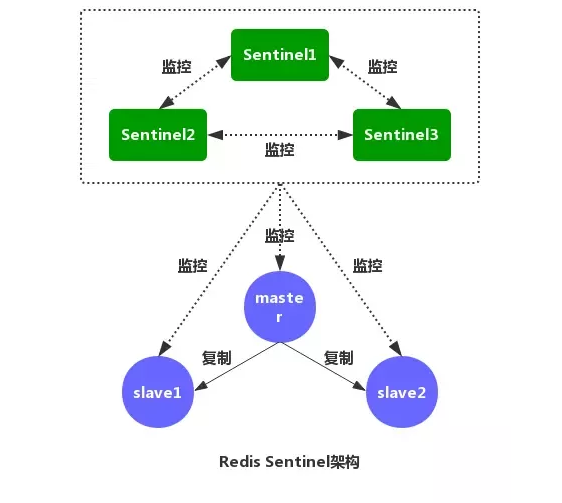

```tex
🙍‍♂️ 面试官 ：那你能说下哨兵的工作原理吗？
🙋 我 ：话不多说，直接上图：
```


```tex
1、每个 Sentinel 节点都需要定期执行以下任务：每个 Sentinel 以每秒一次的频率，向它所知的主服务器、从服务器以及其他的 Sentinel 实例发送一个 PING 命令。
```


```tex
2、如果一个实例距离最后一次有效回复 PING 命令的时间超过down-after-milliseconds所指定的值，那么这个实例会被 Sentinel 标记为主观下线。
```

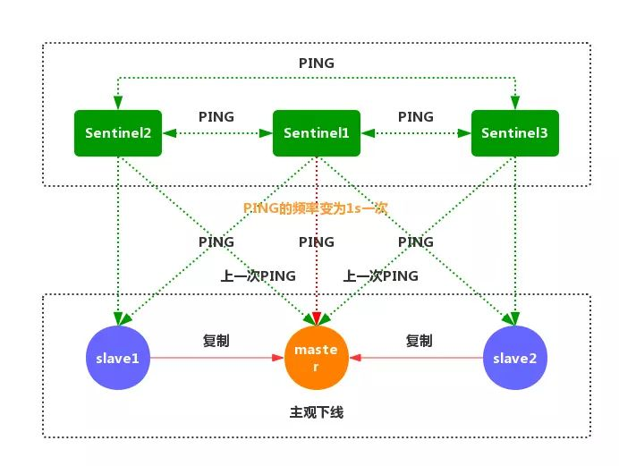

```tex
3、如果一个主服务器被标记为主观下线，那么正在监视这个服务器的所有 Sentinel 节点，要以每秒一次的频率确认主服务器的确进入了主观下线状态。
```

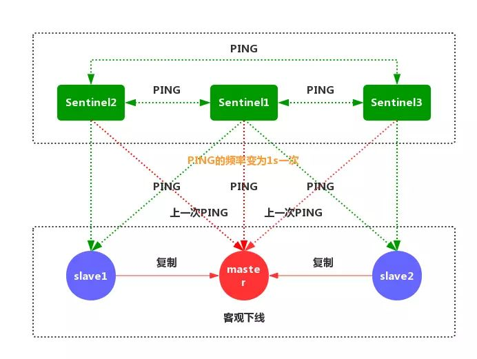

```tex
4、如果一个主服务器被标记为主观下线，并且有足够数量的 Sentinel（至少要达到配置文件指定的数量）在指定的时间范围内同意这一判断，那么这个主服务器被标记为客观下线。
```

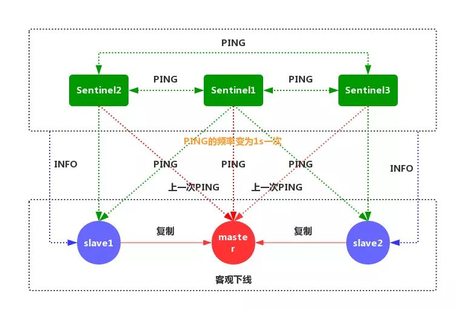

```tex
5、一般情况下，每个 Sentinel 会以每 10 秒一次的频率向它已知的所有主服务器和从服务器发送 INFO 命令，当一个主服务器被标记为客观下线时，Sentinel 向下线主服务器的所有从服务器发送 INFO 命令的频率，会从 10 秒一次改为每秒一次
```

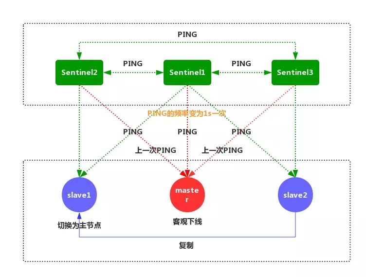

```tex
6、Sentinel 和其他 Sentinel 协商客观下线的主节点的状态，如果处于 SDOWN 状态，则投票自动选出新的主节点，将剩余从节点指向新的主节点进行数据复制。
```

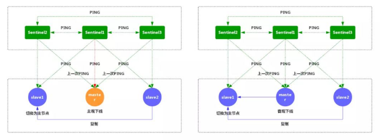

```tex
7、当没有足够数量的 Sentinel 同意主服务器下线时，主服务器的客观下线状态就会被移除。当主服务器重新向 Sentinel 的 PING 命令返回有效回复时，主服务器的主观下线状态就会被移除。
```

### 大厂面试题

```tex
1.JVM 参数配置、常用调试工具、分区、类加载，还会问你有需要线上的调试问题吗？遇到死循环 CPU 飙升怎么解决？

2.Java 并发包常用工具用法和原理、会配合集合类一起考，对了还会有 volatile、CAS 原理等。

3.MySQL 也算是必备了，索引存储结构、索引搜索原理、事务的隔离级别和原理，这些真的是逢考必问。当然除了MySQL，Redis 和 ES 也是面试长文的，大多都是集中到原理。比如 ES 倒排索引、分片原理，Redis 的 zset 原理和使用场景、多路复用、穿透、熔断等等。

4.框架也是必备的知识点，最常见的就是 AOP 原理，自己怎么实现？Spring Boot 啥原理？框架通常会配合设计模式一起考，比如你最熟悉的设计模式是啥？Spring MVC 里面用了什么设计模式？解决了什么问题？

5.服务治理了，这里面内容就太多了，Dubbo 也好，Spring Cloud 也罢，总之这个地方最能看得出你真实的工作经验和问题的考虑深度，毕竟没有真正在庞大的系统里面锻炼过真的很难应付这个地方。

6.算法，这个就靠平时多练了，LeetCode 中文版上线了

7. Git的分支你们是怎么管理的？**(GitFlow)**

8. 接口保证幂等性是基本的要求，那么幂等性你们是怎么做的?

9. 你们有用@Transactional来控制事务是吧，那么能不能说出一些事务不生效的场景？
```

### 微服务相关

#### 服务网关

##### 一、什么是服务网关

```tex
服务网关 = 路由转发 + 过滤器

1、路由转发：接收一切外界请求，转发到后端的微服务上去；

2、过滤器：在服务网关中可以完成一系列的横切功能，例如权限校验、限流以及监控等，这些都可以通过过滤器完成（其实路由转发也是通过过滤器实现的）。

```

##### 二、为什么需要服务网关

```tex
上述所说的横切功能（以权限校验为例）可以写在三个位置：
	每个服务自己实现一遍
	写到一个公共的服务中，然后其他所有服务都依赖这个服务
	写到服务网关的前置过滤器中，所有请求过来进行权限校验
	
第一种，缺点太明显，基本不用；第二种，相较于第一点好很多，代码开发不会冗余，但是有两个缺点：
	由于每个服务引入了这个公共服务，那么相当于在每个服务中都引入了相同的权限校验的代码，使得每个服务的jar包大小无故增加了一些，尤其是对于使用docker镜像进行部署的场景，jar越小越好；
	由于每个服务都引入了这个公共服务，那么我们后续升级这个服务可能就比较困难，而且公共服务的功能越多，升级就越难，而且假设我们改变了公共服务中的权限校验的方式，想让所有的服务都去使用新的权限校验方式，我们就需要将之前所有的服务都重新引包，编译部署。
	
而服务网关恰好可以解决这样的问题：
	将权限校验的逻辑写在网关的过滤器中，后端服务不需要关注权限校验的代码，所以服务的jar包中也不会引入权限校验的逻辑，不会增加jar包大小；
	如果想修改权限校验的逻辑，只需要修改网关中的权限校验过滤器即可，而不需要升级所有已存在的微服务。
所以，需要服务网关！！！
```

#####三、服务网关技术选型

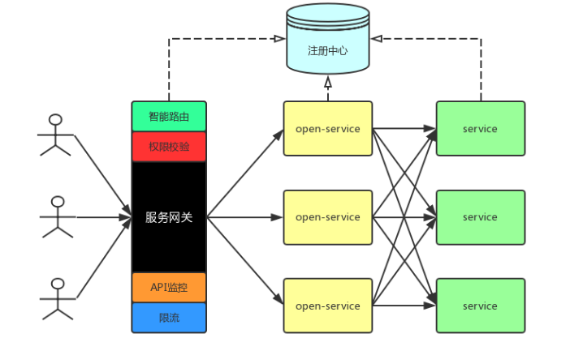

```tex
引入服务网关后的微服务架构如上，总体包含三部分：服务网关、open-service和service。
```

**1、总体流程**

```tex
服务网关、open-service和service启动时注册到注册中心上去；
用户请求时直接请求网关，网关做智能路由转发（包括服务发现，负载均衡）到open-service，这其中包含权限校验、监控、限流等操作
open-service聚合内部service响应，返回给网关，网关再返回给用户
```

**2、引入网关的注意点**

```tex
增加了网关，多了一层转发（原本用户请求直接访问open-service即可），性能会下降一些（但是下降不大，通常，网关机器性能会很好，而且网关与open-service的访问通常是内网访问，速度很快）；

网关的单点问题：在整个网络调用过程中，一定会有一个单点，可能是网关、nginx、dns服务器等。防止网关单点，可以在网关层前边再挂一台nginx，nginx的性能极高，基本不会挂，这样之后，网关服务就可以不断的添加机器。但是这样一个请求就转发了两次，所以最好的方式是网关单点服务部署在一台牛逼的机器上（通过压测来估算机器的配置），而且nginx与zuul的性能比较，根据国外的一个哥们儿做的实验来看，其实相差不大，zuul是netflix开源的一个用来做网关的开源框架；

网关要尽量轻。
```

**3、服务网关基本功能**

```tex
智能路由：接收

外部

一切请求，并转发到后端的对外服务open-service上去；

注意：我们只转发外部请求，服务之间的请求不走网关，这就表示全链路追踪、内部服务API监控、内部服务之间调用的容错、智能路由不能在网关完成；当然，也可以将所有的服务调用都走网关，那么几乎所有的功能都可以集成到网关中，但是这样的话，网关的压力会很大，不堪重负。
权限校验：只校验用户向open-service服务的请求，不校验服务内部的请求。服务内部的请求有必要校验吗？

API监控：只监控经过网关的请求，以及网关本身的一些性能指标（例如，gc等）；

限流：与监控配合，进行限流操作；

API日志统一收集：类似于一个aspect切面，记录接口的进入和出去时的相关日志
```

### 其他问题

#### 1 什么是Singleton？

```tex
Singleton：在Java中即指单例设计模式，它是软件开发中最常用的设计模式之一。
单：唯一
例：实例

单例设计模式，即某个类在整个系统中只能有一个实例对象可被获取和使用的代码模式。
例如：代表JVM运行环境的Runtime类
```

**要点**

```tex
一是某个类只能有一个实例；
	构造器私有化
二是它必须自行创建这个实例；
	含有一个该类的静态变量来保存这个唯一的实例
三是它必须自行向整个系统提供这个实例;
	对外提供获取该实例对象的方式：
	（1）直接暴露
	（2）用静态变量的get方法获取
```

**几种常见形式**

```tex
饿汉式：直接创建对象，不存在线程安全问题
	直接实例化饿汉式（简洁直观）
	枚举式（最简洁）
	静态代码块饿汉式（适合复杂实例化）

懒汉式：延迟创建对象
	线程不安全（适用于单线程）
	线程安全（适用于多线程）
	静态内部类形式（适用于多线程）
```

**代码示例**

```java
package com.atguigu.single;

/*
 * 饿汉式：
 * 	在类初始化时直接创建实例对象，不管你是否需要这个对象都会创建
 * 
 * （1）构造器私有化
 * （2）自行创建，并且用静态变量保存
 * （3）向外提供这个实例
 * （4）强调这是一个单例，我们可以用final修改
 */
public class Singleton1 {
	public static final Singleton1 INSTANCE = new Singleton1();
	private Singleton1(){
		
	}
}
```

```java
package com.atguigu.single;

/*
 * 枚举类型：表示该类型的对象是有限的几个
 * 我们可以限定为一个，就成了单例
 */
public enum Singleton2 {
	INSTANCE
}
```

```java
package com.atguigu.single;

import java.io.IOException;
import java.util.Properties;

public class Singleton3 {
	public static final Singleton3 INSTANCE;
	private String info;
	
	static{
		try {
			Properties pro = new Properties();					pro.load(Singleton3.class.getClassLoader().getResourceAsStream("single.properties"));			
			INSTANCE = new Singleton3(pro.getProperty("info"));
		} catch (IOException e) {
			throw new RuntimeException(e);
		}
	}
	
	private Singleton3(String info){
		this.info = info;
	}

	public String getInfo() {
		return info;
	}

	public void setInfo(String info) {
		this.info = info;
	}

	@Override
	public String toString() {
		return "Singleton3 [info=" + info + "]";
	}
	
}
```

```java
package com.atguigu.single;

/*
 * 懒汉式：
 * 	延迟创建这个实例对象
 * 
 * (1)构造器私有化
 * (2)用一个静态变量保存这个唯一的实例
 * (3)提供一个静态方法，获取这个实例对象
 */
public class Singleton4 {
	private static Singleton4 instance;
	private Singleton4(){
		
	}
	public static Singleton4 getInstance(){
		if(instance == null){
			
			try {
				Thread.sleep(100);
			} catch (InterruptedException e) {
				e.printStackTrace();
			}
			
			instance = new Singleton4();
		}
		return instance;
	}
}
```

```java
package com.atguigu.single;

/*
 * 懒汉式：
 * 	延迟创建这个实例对象
 * 
 * (1)构造器私有化
 * (2)用一个静态变量保存这个唯一的实例
 * (3)提供一个静态方法，获取这个实例对象
 */
public class Singleton5 {
	private static Singleton5 instance;
	private Singleton5(){
		
	}
	public static Singleton5 getInstance(){
		if(instance == null){
			synchronized (Singleton5.class) {
				if(instance == null){
					try {
						Thread.sleep(1000);
					} catch (InterruptedException e) {
						e.printStackTrace();
					}
					
					instance = new Singleton5();
				}
			}
		}
		return instance;
	}
}
```

```java
package com.atguigu.single;

/*
 * 在内部类被加载和初始化时，才创建INSTANCE实例对象
 * 静态内部类不会自动随着外部类的加载和初始化而初始化，它是要单独去加载和初始化的。
 * 因为是在内部类加载和初始化时，创建的，因此是线程安全的
 */
public class Singleton6 {
	private Singleton6(){		
	}
	private static class Inner{
		private static final Singleton6 INSTANCE = new Singleton6();
	}
	
	public static Singleton6 getInstance(){
		return Inner.INSTANCE;
	}
}
```

#### 2 i++ 和 ++i

```java
	public static void main(String[] args) {
		int i = 1;
		i = i++;
		int j = i++;
		int k = i + ++i * i++;
		System.out.println("i=" + i); // i = 4
		System.out.println("j=" + j); // j = 1
		System.out.println("k=" + k); // k = 11
	}
```

.png)


.png)


.png)

```tex
赋值=，最后计算
=右边的从左到右加载值依次压入操作数栈
实际先算哪个，看运算符优先级
自增、自减操作都是直接修改变量的值，不经过操作数栈
最后的赋值之前，临时结果也是存储在操作数栈中
```

#### 3 方法的传递机制

```tex
1.形参是基本数据类型
	传递数据值
2.实参是引用数据类型
	传递地址值
	特殊的类型：String、包装类等对象不可变性
```

```java
public class Exam4 {
	public static void main(String[] args) {
		int i = 1;
		String str = "hello";
		Integer num = 200;
		int[] arr = {1,2,3,4,5};
		MyData my = new MyData();
		
		change(i,str,num,arr,my);
		
		System.out.println("i = " + i); // 1
		System.out.println("str = " + str); // hello
		System.out.println("num = " + num); //200
		System.out.println("arr = " + Arrays.toString(arr)); // {2,2,3,4,5}
		System.out.println("my.a = " + my.a); // 11
	}
	public static void change(int j, String s, Integer n, int[] a,MyData m){
		j += 1;
		s += "world";
		n += 1;
		a[0] += 1;
		m.a += 1;
	}
}
class MyData{
	int a = 10;
}
```

**方法的参数传递机制**

```tex
形参是基本数据类型
	传递数据值
实参是引用数据类型
	传递地址值
特殊的类型：String、包装类等对象不可变性
```

#### 4 类的加载

​	**类初始化过程**

```tex
一个类要创建实例需要先加载并初始化该类
	main方法所在的类需要先加载和初始化
一个子类要初始化需要先初始化父类
一个类初始化就是执行<clinit>()方法
	<clinit>()方法由静态类变量显示赋值代码和静态代码块组成
	类变量显示赋值代码和静态代码块代码从上到下顺序执行
	<clinit>()方法只执行一次
```

**实例初始化过程**

```tex
实例初始化就是执行<init>()方法
	<init>()方法可能重载有多个，有几个构造器就有几个<init>方法
	<init>()方法由非静态实例变量显示赋值代码和非静态代码块、对应构造器代码组成
	非静态实例变量显示赋值代码和非静态代码块代码从上到下顺序执行，而对应构造器的代码最后执行
	每次创建实例对象，调用对应构造器，执行的就是对应的<init>方法
	<init>方法的首行是super()或super(实参列表)，即对应父类的<init>方法
```

**方法的重写Override**

```tex
哪些方法不可以被重写
	final方法
	静态方法
	private等子类中不可见方法
对象的多态性
	子类如果重写了父类的方法，通过子类对象调用的一定是子类重写过的代码
	非静态方法默认的调用对象是this
	this对象在构造器或者说<init>方法中就是正在创建的对象
```

**代码示例**

```java
package src.com.atguigu.test;

/*
 * 父类的初始化<clinit>：
 * （1）j = method();
 * （2）父类的静态代码块
 * 
 *  父类的实例化方法：
 * （1）super()（最前）
 * （2）i = test();
 * （3）父类的非静态代码块
 * （4）父类的无参构造（最后）
 * 
 * 非静态方法前面其实有一个默认的对象this
 * this在构造器（或<init>）它表示的是正在创建的对象，因为这里是在创建Son对象，所以
 * test()执行的是子类重写的代码（面向对象多态）
 * 
 * 这里i=test()执行的是子类重写的test()方法
 */
public class Father{
	private int i = test();
	private static int j = method();
	
	static{
		System.out.print("(1)");
	}
	Father(){
		System.out.print("(2)");
	}
	{
		System.out.print("(3)");
	}
	
	
	public int test(){
		System.out.print("(4)");
		return 1;
	}
	public static int method(){
		System.out.print("(5)");
		return 1;
	}
}
```

```java
package com.atguigu.test;

/*
 * 子类的初始化<clinit>：
 * （1）j = method();
 * （2）子类的静态代码块
 * 
 * 先初始化父类：(5)(1)
 * 初始化子类：（10）(6)
 * 
 * 子类的实例化方法<init>：
 * （1）super()（最前）      （9）（3）（2）
 * （2）i = test();    （9）
 * （3）子类的非静态代码块    （8）
 * （4）子类的无参构造（最后） （7）
 * 
 * 因为创建了两个Son对象，因此实例化方法<init>执行两次
 * 
 * （9）（3）（2）（9）（8）（7）
 */
public class Son extends Father{
	private int i = test();
	private static int j = method();
	static{
		System.out.print("(6)");
	}
	Son(){
//		super();//写或不写都在，在子类构造器中一定会调用父类的构造器
		System.out.print("(7)");
	}
	{
		System.out.print("(8)");
	}
	public int test(){
		System.out.print("(9)");
		return 1;
	}
	public static int method(){
		System.out.print("(10)");
		return 1;
	}
	public static void main(String[] args) {
		Son s1 = new Son();
		System.out.println();
		Son s2 = new Son();
	}
}

```

**运行结果**

```tex
(5)(1)(10)(6)(9)(3)(2)(9)(8)(7)
(9)(3)(2)(9)(8)(7)
```

#### 5 变量的作用域

```tex
就近原则
变量的分类
	成员变量：类变量、实例变量
	局部变量
非静态代码块的执行：每次创建实例对象都会执行
方法的调用规则：调用一次执行一次
```

**局部变量与成员变量的区别**

```tex
1 声明的位置
	局部变量：方法体{}中，形参，代码块{}中
	成员变量：类中方法外
		类变量：有static修饰
		实例变量：没有static修饰
2 修饰符
	局部变量：final
	成员变量：public、protected、private、final、static、volatile、transient
3 值存储的位置
	局部变量：栈
	实例变量：堆
	类变量：方法区
4 作用域
	局部变量：从声明处开始，到所属的}结束
	实例变量：在当前类中“this.”(有时this.可以缺省)，在其他类中“对象名.”访问
	类变量：在当前类中“类名.”(有时类名.可以省略)，在其他类中“类名.”或“对象名.”访问
5 生命周期
	局部变量：每一个线程，每一次调用执行都是新的生命周期
	实例变量：随着对象的创建而初始化，随着对象的被回收而消亡，每一个对象的实例变量是独立的
	类变量：随着类的初始化而初始化，随着类的卸载而消亡，该类的所有对象的类变量是共享的
	
6 当局部变量与xx变量重名时，如何区分
	1 局部变量与实例变量重名
		在实例变量前面加“this.”
	2 局部变量与类变量重名
		在类变量前面加“类名.”
```

```java
public class Exam5 {
	static int s;//成员变量，类变量
	int i;//成员变量，实例变量
	int j;//成员变量，实例变量
	{
		int i = 1;//非静态代码块中的局部变量 i
		i++;
		j++;
		s++;
	}
	public void test(int j){//形参，局部变量,j
		j++;
		i++;
		s++;
	}
	public static void main(String[] args) {//形参，局部变量，args
		Exam5 obj1 = new Exam5();//局部变量，obj1
		Exam5 obj2 = new Exam5();//局部变量，obj1
		obj1.test(10);
		obj1.test(20);
		obj2.test(30);
		System.out.println(obj1.i + "," + obj1.j + "," + obj1.s);
		System.out.println(obj2.i + "," + obj2.j + "," + obj2.s);
	}
}
```

**运行结果**

```tex
2,1,5
1,1,5
```

#### 6 编程题

```tex
有n步台阶，一次只能上1步或2步，共有多少种走法？
	
	递归
	循环迭代
```

```tex
递归
	n=1  	->一步										->f(1) = 1

	n=2  	->(1)一步一步(2)直接2步						->f(2) = 2 


	n=3     ->(1)先到达f(1)，然后从f(1)直接跨2步			->f(3) = f(1) + f(2)
    		  (2)先到达f(2)，然后从f(2)跨1步

	n=4 	->(1)先到达f(2)，然后从f(2)直接跨2步      		->f(4) = f(2) + f(3)
  			  (2)先到达f(3)，然后从f(3)跨1步
	....
	n=x     ->(1)先到达f(x-2)，然后从f(x-2)直接跨2步  		->f(x) = f(x-2) + f(x-1)
  			  (2)先到达f(x-1)，然后从f(x-1)跨1步                     

```

```java
package com.atguigu.step;

import org.junit.Test;

public class TestStep{
	@Test
	public void test(){
		long start = System.currentTimeMillis();
		System.out.println(f(100));//165580141
		long end = System.currentTimeMillis();
		System.out.println(end-start);//586ms
	}
	
	//实现f(n)：求n步台阶，一共有几种走法
	public int f(int n){
		if(n<1){
			throw new IllegalArgumentException(n + "不能小于1");
		}
		if(n==1 || n==2){
			return n;
		}
		return f(n-2) + f(n-1);
	}
}

```

```tex
循环迭代
	n=1  			->一步											->f(1) = 1
	n=2  			->(1)一步一步(2)直接2步							->f(2) = 2 

	n=3      		->(1)先到达f(1)，然后从f(1)直接跨2步
					  (2)先到达f(2)，然后从f(2)跨1步					->f(3) = two + one  
					  												 f(3) = f(1) + f(2)    
					  												 two = f(1) ; one = f(2)

	n=4 			->(1)先到达f(2)，然后从f(2)直接跨2步      
 				      (2)先到达f(3)，然后从f(3)跨1步
																	->f(4) = two + one  
																	f(4) = f(2) + f(3)
                                                                     two = f(2);    one = f(3)  

	....

	n=x				->(1)先到达f(x-2)，然后从f(x-2)直接跨2步  	
  					  (2)先到达f(x-1)，然后从f(x-1)跨1步    			->f(x) = two + one
  																	 f(x) = f(x-2) + f(x-1)
   																	 two = f(x-2); one = f(x-1)
```

```java
import org.junit.Test;

public class TestStep2 {
	@Test
	public void test(){
		long start = System.currentTimeMillis();
		System.out.println(loop(100));//165580141
		long end = System.currentTimeMillis();
		System.out.println(end-start);//<1ms
	}
	
	public int loop(int n){
		if(n<1){
			throw new IllegalArgumentException(n + "不能小于1");
		}
		if(n==1 || n==2){
			return n;
		}
		
		int one = 2;//初始化为走到第二级台阶的走法
		int two = 1;//初始化为走到第一级台阶的走法
		int sum = 0;
		
		for(int i=3; i<=n; i++){
			//最后跨2步 + 最后跨1步的走法
			sum = two + one;
			two = one;
			one = sum;
		}
		return sum;
	}
}
```

**小结**

```tex
方法调用自身称为递归，利用变量的原值推出新值称为迭代。
	递归
		优点：大问题转化为小问题，可以减少代码量，同时代码精简，可读性好；
		缺点：递归调用浪费了空间，而且递归太深容易造成堆栈的溢出。
	迭代
		优点：代码运行效率好，因为时间只因循环次数增加而增加，而且没有额外的空间开销；
		缺点：代码不如递归简洁，可读性好
```

#### 7 Cookie 和Session是什么？

```tex
Cookie 定义
	“Cookie”是小量信息，由网络服务器发送出来以存储在网络浏览器上，从而下次这位独一无二的访客又回到该网络服务器时，可从该浏览器读回此信息。这是很有用的，让浏览器记住这位访客的特定信息，如上次访问的位置、花费的时间或用户首选项（如样式表）。Cookie 是个存储在浏览器目录的文本文件，当浏览器运行时，存储在 RAM 中。一旦你从该网站或网络服务器退出，Cookie 也可存储在计算机的硬驱上。当访客结束其浏览器对话时，即终止的所有 Cookie。
	
Cookie什么时候产生？
	Cookie的使用一先要看需求。因为浏览器可以禁用Cookie，同时服务端也可以不Set-Cookie。
	客户端向服务器端发送一个请求的时，服务端向客户端发送一个Cookie 然后浏览器将Cookie保存，Cookie有两种保存方式，一种是浏览器会将Cookie保存在内存中，还有一种是保存在客户端的硬盘中，之后每次HTTP请求浏览器都会将Cookie发送给服务器端。

具体流程如下：
	客户端提交一个HTTP请求给服务端,服务端这个时候做了两件事，一个是Set-Cookie，还有一个是提交响应内容给客户端 客户端再次向服务器请求时会在请求头中携带一个Cookie服务端提交响应内容给客户端。
	举例：分登录之前和登录后，登录前服务端给浏览器一个Cookie，但是这个Cookie里面没有用户信息，但是登录成功之后，服务端给浏览器一个Cookie，这个时候的Cookie已经记录了用户的信息，在系统内任意访问，可以实现免登录。
	
Cookie的生存周期？
	Cookie在生成时就会被指定一个Expire值，这就是Cookie的生存周期，在这个周期内Cookie有效，超出周期Cookie就会被清除。有些页面将Cookie的生存周期设置为“0”或负值，这样在关闭浏览器时，就马上清除Cookie，不会记录用户信息，更加安全。

Cookie有哪些缺陷？
	1、数量受到限制。一个浏览器能创建的 Cookie 数量最多为 300 个，并且每个不能超过 4KB，每个 Web 站点能设置的 Cookie 总数不能超过 20 个
	2、安全性无法得到保障。通常跨站点脚本攻击往往利用网站漏洞在网站页面中植入脚本代码或网站页面引用第三方法脚本代码，均存在跨站点脚本攻击的可能，在受到跨站点脚本攻击时，脚本指令将会读取当前站点的所有 Cookie 内容（已不存在 Cookie 作用域限制），然后通过某种方式将 Cookie 内容提交到指定的服务器（如：AJAX）。一旦 Cookie 落入攻击者手中，它将会重现其价值。
```

```tex
什么是Session？Session什么时候产生？
	Session:在计算机中，尤其是在网络应用中，称为“会话控制”。Session 对象存储特定用户会话所需的属性及配置信息。这样，当用户在应用程序的 Web 页之间跳转时，存储在 Session 对象中的变量将不会丢失，而是在整个用户会话中一直存在下去。当用户请求来自应用程序的 Web 页时，如果该用户还没有会话，则 Web 服务器将自动创建一个 Session 对象。当会话过期或被放弃后，服务器将终止该会话。
	
为什么要使用Session？
	因为很多第三方可以获取到这个Cookie，服务器无法判断Cookie是不是真实用户发送的，所以Cookie可以伪造，伪造Cookie实现登录进行一些HTTP请求。如果从安全性上来讲，Session比Cookie安全性稍微高一些，我们先要知道一个概念--SessionID。SessionID是什么？客户端第一次请求服务器的时候，服务器会为客户端创建一个Session，并将通过特殊算法算出一个session的ID，下次请求资源时（Session未过期），浏览器会将sessionID(实质是Cookie)放置到请求头中，服务器接收到请求后就得到该请求的SessionID，服务器找到该id的session返还给请求者使用。

Session的生命周期？
	根据需求设定，一般来说，半小时。举个例子，你登录一个服务器，服务器返回给你一个sessionID，登录成功之后的半小时之内没有对该服务器进行任何HTTP请求，半小时后你进行一次HTTP请求，会提示你重新登录。

Session有哪些缺陷？
	因为Session是存储在服务器当中的，所以Session过多，会对服务器产生压力。在我看来，Session的生命周期算是减少服务器压力的一种方式。
```

```tex
Cookie与Session之间有哪些区别或者是优缺点？
	1、Cookie可以存储在浏览器或者本地，session只能存在服务器
	2、Session比Cookie更具有安全性
	3、Session占用服务器性能，Session过多，增加服务器压力
	4、单个Cookie保存的数据不能超过4K，很多浏览器都限制一个站点最多保存20个Cookie
```

#### 8 算法题

#####求最大子数组和

```tex
 	（浙江大学考研题）输入一个整形数组，数组里有正数也有负数。数组中连续的一个或多个整数组成一个子数组，每个子数组都有一个和。
 	求所有子数组的和的最大值。要求时间复杂度为O(n)。
 例如：输入的数组为1, -2, 3, -10, -4, 7, 2, -5，和最大的子数组为3, 10, -4, 7, 2，
 因此输出为该子数组的和18。
```

```java
/*
 * 输入一个整形数组，数组里有正数也有负数。数组中连续的一个或多个整数组成一个子数组，每个子数组都有一个和。
 * 求所有子数组的和的最大值。要求时间复杂度为O(n)。
 例如：输入的数组为1, -2, 3, -10, -4, 7, 2, -5，和最大的子数组为3, 10, -4, 7, 2，
 因此输出为该子数组的和18。

 */
public class Test3 {
	public static void main(String[] args) {
		int[] arr = new int[]{1, -2, 3, 10, -4, 7, 2, -5};
		int i = getGreatestSum(arr);
		System.out.println(i);
	}
	
	public static int getGreatestSum(int[] arr){
      	// 设置储存最大和的值
		int greatestSum = 0;
		if(arr == null || arr.length == 0){
			return 0;
		}
		int temp = greatestSum;
		for(int i = 0;i < arr.length;i++){
			temp += arr[i];
			
          	// 题意要求，有正数，有负数，若为0，则前面的子数组应该抛弃
			if(temp < 0){
				temp = 0;
			}
			
          	// 若临时值 > 最大值，将临时值赋值给最大值，继续向后添加
			if(temp > greatestSum){
				greatestSum = temp;
			}
		}
      	// 由题意得知，若最终最大值为0数组结构为 1，-1, 2，-2 的结构
      	// 必须找出最大的单个数值
		if(greatestSum == 0){
			greatestSum = arr[0];
			for(int i = 1;i < arr.length;i++){
				if(greatestSum < arr[i]){
					greatestSum = arr[i];
				}
			}
		}
		return greatestSum;
	}
}
```

#####求最大公约数和最小公倍数

```java
//输入两个正整数m和n，求其最大公约数和最小公倍数。
public class Test2 {
	public static void main(String[] args) {
		int m = 12;
		int n = 28;
		int max = (m > n)? m : n;
		int min = (m < n)? m : n;
		//最大公约数
		for(int i = min;i >= 1;i--){
			if( m % i == 0 && n % i == 0){
				System.out.println(i);
				break;
			}
		}
		//最小公倍数
		for(int i = max;i <= m * n;i++){
			if(i % m == 0 && i % n == 0){
				System.out.println(i);
				break;
			}
		}
	}
}
```

#####数组问题

```java
//题目1：一个数组，让数组的每个元素去除第一个元素，得到的商作为被除数所在位置的新值。
public class Test1 {
	public static void main(String[] args) {
		int[] arr = new int[]{12,43,65,3,-8,64,2};
		
//		for(int i = 0;i < arr.length;i++){
//			arr[i] = arr[i] / arr[0];
//		}
		for(int i = arr.length -1;i >= 0;i--){
			arr[i] = arr[i] / arr[0];
		}
		//遍历arr
		for(int i = 0;i < arr.length;i++){
			System.out.print(arr[i] + " ");
		}
	}
}
```

#####这一天是当年的第几天

```java
//从键盘分别输入年、月、日，判断这一天是当年的第几天。
public class Test {
	public static void main(String[] args) {
      	// 为保证健壮性，前期最好做判断
		Scanner scanner = new Scanner(System.in);
		System.out.println("输入year：");
		int year = scanner.nextInt();
		System.out.println("输入month：");
		int month = scanner.nextInt();
		System.out.println("输入day：");
		int day = scanner.nextInt();
		int sumDay = 0;
		switch (month) {
            case 12:
                sumDay += 30;
            case 11:
                sumDay += 31;
            case 10:
                sumDay += 30;
            case 9:
                sumDay += 31;
            case 8:
                sumDay += 31;
            case 7:
                sumDay += 30;
            case 6:
                sumDay += 31;
            case 5:
                sumDay += 30;
            case 4:
                sumDay += 31;
            case 3:
                if (year % 4 == 0 && year % 100 != 0 || year % 400 == 0)
                    sumDay += 29;
                else
                    sumDay += 28;
            case 2:
                sumDay += 31;
            case 1:
              sumDay += day;

		}
		System.out.println(year + "年" + month + "月" + day + "日是今年的第" + sumDay
				+ "天");
	}
}
```

##### 字符串反转（大厂面试题）

```java
/*
 * 将一个字符串进行反转。将字符串中指定部分进行反转。比如将“abcdefg”反转为”abfedcg”
 */
public class Test5 {
	public static void main(String[] args) {
		String str = new String("abcdefg");
		str = reverseString(str,2,5);
		System.out.println(str);		
	}
	
  	// 将字符串中间部分反转改成字符数组进行反转
	public static String reverseString(String str,int start,int end){
		char[] c = str.toCharArray();		
		return reverseArray(c,start,end);
	}
	// 反转字符数组
	public static String reverseArray(char[] c,int start,int end){
		for(int x = start,y = end;x < y;x++,y--){
			char temp = c[x];
			c[x] = c[y];
			c[y] = temp;
		}
		return new String(c);
	}
}
```

##### 需要做的


##### 递归（要朝着已知的方向递归）

```java
/*
 * 已知有一个数列：f(0) = 1,f(1) = 4,
 * f(n+2)=2*f(n+1) + f(n),==>f(n) = 2*f(n-1) + f(n-2)
 * 其中n是大于0的整数，求f(10)的值。

 */
public class Test8 {
	public static void main(String[] args) {
		Test8 t = new Test8();
		int i = t.func(10);
		System.out.println(i);
	}
	
	public int func(int n){
		if(n == 0)
			return 1;
		else if(n == 1)
			return 4;
		else{
			//return 2*func(n-1) + func(n-2);
			return func(n+2)-2*func(n+1);
		}
	}
}
```

##### 求1! + 2! + 3! + 4! + 5! + ...  + 20!

```tex
思路
	1 + 2 * 1! + 3 * 2! + 4 * 3! + ... + 20 * 19! 
```

```java
   public static void main(String[] args) {
        long sum = 0;
        long fac = 1;
        for (int i = 1; i <= 4; i++) {
          	// i * (i - 1)!
            fac = fac * i;
            sum += fac;
        }
        System.out.println(sum);
    }
```

#### 9 SpringMVC的工作流程


